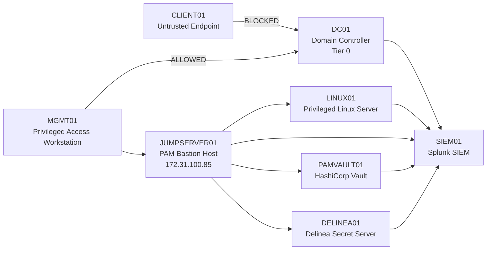

# 🔐 IAM-PRIVILEGED-ACCESS-ENGINEERING


10-module enterprise PAM lab extending hybrid identity through HashiCorp Vault, Delinea Secret Server, JumpServer Community Edition, tiered administration, privileged session governance, and centralized PAM monitoring.

🔗 **Companion Repository:**
[HYBRID-IDENTITY-ACCESS-MGMT](../HYBRID-IDENTITY-ACCESS-MGMT)

---

## 🧠 Overview

This repository documents an enterprise-grade Privileged Access Management lab built as a direct extension of the existing hybrid identity platform in **HYBRID-IDENTITY-ACCESS-MGMT**.

This is not just a configuration lab.

During this build, access control enforcement failed, GPO restrictions broke legitimate admin paths, and the built-in Administrator account resisted every enforcement attempt — all of which had to be diagnosed and resolved using real PAM engineering principles.

The lab environment, **IAMPAM.LAB**, simulates PAM architectures used in regulated enterprise environments including financial services, defense, and critical infrastructure.

---

## 🔍 What This Lab Demonstrates

• Privileged identity segmentation and tiered administration  
• Controlled administrative access paths via Privileged Access Workstation (PAW)  
• HashiCorp Vault — API-driven secrets management and audit logging  
• Delinea Secret Server — enterprise PAM platform with credential vaulting, RBAC, and privileged access administration 
• JumpServer Community Edition — privileged session brokering, session replay, command auditing, and authorization policy enforcement
• GPO-based access control enforcement (WHO + WHERE model)  
• Privileged access monitoring and incident detection via Splunk  
• Identity automation and PAM policy enforcement  
• End-to-end PAM architecture validation

---

## 🏗️ Architecture Overview — IAMPAM.LAB




**Network Range:** `172.31.100.0/24`

The architecture enforces a **controlled identity plane + privileged access plane model**:

* Identity services remain centralized (DC01, Entra ID)
* Administrative access is restricted through a designated PAW (MGMT01)
* Privileged credentials are externalized into vault systems (PAMVAULT01, DELINEA01)
* All privileged activity is forwarded to centralized security telemetry (SIEM01)

---

## 🔥 Key Engineering Incidents

### 1. Built-in Administrator Cannot Be Restricted

**Problem:**
Initial enforcement testing used `IAMPAM\Administrator`.
CLIENT01 → RDP → DC01 using Administrator = **SUCCESS** (should be blocked)

**Root Cause:**
Built-in Administrator is protected by AdminSDHolder (`adminCount=1`).
The "Log On To" workstation restriction cannot be applied to this account.
GPO alone does not enforce *where* a login originates.

**Fix Implemented:**
```
Dedicated Tier 0 account (adm.dc01) created
GPO → Allow log on through RDS → adm.dc01 ONLY
AD → Log On To → MGMT01 ONLY
WHO control + WHERE control = enforced access path
```

**Result:**
CLIENT01 → DC01 using adm.dc01 = **ACCESS DENIED**  
MGMT01 → DC01 using adm.dc01 = **SUCCESS**

---

### 2. GPO Deny Policy Caused Global Lockout

**Problem:**
Attempting to deny Domain Users / Domain Admins via GPO to block CLIENT01
broke all legitimate admin access — including MGMT01.

**Root Cause:**
Deny overrides Allow. Broad group-based deny policies are indiscriminate
and cannot distinguish access origin.

**Fix:**
Abandoned broad deny model. Implemented allow-only model scoped
to a named Tier 0 account combined with workstation-level Log On To restriction.

---

## 🖥️ Systems Inventory

| System Name  | Role                                         | OS                        | IP Address    |
| ------------ | -------------------------------------------- | ------------------------- | ------------- |
| DC01         | Domain Controller                            | Windows Server 2022       | 172.31.100.10 |
| MGMT01       | Privileged Access Workstation (PAW)          | Windows Server 2022       | 172.31.100.20 |
| ID-SYNC01    | Entra Connect Sync Server                    | Windows Server 2022       | 172.31.100.25 |
| CLIENT01     | Standard User Workstation                    | Windows 11                | 172.31.100.30 |
| LINUX01      | Privileged Linux Server                      | Ubuntu 22.04.4 LTS        | 172.31.100.40 |
| SIEM01       | Security Monitoring (Splunk Enterprise)      | Ubuntu 22.04.4 LTS        | 172.31.100.60 |
| PAMVAULT01   | HashiCorp Vault Credential Platform          | Ubuntu 22.04.4 LTS        | 172.31.100.70 |
| DELINEA01    | Delinea Secret Server                        | Windows Server 2022       | 172.31.100.80 |
| JUMPSERVER01 | PAM Bastion Host / Privileged Access Gateway | Ubuntu Server 22.04.4 LTS | 172.31.100.85 |


---

## 🔑 PAM Platforms in This Lab

### PAMVAULT01 — HashiCorp Vault

Implements a **lightweight, API-driven secrets engine**:

* Secure credential storage
* Policy-based access control
* CLI/API-driven operations
* JSON audit logging
* Integration with automation pipelines

---

## DELINEA01 — Delinea Secret Server

Enterprise Privileged Access Management (PAM) platform deployed within IAMPAM.LAB to support credential security and privileged access administration.

Implemented capabilities:

* Centralized credential vaulting through a web-based interface
* Role-based access control (RBAC)
* Secret and credential management workflows
* Administrative policy configuration
* Audit logging and reporting
* Enterprise PAM architecture integration

Note: Advanced capabilities such as automated password rotation, privileged session management, session recording, discovery services, and other licensed enterprise features were not implemented within this lab environment.


---

### Why Both?

This lab demonstrates **three tiers of PAM maturity**:

| Platform | Purpose |
|----------|---------|
| Vault | Engineering-driven secrets management |
| Delinea | Enterprise credential governance  |
| Jumpserver | Privileged session management and access brokering |


This demonstrates the ability to design, deploy, and operate multiple PAM technologies supporting enterprise identity and security operations.

---

## 🛡️ Privileged Access Management Design Goals

* **Credential Isolation** — Privileged credentials are never stored on endpoints or embedded in scripts
* **Controlled Administrative Access Paths** — Administrative actions must originate from hardened systems
* **Tiered Privilege Enforcement** — Administrative roles are segmented based on system sensitivity
* **Centralized Secret Management** — All privileged credentials stored and accessed through vault platforms
* **Auditability and Traceability** — All privileged actions generate verifiable logs
* **Elimination of Standing Privilege** — Persistent elevated access is minimized and controlled

---

## ⚠️ Security Threat Model

The PAM implementation is designed to mitigate:

* Credential dumping from compromised endpoints
* Lateral movement using privileged credentials
* Pass-the-Hash and Pass-the-Ticket attacks
* Unauthorized administrative access from unmanaged systems
* Insider misuse of privileged accounts
* Persistence through credential reuse

---

## 📚 Module Breakdown

* [Module 01 — Privileged Identity Architecture](./module/01-privileged-identity-architecture.md)
* [Module 02 — Tiered Administration Model](./module/02-tiered-administration-model.md)
* [Module 03 — Administrative Workstation Model](./module/03-administrative-workstation-model.md)
* [Module 04 — Privileged Credential Vault (HashiCorp Vault)](./module/04-privileged-credential-vault.md)
* [Module 05 — Privileged Access Monitoring and Auditing](./module/05-privileged-access-monitoring.md)
* [Module 06 — Delinea Secret Server Deployment and Integration](./module/06-delinea-secret-server.md)
* [Module 07 — JumpServer PAM Operations](./module/07-jumpserver-pam-operations.md)
* [Module 08 — IAM PAM Monitoring and Incident Detection](./module/08-iam-pam-monitoring-incident-detection.md)
* [Module 09 — IAM Automation and Policy Enforcement](./module/09-iam-automation-policy-enforcement.md)
* [Module 10 — IAM Architecture Validation](./module/10-iam-architecture-validation.md)


---

## 📁 Repository Structure

```
IAM-PRIVILEGED-ACCESS-ENGINEERING/
│
├── README.md
│
├── architecture/
│   ├── iampam-pam-architecture.png
│   ├── pam-architecture.md
│   ├── pam-threat-model.md
│   ├── privilege-boundaries.md
│   └── tiered-admin-model.md
│
├── automation/
│   └── splunk_alert_action_logger.py
│
├── grc/
│   └── grc-framework-mapping-pam.md
│
├── module/
│   ├── 01-privileged-identity-architecture.md
│   ├── 02-tiered-administration-model.md
│   ├── 03-administrative-workstation-model.md
│   ├── 04-privileged-credential-vault.md
│   ├── 05-privileged-access-monitoring.md
│   ├── 06-delinea-secret-server.md
│   ├── 07-jumpserver-pam-operations.md
│   ├── 08-iam-pam-monitoring-incident-detection.md
│   ├── 09-iam-automation-policy-enforcement.md
│   └── 10-iam-architecture-validation.md
│
├── runbook/
│   ├── delinea-secret-server-installation.md
│   ├── sql-express-deployment.md
│   └── windows-iis-prerequisites.md
│
└── screenshot/
```

---

## ✅ Final Summary

The **IAM-PRIVILEGED-ACCESS-ENGINEERING** repository demonstrates a complete, enterprise-aligned implementation of Privileged Access Management within an existing hybrid identity environment.

This lab validates the ability to:

* Engineer secure privileged access pathways
* Design and enforce tiered administrative models
* Deploy and operate multiple PAM platforms (Vault + Delinea + JumpServer)
* Integrate privileged activity into centralized monitoring systems
* Align identity security controls with enterprise threat models

The resulting architecture reflects real-world PAM design patterns and provides a portfolio-ready demonstration of:

**Privileged Access Management engineering capability at an enterprise level.**

---

**Author:** Edward E. Spence  
**Environment:** IAMPAM.LAB  

[LinkedIn](https://linkedin.com/in/edward-e-spence-6598bb312) | [Portfolio](https://edwards-it-portfolio.com)