← [Back to Main README](../README.md)


# Module 01: Privileged Identity Architecture

**Module**: 01 - Privileged Identity Architecture
**Status**: ✅ COMPLETE (Privileged Identity Model Implemented & Validated)
**Built by**: Edward E. Spence
**Completed**: March 2026
**Purpose**: Establish a structured privileged identity model within the IAMPAM.LAB environment by implementing tier-aligned administrative identities, group-based privilege assignment, and identity separation to reduce credential exposure risk and support enterprise PAM design patterns.

---

## Module Objective

The objective of this module is to establish a structured privileged identity model within the **IAMPAM.LAB** environment. This model enforces strict separation between standard user identities and privileged administrative identities using a tier-aligned naming convention and role-based grouping strategy.

Privileged identities are created, organized, and controlled to support:

• Tier-based administrative boundaries
• Controlled access to domain, server, and workstation resources
• Reduced credential exposure risk
• Alignment with enterprise PAM design patterns

This identity model is actively enforced in **Module 02** using Group Policy-based logon restrictions.

---

## Implementation Overview

Privileged identities are implemented using:

• Dedicated Organizational Units (OUs)
• Tier-aligned administrative accounts
• PAM security groups for privilege assignment
• Separation of duties between identity tiers

---

## Security Significance

Privileged identity separation mitigates:

• Credential theft via lateral movement
• Pass-the-Hash / Pass-the-Ticket attacks
• Over-privileged account misuse
• Identity plane compromise

---

## Systems Involved

DC01 — 172.31.100.10
MGMT01 — 172.31.100.20
CLIENT01 — 172.31.100.30

---

## Prerequisites

• Domain IAMPAM.LAB operational
• Administrative access to DC01
• RSAT tools available on MGMT01
• Baseline AD structure exists

---

# Step-by-Step Implementation

---

## Step 1 — Create Privileged Identity OU Structure

```powershell
New-ADOrganizationalUnit -Name "PAM" -Path "DC=IAMPAM,DC=LAB"

New-ADOrganizationalUnit -Name "Tier0" -Path "OU=PAM,DC=IAMPAM,DC=LAB"
New-ADOrganizationalUnit -Name "Tier1" -Path "OU=PAM,DC=IAMPAM,DC=LAB"
New-ADOrganizationalUnit -Name "Tier2" -Path "OU=PAM,DC=IAMPAM,DC=LAB"
```

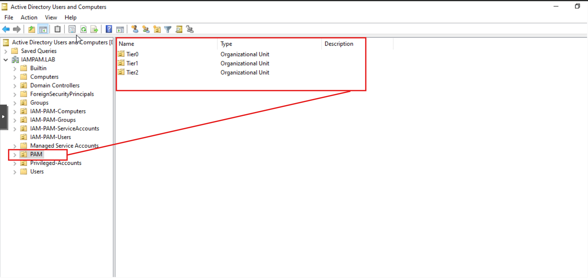

---

## Step 2 — Create PAM Role Security Groups

```powershell
New-ADGroup -Name "PAM-Tier0-Admins" -GroupScope Global -Path "OU=Tier0,OU=PAM,DC=IAMPAM,DC=LAB"
New-ADGroup -Name "PAM-Tier1-Admins" -GroupScope Global -Path "OU=Tier1,OU=PAM,DC=IAMPAM,DC=LAB"
New-ADGroup -Name "PAM-Tier2-Admins" -GroupScope Global -Path "OU=Tier2,OU=PAM,DC=IAMPAM,DC=LAB"
```

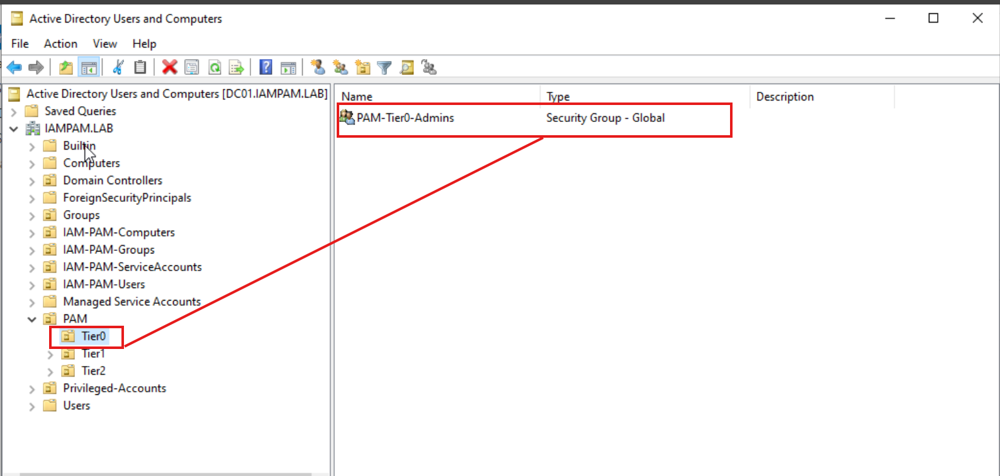
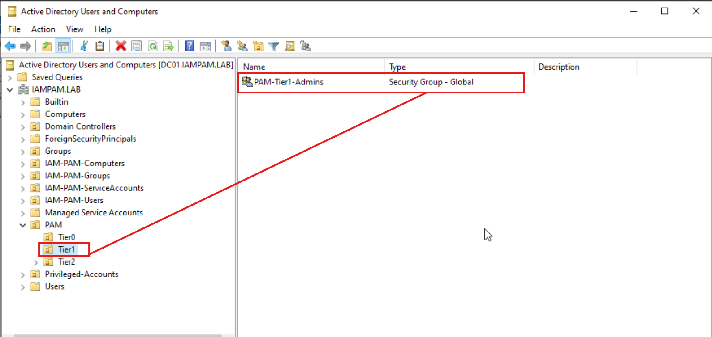
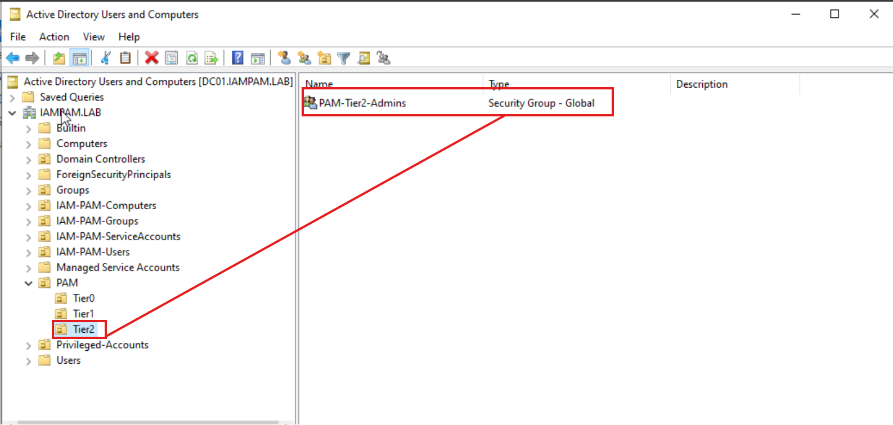

---

## Step 3 — Create Privileged Accounts

### Tier 0 Account

```powershell
# Lab use only — replace with secure input in production
# Read-Host -AsSecureString for production deployments

New-ADUser `
-Name "adm-t0-administrator" `
-SamAccountName "adm-t0-administrator" `
-UserPrincipalName "adm-t0-administrator@IAMPAM.LAB" `
-Path "OU=Tier0,OU=PAM,DC=IAMPAM,DC=LAB" `
-AccountPassword (ConvertTo-SecureString "P@ssw0rd123!" -AsPlainText -Force) `
-Enabled $true
```

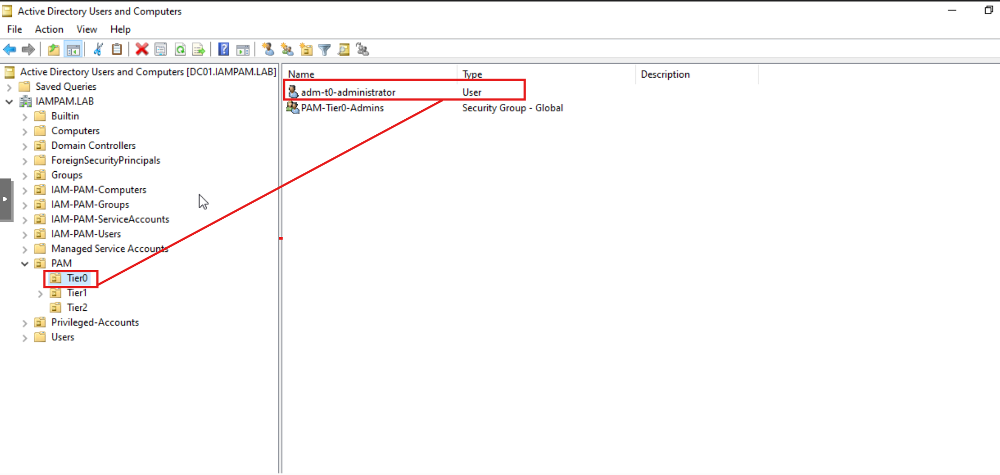

---

### Tier 1 Account

```powershell
# Lab use only — replace with secure input in production

New-ADUser `
-Name "adm-t1-serveradmin" `
-SamAccountName "adm-t1-serveradmin" `
-UserPrincipalName "adm-t1-serveradmin@IAMPAM.LAB" `
-Path "OU=Tier1,OU=PAM,DC=IAMPAM,DC=LAB" `
-AccountPassword (ConvertTo-SecureString "P@ssw0rd123!" -AsPlainText -Force) `
-Enabled $true
```

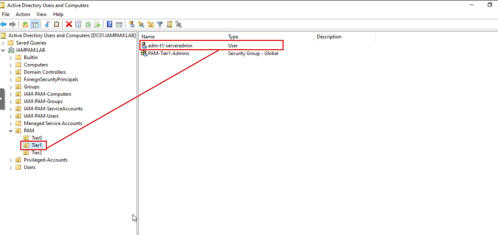

---

### Tier 2 Account

```powershell
# Lab use only — replace with secure input in production

New-ADUser `
-Name "adm-t2-helpdesk" `
-SamAccountName "adm-t2-helpdesk" `
-UserPrincipalName "adm-t2-helpdesk@IAMPAM.LAB" `
-Path "OU=Tier2,OU=PAM,DC=IAMPAM,DC=LAB" `
-AccountPassword (ConvertTo-SecureString "P@ssw0rd123!" -AsPlainText -Force) `
-Enabled $true
```

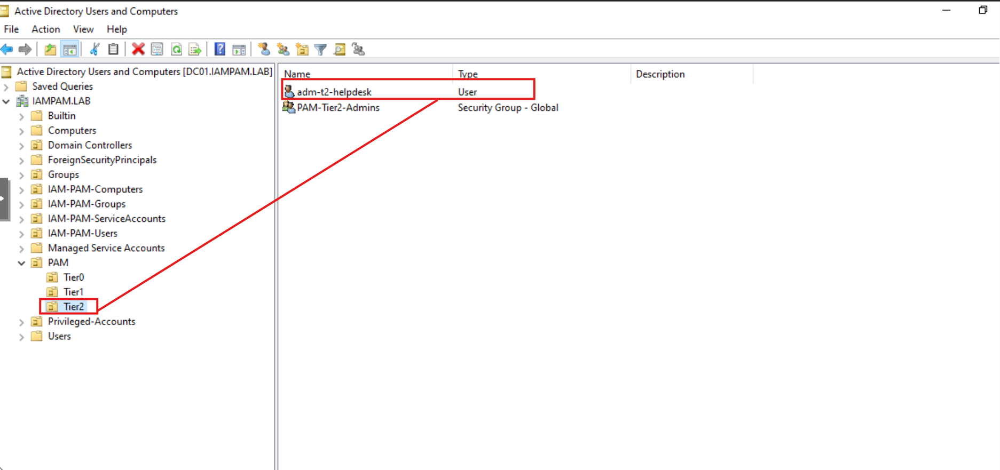

---

## Step 4 — Assign Accounts to PAM Groups

```powershell
Add-ADGroupMember "PAM-Tier0-Admins" -Members adm-t0-administrator
Add-ADGroupMember "PAM-Tier1-Admins" -Members adm-t1-serveradmin
Add-ADGroupMember "PAM-Tier2-Admins" -Members adm-t2-helpdesk
```

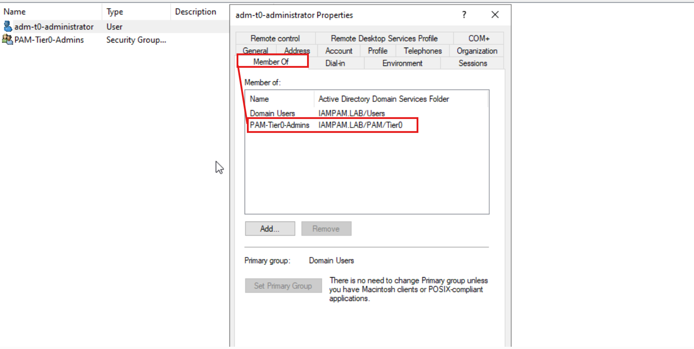
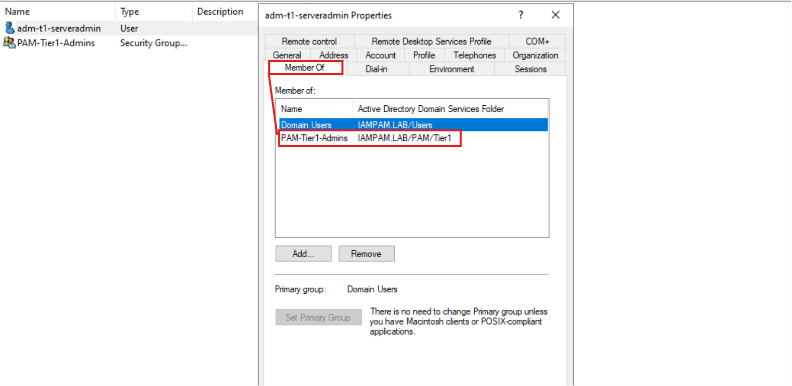
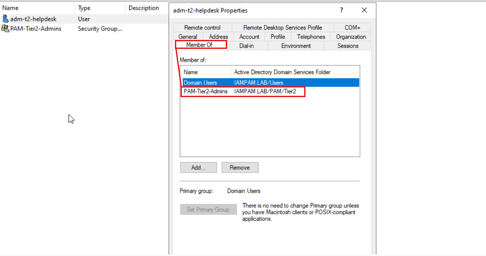

---

## Step 5 — Map PAM Groups to Privilege Roles

```powershell
Add-ADGroupMember "Domain Admins" -Members "PAM-Tier0-Admins"
```

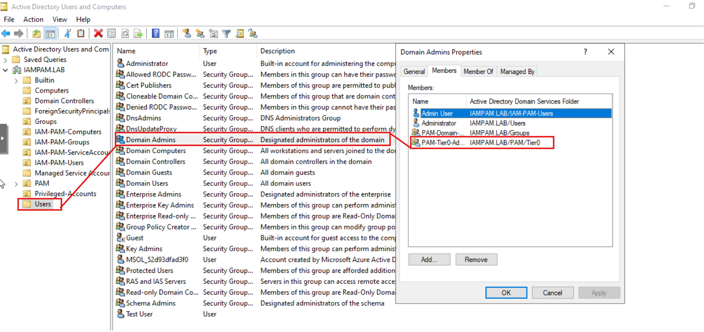

---

## Step 6 — Validate Identity Separation

Test:

Tier 2 login on CLIENT01

Expected:

• Successful login
• No privileged escalation

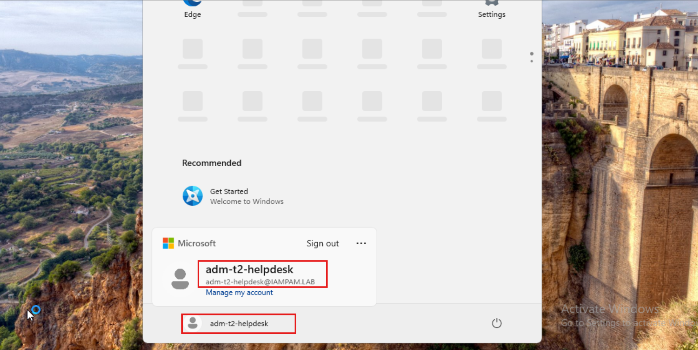

---

## Validation Commands

```powershell
Get-ADOrganizationalUnit -Filter * | Where-Object {$_.Name -like "*Tier*"}
Get-ADGroupMember "PAM-Tier0-Admins"
Get-ADGroupMember "Domain Admins"
```

---

## Operational Considerations

• No shared credentials
• All privileges assigned via groups
• Tier identities separated
• No direct admin assignments

---

## Lab Complete When

• PAM OU hierarchy exists
• Tiered admin accounts implemented
• Naming conventions enforced
• PAM groups operational
• Domain Admin access controlled via groups
• No direct privilege assignment
• Tier separation established

---

**E.E. Spence — PAM Engineering | IAMPAM.LAB**
