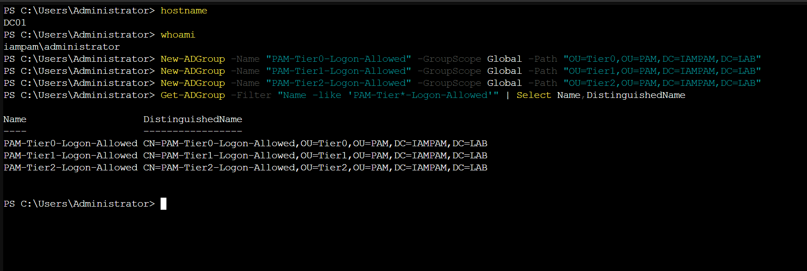
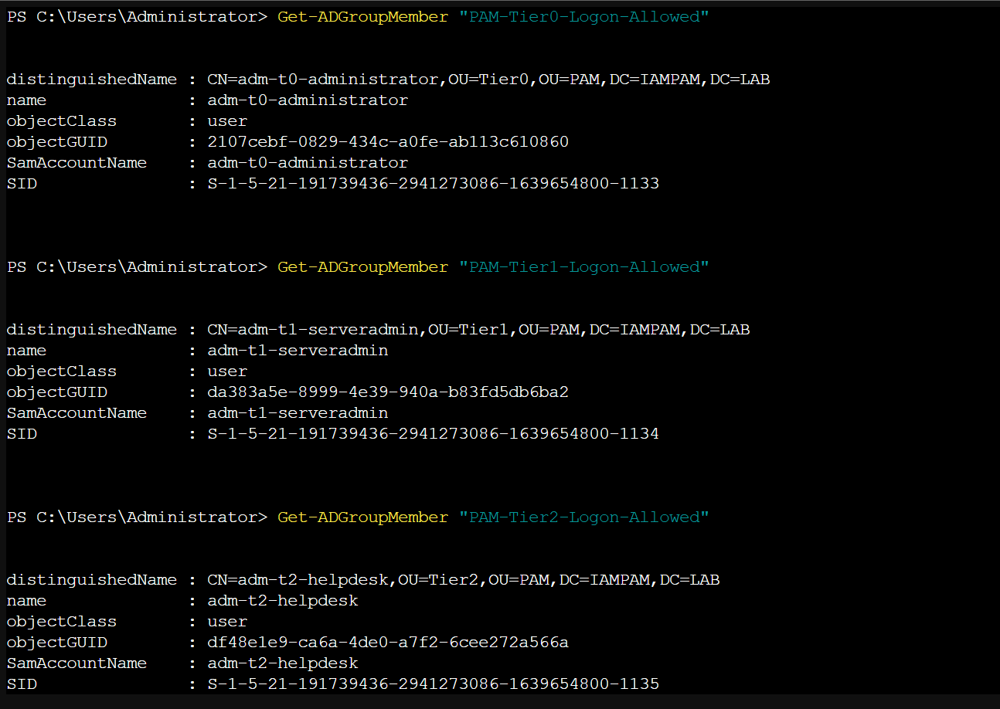
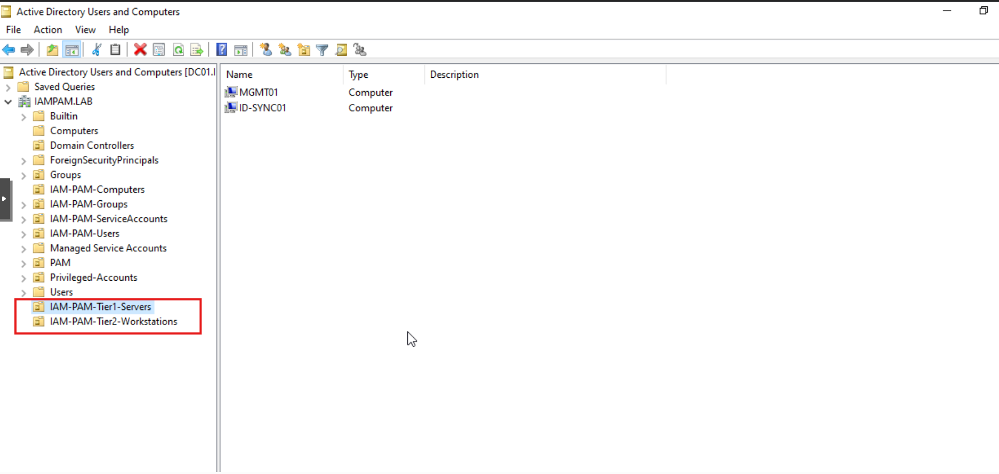
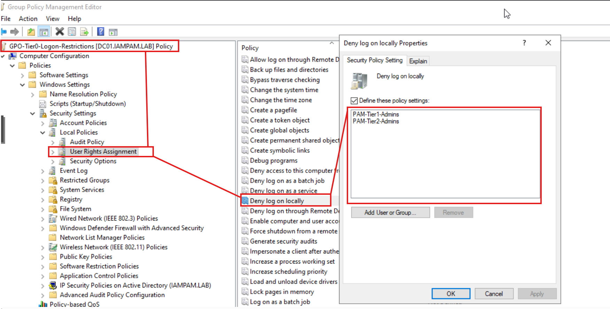
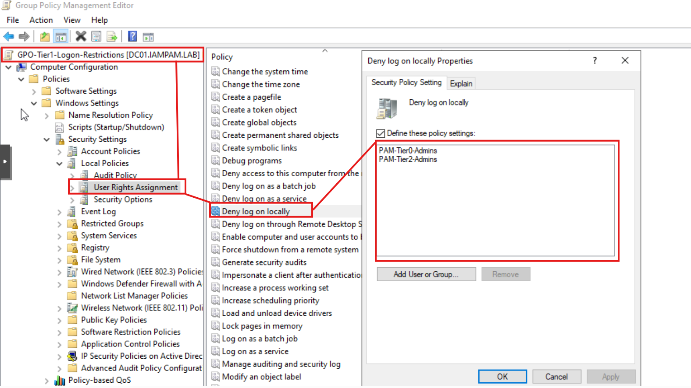
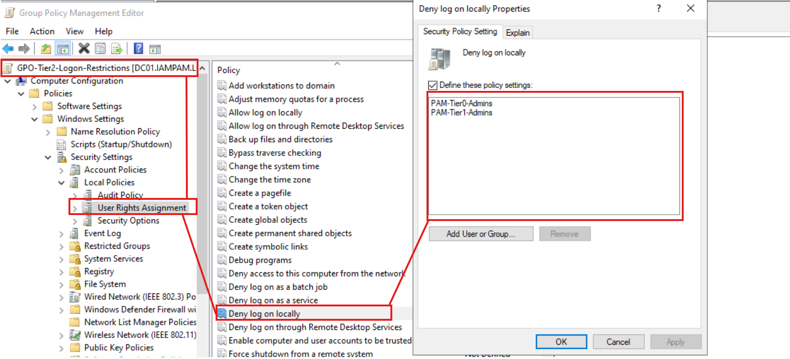
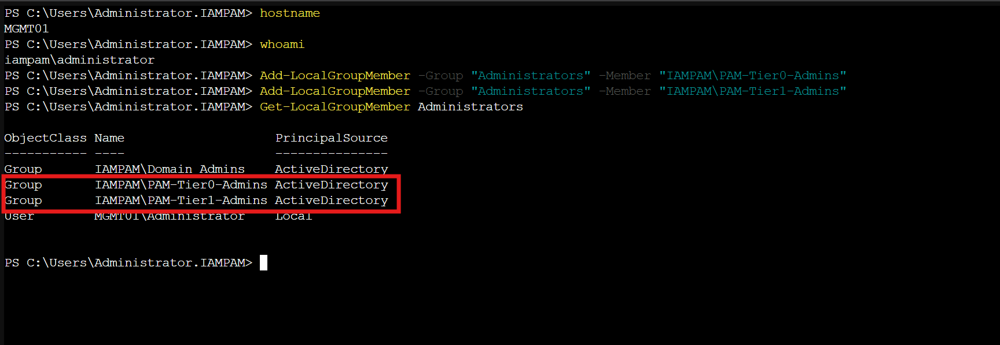
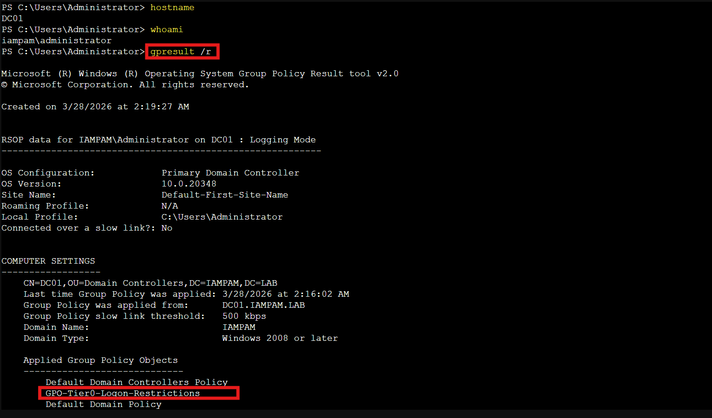

← [Back to Main README](../README.md)


# Module 02: Tiered Administration Model (Hardened)

**Module**: 02 - Tiered Administration Model (Hardened)
**Status**: ✅ COMPLETE (Tier Enforcement & Logon Restrictions Validated)
**Built by**: Edward E. Spence
**Completed**: March 2026
**Purpose**: Enforce administrative tier isolation within the IAMPAM.LAB environment using Active Directory and Group Policy by implementing deny-based logon controls, restricting credential exposure across tiers, and preventing lateral movement between identity boundaries.

---

## Module Objective

Implement a tiered administrative model with enforced logon restrictions to prevent credential exposure and lateral movement across identity tiers within the domain.

---

## Implementation Overview

A three-tier administrative boundary was implemented using Active Directory OU scoping and GPO-based deny logon controls.

Tier 0 — Identity Infrastructure
DC01

Tier 1 — Administrative Servers
MGMT01, ID-SYNC01

Tier 2 — User Workstations
CLIENT01

---

## Tier Enforcement — MITRE ATT&CK Alignment

| Control                             | Threat Mitigated     | MITRE Technique |
| ----------------------------------- | -------------------- | --------------- |
| Tier 0 Logon Restriction            | Lateral Movement     | T1021           |
| Deny Logon Rights                   | Valid Account Abuse  | T1078           |
| Cross-Tier Isolation                | Pass-the-Hash        | T1550.002       |
| Administrative Boundary Enforcement | Privilege Escalation | T1068           |
| Event Monitoring (4625)             | Brute Force          | T1110           |

---

## Lab Mapping

| System    | Role                  | Tier     | Enforcement       |
| --------- | --------------------- | -------- | ----------------- |
| DC01      | Domain Controller     | Tier 0   | GPO Enforced      |
| MGMT01    | Administrative Server | Tier 1   | GPO Enforced      |
| ID-SYNC01 | Entra Sync Server     | Tier 1   | GPO Enforced      |
| CLIENT01  | Workstation           | Tier 2   | GPO Enforced      |
| LINUX01   | Linux Server          | External | Not Domain Joined |
| SIEM01    | Splunk Server         | External | Not Domain Joined |

---

## Security Significance

This implementation enforces strict administrative boundaries that prevent:

• Credential theft on lower-tier systems
• Lateral movement between tiers
• Privileged account exposure outside controlled systems

Higher-tier credentials must never authenticate on lower-tier systems.

---

## Systems Involved

DC01
MGMT01
ID-SYNC01
CLIENT01

---

## Prerequisites

• Domain Admin access
• Group Policy Management available
• Active Directory OU structure from Module 01
• Tiered admin groups already created

---

# Step-by-Step Implementation

---

## Step 1 — Logon Control Groups

Created:

• PAM-Tier0-Logon-Allowed
• PAM-Tier1-Logon-Allowed
• PAM-Tier2-Logon-Allowed



---

## Step 2 — Group Membership Validation

Validated:

• adm-t0-administrator → PAM-Tier0
• adm-t1-serveradmin → PAM-Tier1
• adm-t2-helpdesk → PAM-Tier2



---

## Step 3 — Tier OU Structure

Created:

• IAM-PAM-Tier1-Servers
• IAM-PAM-Tier2-Workstations

System placement:

• DC01 remains in Domain Controllers OU
• MGMT01, ID-SYNC01 → IAM-PAM-Tier1-Servers
• CLIENT01 → IAM-PAM-Tier2-Workstations



---

## Step 4 — Tier 0 Enforcement (DC01)

GPO:
GPO-Tier0-Logon-Restrictions

Configured:

Deny log on locally

• PAM-Tier1-Admins
• PAM-Tier2-Admins



---

## Step 5 — Tier 1 Enforcement (MGMT01, ID-SYNC01)

GPO:
GPO-Tier1-Logon-Restrictions

Configured:

Deny log on locally

• PAM-Tier0-Admins
• PAM-Tier2-Admins



---

## Step 6 — Tier 2 Enforcement (CLIENT01)

GPO:
GPO-Tier2-Logon-Restrictions

Configured:

Deny log on locally

• PAM-Tier0-Admins
• PAM-Tier1-Admins



---

## Step 7 — Controlled Administrative Access (MGMT01)

```powershell id="0h3k1p"
Add-LocalGroupMember -Group "Administrators" -Member "IAMPAM\PAM-Tier0-Admins"
Add-LocalGroupMember -Group "Administrators" -Member "IAMPAM\PAM-Tier1-Admins"
```

Validation:

```powershell id="9q3f0l"
Get-LocalGroupMember Administrators
```



---

## Step 8 — Mandatory Policy Application

```powershell id="9vvq1x"
gpupdate /force
shutdown /r /t 0
```

---

## Step 9 — Policy Validation

```powershell id="w3nt3c"
gpresult /r
```



---

## Enforcement Strategy

Deny-based enforcement model used.

---

# Validation Steps

• Tier 2 login to DC01 → Denied
• Tier 1 login to DC01 → Denied
• Tier 0 login to MGMT01 → Allowed
• Tier 1 login to MGMT01 → Allowed
• Tier 2 login to MGMT01 → Denied
• Tier 0 login to CLIENT01 → Denied
• Tier 2 login to CLIENT01 → Allowed

---

# Lab Complete When

• Tiered groups created
• Membership validated
• OU structure correct
• Tier 0 enforcement working
• Tier 1 enforcement working
• Tier 2 enforcement working
• MGMT01 configured as admin system
• GPO validation confirmed

---

# Summary

This module enforces administrative tier isolation using Active Directory and Group Policy.

---

**E.E. Spence — PAM Engineering | IAMPAM.LAB**
