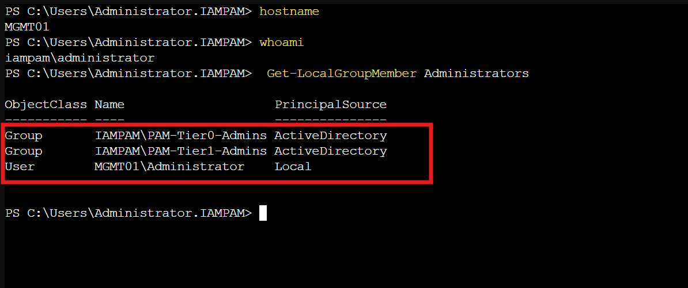
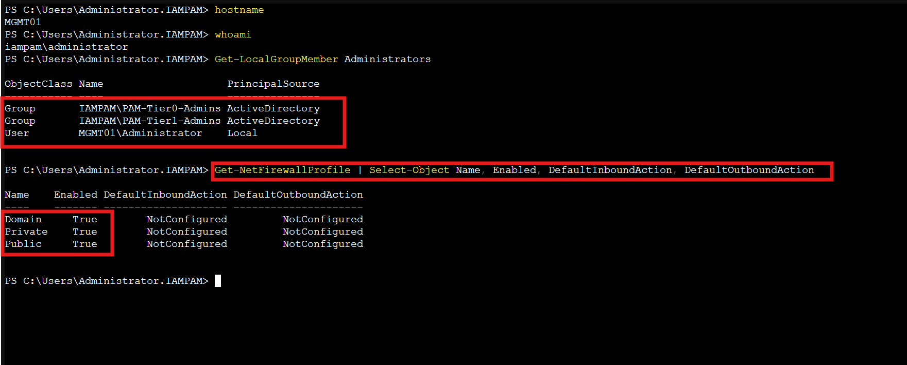
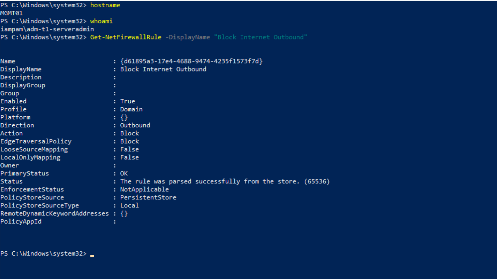
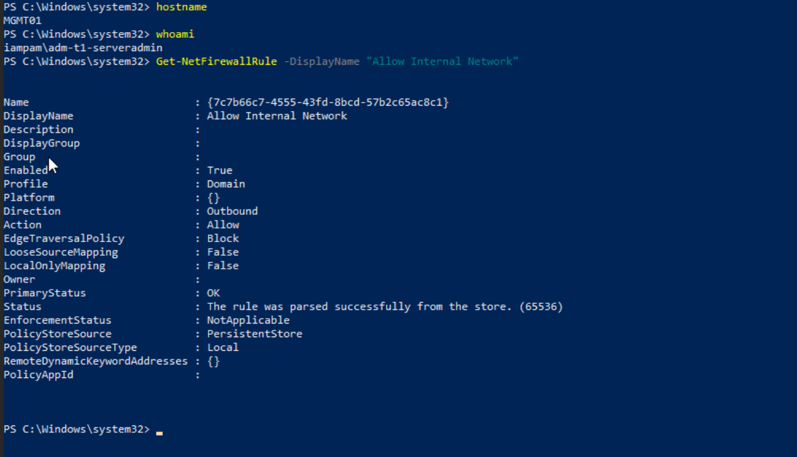
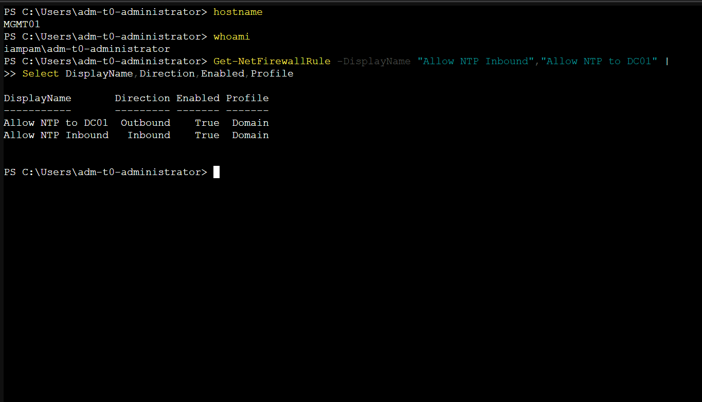
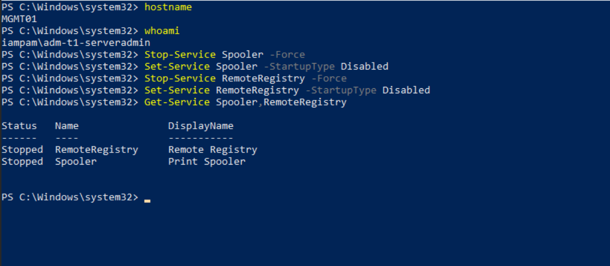
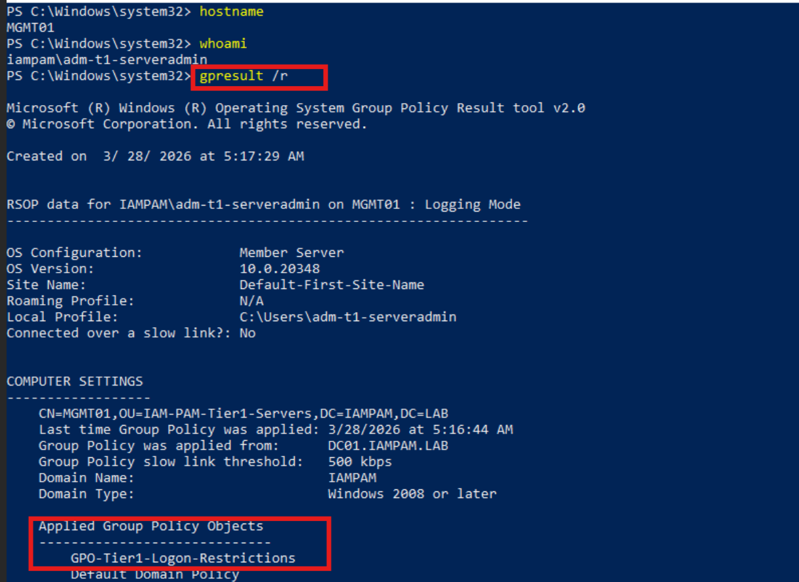
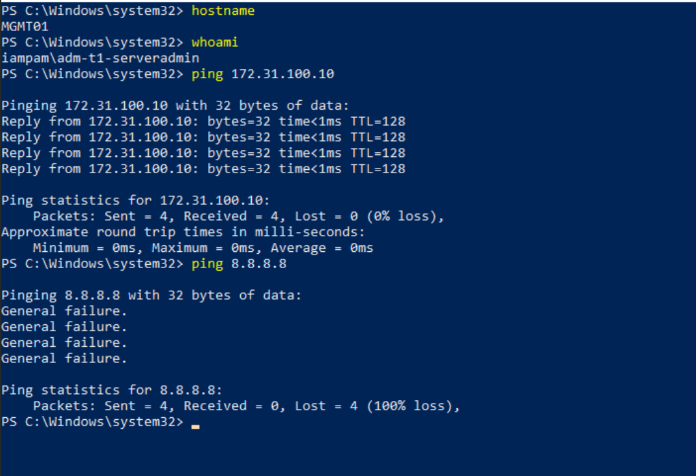

← [Back to Main README](../README.md)


# Module 03: Administrative Workstation Model

**Module**: 03 - Administrative Workstation Model
**Status**: ✅ COMPLETE (Privileged Access Workstation Implemented & Validated)
**Built by**: Edward E. Spence
**Completed**: March 2026
**Purpose**: Establish MGMT01 as a Privileged Access Workstation (PAW) within the IAMPAM.LAB environment by enforcing strict administrative session isolation, restricting privileged access to a hardened workstation, and preventing credential exposure from lower-tier systems.

---

## Module Objective

The objective of this module is to establish **MGMT01 as a Privileged Access Workstation (PAW)** and enforce strict isolation of privileged administrative activities within the IAMPAM.LAB environment.

This module ensures:

* Privileged identities are used exclusively from MGMT01
* Standard user systems (CLIENT01) cannot execute privileged operations
* Administrative sessions occur only within a hardened workstation boundary

---

## Implementation Overview

MGMT01 (**172.31.100.20**) is configured as a **Tier 0/1 Privileged Access Workstation (PAW)** by implementing:

* Tier-based logon restrictions via GPO
* Denial of privileged access from CLIENT01
* Local administrator scope reduction
* Host hardening (service reduction)
* Firewall enforcement with outbound restriction
* Internal-only communication model

---

## Systems Involved

| System     | Role                          | IP Address    |
| ---------- | ----------------------------- | ------------- |
| DC01       | Domain Controller             | 172.31.100.10 |
| MGMT01     | Privileged Access Workstation | 172.31.100.20 |
| CLIENT01   | Standard User Workstation     | 172.31.100.30 |
| PAMVAULT01 | Secrets Vault                 | 172.31.100.70 |
| DELINEA01  | Privileged Access Platform    | 172.31.100.80 |
| SIEM01     | SIEM (Splunk)                 | 172.31.100.60 |

---

## Time Synchronization Consideration (PAW Constraint)

As part of the Privileged Access Workstation (PAW) hardening process, MGMT01 enforces strict outbound network restrictions, limiting communication to the internal subnet only.

This control prevents MGMT01 from maintaining a reliable external Network Time Protocol (NTP) source.

### Impact

Because MGMT01 cannot reach external NTP services (e.g., pool.ntp.org), it cannot function as a root time source within the environment.

To maintain consistent time synchronization required for Kerberos authentication and identity operations, the time hierarchy is adjusted as follows:

DC01 (Authoritative Time Source)
  ↓
MGMT01 (PAW - Time Consumer and Relay)
  ↓
Managed Systems (Domain-Joined Systems)

### Design Justification

* The Domain Controller (DC01), specifically the PDC Emulator role, acts as the authoritative time source within the domain.
* MGMT01, as a hardened PAW, consumes time from DC01 and relays time to downstream systems.
* This ensures:

  * Kerberos ticket validity
  * Consistent authentication behavior
  * Elimination of circular NTP dependencies

### Security Alignment

This approach aligns with:

* Microsoft Active Directory time hierarchy requirements
* Zero Trust principles (restricted outbound communication)
* Privileged Access Workstation (PAW) isolation model

---

### 🟦 Implementation Note — Windows Time Service Configuration

In order for MGMT01 to function as a time relay within the environment, the Windows Time Service must be configured to both synchronize with the domain controller and serve time to downstream systems.

This requires enabling the NTP server provider and designating the system as a reliable time source.

Reference Commands:

```powershell id="n4m7q2"
w32tm /config /manualpeerlist:"172.31.100.10" /syncfromflags:manual /update
w32tm /config /reliable:yes /update

reg add HKLM\SYSTEM\CurrentControlSet\Services\W32Time\TimeProviders\NtpServer /v Enabled /t REG_DWORD /d 1 /f
reg add HKLM\SYSTEM\CurrentControlSet\Services\W32Time\TimeProviders\NtpServer /v InputProvider /t REG_DWORD /d 0 /f

net stop w32time
net start w32time
```

Validation:

```powershell id="u8c5r1"
w32tm /query /status
w32tm /query /source
w32tm /query /configuration
```

This ensures MGMT01 operates as both an NTP client (synchronizing from DC01) and an NTP server (serving time to managed systems), maintaining a consistent and trusted time hierarchy across the environment.

---

## Security Significance

This control mitigates:

* Credential harvesting from compromised endpoints
* Pass-the-Hash / Pass-the-Ticket attacks
* Phishing-based administrative compromise
* Lateral movement from Tier 2 systems

**Enterprise Alignment:**

* Microsoft Tiered Administration Model
* CyberArk Secure Workstation model
* BeyondTrust session isolation architecture

---

## PAW Enforcement — MITRE ATT&CK Alignment

| Control                              | Threat Mitigated         | MITRE Technique |
| ------------------------------------ | ------------------------ | --------------- |
| Logon Restriction (Tier Enforcement) | Lateral Movement         | T1021           |
| Deny Logon from CLIENT01             | Valid Account Abuse      | T1078           |
| Outbound Internet Restriction        | Command & Control        | T1071           |
| Service Hardening                    | Defense Evasion          | T1562.001       |
| Firewall Enforcement                 | Network Boundary Control | T1599           |

---

# IMPLEMENTATION — PAW ACCESS CONTROLS

---

## Step 1 — Restrict Local Administrators (MGMT01)

Run on MGMT01:

```powershell id="b7v2d9"
Remove-LocalGroupMember -Group "Administrators" -Member "IAMPAM\Domain Admins"
```

Verify:

```powershell id="k3f8p1"
Get-LocalGroupMember Administrators
```

Expected:

* PAM-Tier0-Admins
* PAM-Tier1-Admins
* Local Administrator

---

## Step 2 — Enforce Tier-Based Logon (GPO)

Configured in Module 02:

* GPO-Tier1-Logon-Restrictions applied to MGMT01
* GPO-Tier2-Logon-Restrictions applied to CLIENT01

---

## Step 3 — Validate PAW Access

### MGMT01 Login (Allowed)

Login using:

IAMPAM\adm-t1-serveradmin



---

### CLIENT01 Login (Blocked)

Attempt login:

IAMPAM\adm-t1-serveradmin

Expected:

The sign-in method you're trying to use isn't allowed


---

# MGMT01 — PAW HARDENING

---

## Step 4 — Enable Windows Firewall

```powershell id="r6h4w8"
Set-NetFirewallProfile -Profile Domain,Private,Public -Enabled True
```



---

## Step 5 — Enforce Outbound Restriction (CRITICAL CONTROL)

```powershell id="m2x9c7"
Set-NetFirewallProfile -Profile Domain -DefaultOutboundAction Block
```

Verify:

```powershell id="q1l7z5"
Get-NetFirewallProfile | Select Name, Enabled, DefaultOutboundAction
```

Expected:

Domain   True   Block



---

## Step 6 — Allow Internal Network Only

```powershell id="t8n3y6"
New-NetFirewallRule -DisplayName "Allow Internal Network" `
  -Direction Outbound `
  -Action Allow `
  -RemoteAddress 172.31.100.0/24 `
  -Profile Domain
```

Verify:

```powershell id="j5s4u2"
Get-NetFirewallRule -DisplayName "Allow Internal Network"
```



---

## Step 7 — Allow NTP for Time Synchronization (PAW Constraint)

As MGMT01 enforces a default outbound block policy, explicit firewall rules are required to support internal time synchronization.

These rules allow MGMT01 to:

* Synchronize time with the domain controller (DC01)
* Serve time to downstream managed systems

### Allow NTP Inbound (Client Systems → MGMT01)

```powershell id="f9a6k3"
New-NetFirewallRule -DisplayName "Allow NTP Inbound" `
  -Direction Inbound `
  -Protocol UDP `
  -LocalPort 123 `
  -Action Allow `
  -Profile Domain
```

Verify:

```powershell id="v4r1m8"
Get-NetFirewallRule -DisplayName "Allow NTP Inbound"
```

---

### Allow NTP Outbound to DC01 (MGMT01 → DC01)

```powershell id="c7p2e9"
New-NetFirewallRule -DisplayName "Allow NTP to DC01" `
  -Direction Outbound `
  -Protocol UDP `
  -RemoteAddress 172.31.100.10 `
  -RemotePort 123 `
  -Action Allow `
  -Profile Domain
```

---

### Control Justification

These rules are required due to the enforced outbound restriction on the PAW.

Without explicit NTP allowances:

* MGMT01 cannot synchronize with DC01
* Downstream systems cannot synchronize with MGMT01
* Kerberos authentication reliability is impacted

This maintains secure time synchronization while preserving the PAW’s restricted network posture.



---

## Step 8 — Disable Non-Essential Services

```powershell id="x3d8b1"
Stop-Service Spooler -Force
Set-Service Spooler -StartupType Disabled

Stop-Service RemoteRegistry -Force
Set-Service RemoteRegistry -StartupType Disabled
```

Verify:

```powershell id="p6g5n4"
Get-Service Spooler,RemoteRegistry
```



---

## Step 9 — Validate GPO Enforcement

```powershell id="w2k9q7"
gpresult /r
```

Confirm:

GPO-Tier1-Logon-Restrictions



---

# VALIDATION — NETWORK ENFORCEMENT

---

## Step 10 — Connectivity Testing

```powershell id="s1h6y3"
ping 172.31.100.10
ping 8.8.8.8
```

Expected:

* Internal → SUCCESS
* Internet → FAILURE



---

# LAB COMPLETE WHEN

* Privileged logins succeed ONLY on MGMT01
* Privileged logins fail on CLIENT01
* Local admin group restricted to PAM groups
* Firewall enabled across profiles
* Default outbound set to Block
* Internal subnet explicitly allowed
* Internet access blocked
* Non-essential services disabled
* GPO enforcement validated

---

# SUPPORTING DOCUMENT

---

## architecture/PAW-DESIGN.md

This document defines:

* PAW security model
* Credential isolation strategy
* Administrative session containment
* Threat reduction from phishing, malware, and credential theft

---

**E.E. Spence — PAM Engineering | IAMPAM.LAB**
