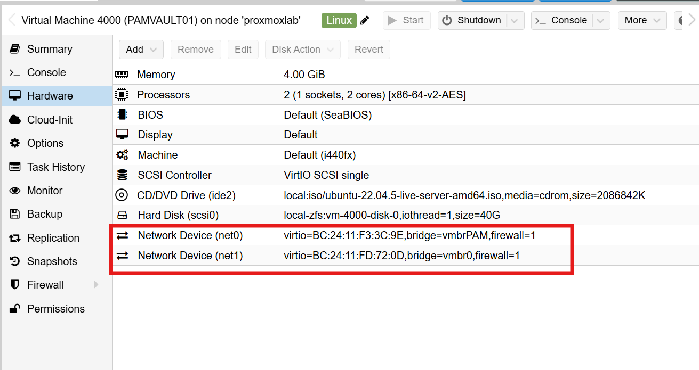
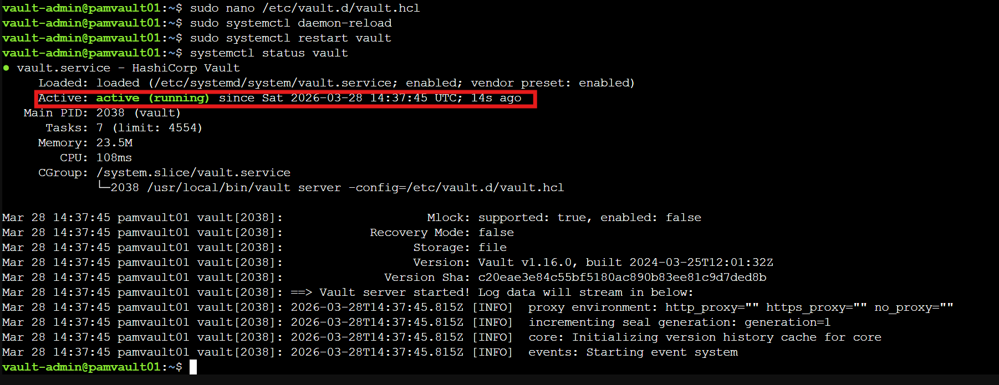
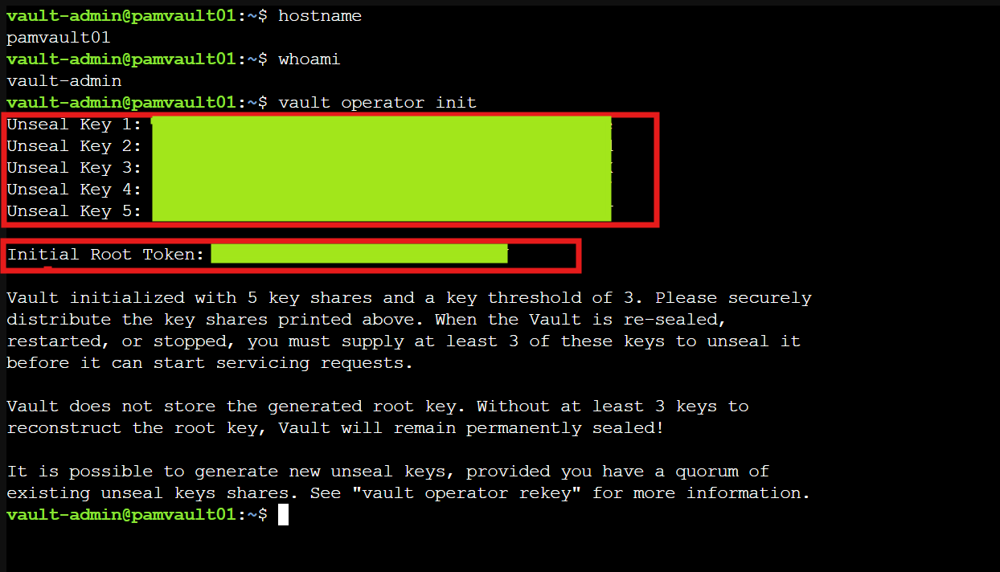
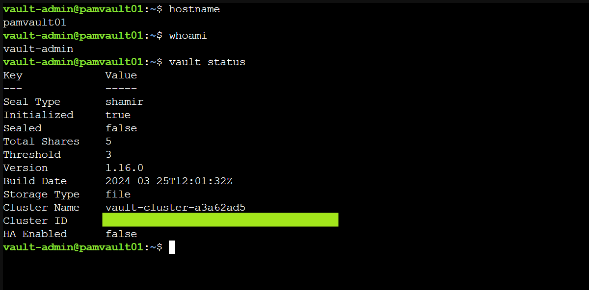
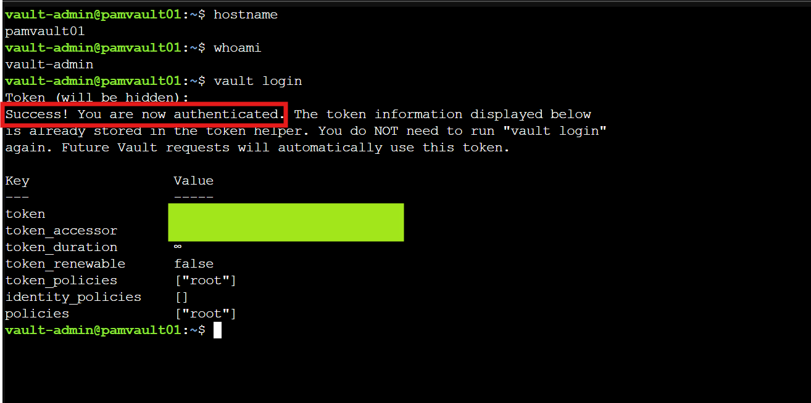
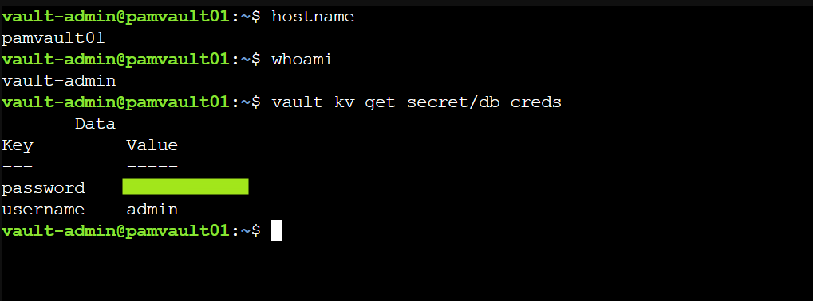
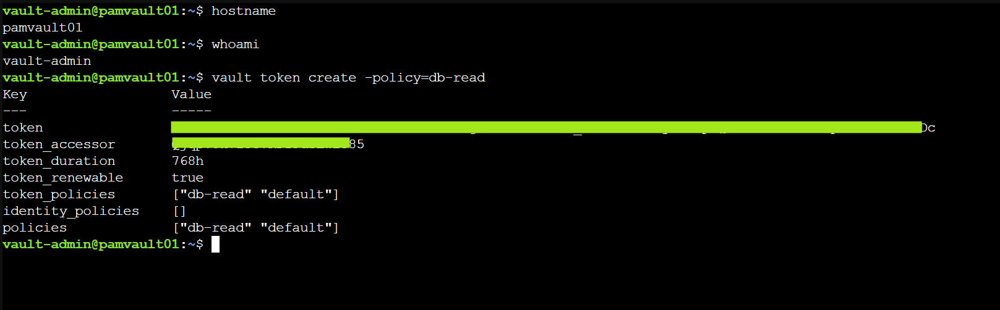

← [Back to Main README](../README.md)

# Module 04: Privileged Credential Vault

**Module**: 04 - Privileged Credential Vault
**Status**: ✅ COMPLETE (Credential Vault Deployment & Access Control Validated)
**Built by**: Edward E. Spence
**Completed**: March 2026
**Purpose**: Introduce a dedicated privileged credential vault layer within the IAMPAM.LAB environment using HashiCorp Vault 1.16 OSS to securely store, control, and audit access to privileged credentials while aligning with enterprise PAM vaulting architectures.

---

## Module Objective

The objective of this module is to introduce a dedicated privileged credential vault layer into the **IAMPAM.LAB** environment using **HashiCorp Vault 1.16 OSS**.

This vault acts as the authoritative control point for:

* privileged credential storage
* controlled credential retrieval
* audit visibility of access events

The implementation aligns with enterprise PAM design patterns used by platforms such as CyberArk, Delinea, and BeyondTrust.

---

## Implementation Overview

A new VM named **PAMVAULT01** is provisioned within the segmented PAM network:

* Hostname: PAMVAULT01
* IP Address: 172.31.100.70
* OS: Ubuntu Server 22.04 LTS

Vault is deployed in standalone mode for lab purposes and provides:

* KV secrets storage
* access control enforcement
* audit logging for credential access

---

## Security Significance

Separating credential storage from identity systems:

* prevents credential exposure during domain compromise
* eliminates plaintext credential storage risks
* enforces controlled retrieval patterns
* introduces full auditability of privileged access

This mirrors enterprise PAM vault isolation principles.

---

## Vault Implementation — MITRE ATT&CK Alignment

| Control                    | Threat Mitigated          | MITRE Technique |
| -------------------------- | ------------------------- | --------------- |
| Credential Vaulting        | Unsecured Credentials     | T1552           |
| Tiered Secret Paths        | Credential Access         | T1003           |
| Audit Logging              | Defense Evasion Detection | T1562           |
| Access Control Enforcement | Valid Account Abuse       | T1078           |
| Vault Isolation            | Lateral Movement          | T1021           |

---

# SECTION 1 — VM BUILD (PAMVAULT01)

## VM Purpose

Dedicated credential vault host for privileged secrets.

---

## Static IP Configuration

sudo nano /etc/netplan/00-installer-config.yaml

network:
version: 2
ethernets:
ens18:
addresses:

* 172.31.100.70/24
  gateway4: 172.31.100.1
  nameservers:
  addresses:
* 172.31.100.10

Apply:

sudo netplan apply

---

## Hostname Configuration

sudo hostnamectl set-hostname PAMVAULT01

---

## OpenSSH Verification

sudo systemctl status ssh

---

## Firewall Configuration

sudo ufw allow OpenSSH
sudo ufw allow 8200/tcp
sudo ufw enable

---

## Architectural Note — Temporary Build Network Access

A secondary NIC was temporarily attached during the build phase to allow outbound internet access for package installation.

Primary Interface:

* ens18 → vmbrPAM (172.31.100.0/24)

Temporary Interface:

* ens19 → vmbr0 (192.168.8.0/24)

This interface is intended to be removed after deployment to maintain vault isolation.

---

# SECTION 2 — HASHICORP VAULT INSTALLATION

## Download Vault

wget https://releases.hashicorp.com/vault/1.16.0/vault_1.16.0_linux_amd64.zip

sudo apt install unzip -y
unzip vault_1.16.0_linux_amd64.zip
sudo mv vault /usr/local/bin/

Verify:

vault version

---

## Create Vault User

sudo useradd --system --home /etc/vault.d --shell /bin/false vault

---

## Directory Setup

sudo mkdir -p /etc/vault.d
sudo mkdir -p /opt/vault/data
sudo chown -R vault:vault /etc/vault.d /opt/vault
sudo chmod 750 /etc/vault.d /opt/vault

---

## Vault Configuration

sudo nano /etc/vault.d/vault.hcl

storage "file" {
path = "/opt/vault/data"
}

listener "tcp" {
address     = "0.0.0.0:8200"
tls_disable = 1
}

disable_mlock = true
ui = true

---

## Systemd Service

sudo nano /etc/systemd/system/vault.service

[Unit]
Description=HashiCorp Vault
After=network.target

[Service]
User=vault
Group=vault
ExecStart=/usr/local/bin/vault server -config=/etc/vault.d/vault.hcl
Restart=on-failure

[Install]
WantedBy=multi-user.target

---

## Start Vault

sudo systemctl daemon-reexec
sudo systemctl daemon-reload
sudo systemctl enable vault
sudo systemctl start vault

Verify:

sudo systemctl status vault

---

## Environment Variable

export VAULT_ADDR="http://127.0.0.1:8200"

---

## Initialize Vault

vault operator init

Securely store:

* Unseal Keys
* Root Token

---

## Unseal Vault

vault operator unseal

(Repeat until threshold met)

---

## Login

vault login

---

# SECTION 3 — SECRETS MANAGEMENT

## Enable KV Engine

vault secrets enable -path=secret kv

---

## Store Credential

vault kv put secret/db-creds username=admin password=<REDACTED-LAB-SECRET>

---

## Retrieve Credential

vault kv get secret/db-creds

---

# SECTION 4 — POLICY & ACCESS CONTROL

## Create Policy File

nano db-policy.hcl

path "secret/data/db-creds" {
capabilities = ["read"]
}

---

## Apply Policy

vault policy write db-read db-policy.hcl

---

## Create Token

vault token create -policy=db-read

---

# VALIDATION

vault status

Expected:

* Initialized: true
* Sealed: false

sudo systemctl status vault

Expected:

* active (running)

---

# SCREENSHOT EVIDENCE

## Module 04 — Build & Deployment Evidence

| Step | Description                    | Filename                                       |
| ---- | ------------------------------ | ---------------------------------------------- |
| 01   | Proxmox VM Created             | module04-01-proxmox-vm-created.png             |
| 02   | Ubuntu Installation Complete   | module04-02-ubuntu-install-complete.png        |
| 03   | Static IP Configured           | module04-03-static-ip-configured.png           |
| 04   | SSH Connectivity Verified      | module04-04-ssh-connectivity-validated.png     |
| 05   | Dual NIC Configuration         | module04-05-dual-nic-configuration.png         |
| 06   | Internet Connectivity Verified | module04-06-internet-connectivity-verified.png |
| 07   | Static Dual NIC Configuration  | module04-07-static-dual-nic-config.png         |
| 08   | Vault Binary Installed         | module04-08-vault-binary-installed.png         |
| 09   | Vault User Created             | module04-09-vault-user-created.png             |
| 10   | Vault Directories Created      | module04-10-vault-directories-created.png      |
| 11   | Vault Config Created           | module04-11-vault-config-created.png           |
| 12   | Vault Service Created          | module04-12-vault-service-created.png          |
| 13   | Vault Service Running          | module04-13-vault-service-running.png          |
| 14   | VAULT_ADDR Set                 | module04-14-vault-env-set.png                  |
| 15   | Vault Initialized              | module04-15-vault-initialized.png              |
| 15b  | Vault Unseal Progress          | module04-15b-vault-unseal-progress.png         |
| 16   | Vault Unsealed                 | module04-16-vault-unsealed.png                 |
| 17   | Vault Login Success            | module04-17-vault-login-success.png            |
| 18   | KV Engine Enabled              | module04-18-secrets-engine-enabled.png         |
| 19   | Secret Written                 | module04-19-secret-written.png                 |
| 20   | Secret Retrieved               | module04-20-secret-retrieved.png               |
| 21   | Policy Created                 | module04-21-policy-created.png                 |
| 22   | Token Created                  | module04-22-token-created.png                  |

---

## Screenshot Directory

../screenshot/module-04/

---

# LAB COMPLETE WHEN

* Vault installed and running
* Vault initialized and unsealed
* KV secrets engine enabled
* Credentials stored and retrieved
* Access policy created
* Token-based access validated

---

## Operational Considerations

* TLS disabled (lab only)
* mlock disabled for compatibility
* root token should be rotated or revoked
* secrets should be periodically rotated

---

## Enterprise Mapping

| Capability          | Lab Implementation | Enterprise Equivalent |
| ------------------- | ------------------ | --------------------- |
| Credential Vaulting | Vault KV engine    | CyberArk Safe         |
| Access Logging      | Vault logs         | Session recording     |
| Segmentation        | Tiered paths       | PAM zones             |
| Access Control      | Vault policies     | RBAC / Just-In-Time   |

---

**E.E. Spence — PAM Engineering | IAMPAM.LAB**
