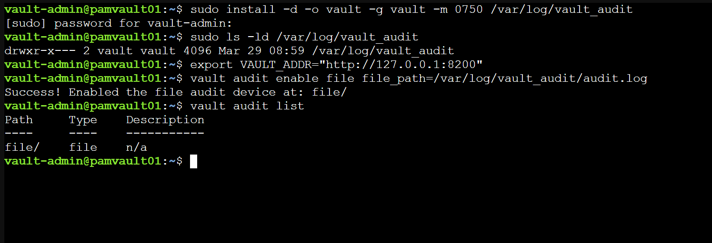
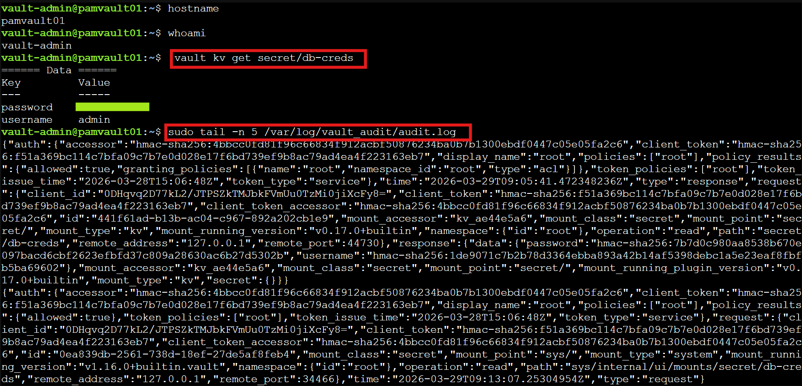
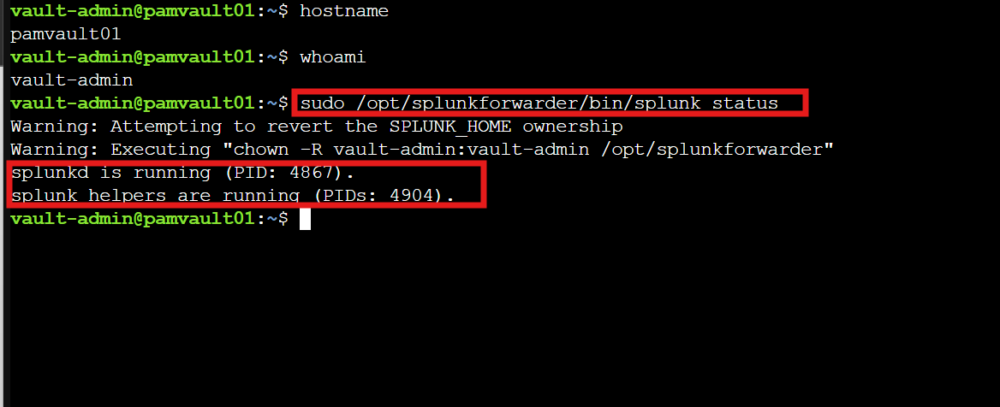
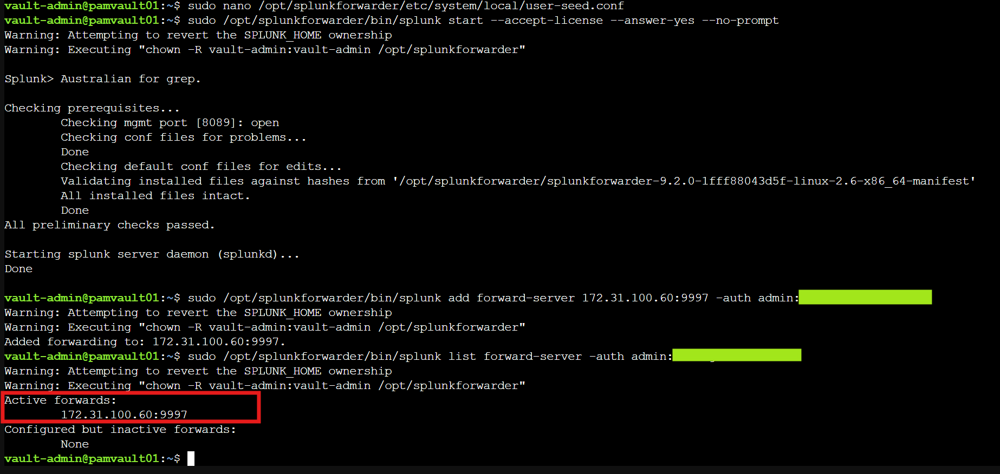
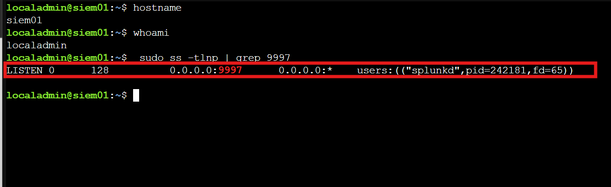
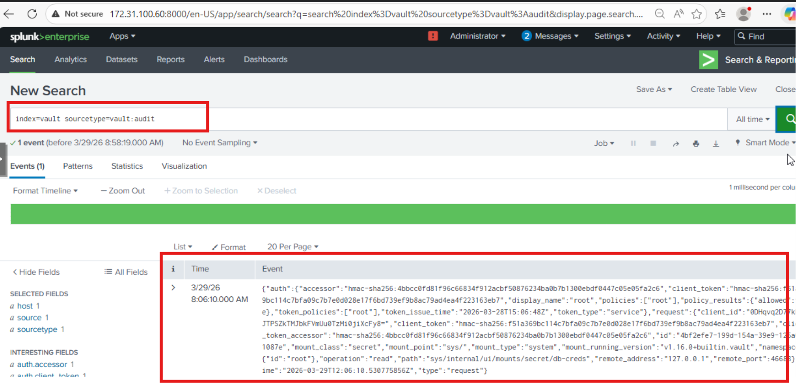
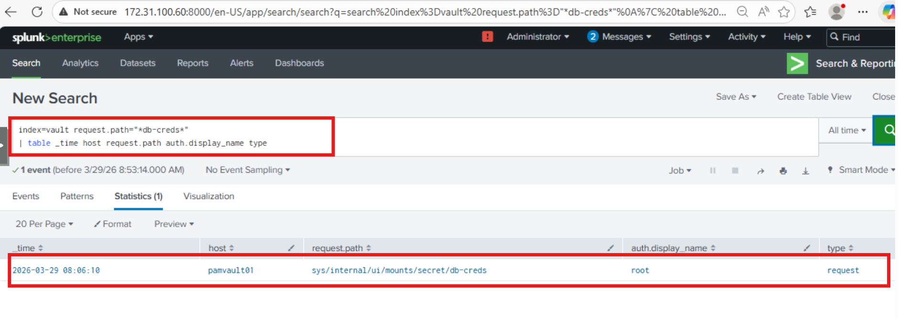
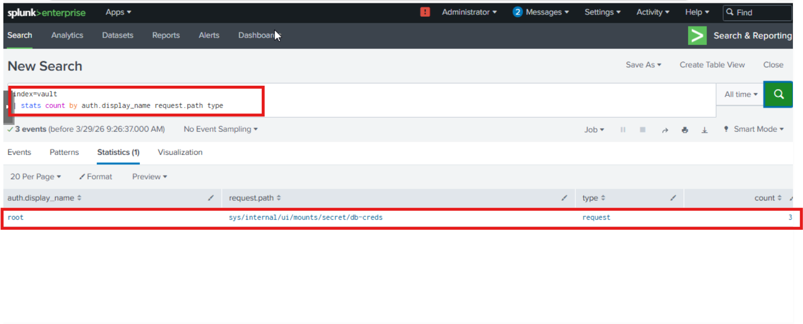
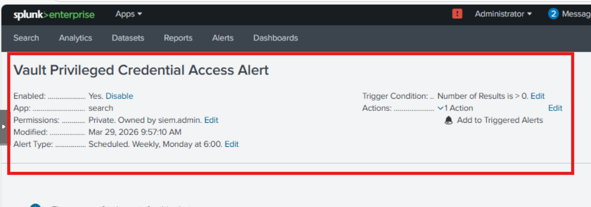

← [Back to Main README](../README.md)


# Module 05: Privileged Access Monitoring and Auditing

**Module**: 05 - Privileged Access Monitoring and Auditing
**Status**: ✅ COMPLETE (Privileged Activity Monitoring & Detection Validated)
**Built by**: Edward E. Spence
**Completed**: March 2026
**Purpose**: Establish centralized monitoring and auditing of privileged credential activity within the IAMPAM.LAB environment by enabling Vault audit logging, forwarding logs to Splunk Enterprise, and implementing detection queries and alerting for credential access events.

---

## Monitoring Implementation — MITRE ATT&CK Alignment

| Control                    | Threat Mitigated            | MITRE Technique |
| -------------------------- | --------------------------- | --------------- |
| Vault Audit Logging        | Credential Access Detection | T1003           |
| Splunk UF Ingestion        | Defense Evasion Detection   | T1562           |
| Credential Retrieval Query | Valid Account Abuse         | T1078           |
| High Frequency Detection   | Brute Force Detection       | T1110           |
| Centralized Log Pipeline   | Indicator Removal           | T1070           |

---

# Module Objective

The objective of this module is to establish centralized monitoring and auditing of privileged credential activity within the IAMPAM.LAB environment.

This is achieved by enabling audit logging on HashiCorp Vault (PAMVAULT01) and forwarding those logs to Splunk Enterprise (SIEM01) using the Splunk Universal Forwarder.

This module ensures that privileged credential access is:

• Logged
• Forwarded
• Indexed
• Searchable
• Alertable

---

# Implementation Overview

Vault audit logs are written locally on PAMVAULT01 using the file audit device. These logs are monitored and forwarded directly to Splunk Enterprise using the Splunk Universal Forwarder over TCP port 9997.

**Log Pipeline**

PAMVAULT01 → Splunk Universal Forwarder → SIEM01 → Splunk Index (vault)

---

# Systems Involved

| System     | Role                   | IP Address    |
| ---------- | ---------------------- | ------------- |
| PAMVAULT01 | Vault Audit Source     | 172.31.100.70 |
| SIEM01     | Splunk Enterprise SIEM | 172.31.100.60 |

---

# Security Significance

Privileged credential usage must be monitored to maintain visibility into identity-based attack paths.

---

# ⚠️ Lab Note

Passwords and credentials shown in this module are for lab use only.

**Replace with secure credential handling in production environments.**

---

# Section 1 — Vault Audit Logging

## Step 1 — Create Audit Directory

```bash
sudo mkdir -p /var/log/vault_audit
sudo chown vault:vault /var/log/vault_audit
sudo chmod 750 /var/log/vault_audit
```

---

## Step 2 — Enable Audit Logging

```bash
export VAULT_ADDR="http://127.0.0.1:8200"
vault audit enable file file_path=/var/log/vault_audit/audit.log
```



---

## Step 3 — Generate Audit Event

```bash
vault kv get secret/db-creds
```

---

## Step 4 — Validate Audit Log Output

```bash
sudo tail -n 5 /var/log/vault_audit/audit.log
```



---

# Section 2 — Splunk Universal Forwarder (PAMVAULT01)

## Step 1 — Initialize Forwarder

```bash
sudo nano /opt/splunkforwarder/etc/system/local/user-seed.conf
```

```ini
[user_info]
USERNAME = admin
PASSWORD = <secure-password>
```

---

## Step 2 — Start Forwarder

```bash
sudo /opt/splunkforwarder/bin/splunk start --accept-license --answer-yes --no-prompt
```



---

## Step 3 — Configure Forwarding

```bash
sudo /opt/splunkforwarder/bin/splunk add forward-server 172.31.100.60:9997 -auth admin:<secure-password>
```



---

## Step 4 — Monitor Vault Logs

```bash
sudo /opt/splunkforwarder/bin/splunk add monitor /var/log/vault_audit/audit.log -sourcetype vault:audit -index vault -auth admin:<secure-password>
```


---

## Step 5 — Verify Forwarder

```bash
sudo /opt/splunkforwarder/bin/splunk list forward-server -auth admin:<secure-password>
sudo /opt/splunkforwarder/bin/splunk list monitor -auth admin:<secure-password>
```

---

# Section 3 — Splunk Configuration (SIEM01)

## Step 1 — Enable Receiver

```bash
sudo /opt/splunk/bin/splunk enable listen 9997 -auth siem.admin:<secure-password>
```

---

## Step 2 — Create Index

```bash
sudo /opt/splunk/bin/splunk add index vault -auth siem.admin:<secure-password>
```

---

## Step 3 — Restart Splunk

```bash
sudo /opt/splunk/bin/splunk restart
```



---

## Step 4 — Validate Ingestion

```spl
index=vault
```



---

# Section 4 — Detection Queries

## Credential Access Detection

```spl
index=vault request.path="*db-creds*"
| table _time host request.path auth.display_name type
```



---

## Identity Activity Visibility

```spl
index=vault
| stats count by auth.display_name request.path type
```



---

# Section 5 — Saved Splunk Alert

## Alert Name

Vault Privileged Credential Access Alert

---

## Alert Search

```spl
index=vault request.path="*db-creds*"
```

---

## Alert Configuration

• Trigger: Number of Results > 0
• Time Range: All Time
• Severity: High
• Action: Add to Triggered Alerts



---

# Section 6 — Screenshot Evidence

| Description         | Filename                                      |
| ------------------- | --------------------------------------------- |
| Vault audit enabled | module05-01-vault-audit-enabled.png           |
| Audit log output    | module05-02-vault-audit-log-output.png        |
| Splunk status       | module05-03-splunk-status-verified.png        |
| Splunk receiver     | module05-04-splunk-receiver-9997.png          |
| UF installed        | module05-05-universal-forwarder-installed.png |
| Forwarder connected | module05-06-forwarder-connected.png           |
| Vault logs in SIEM  | module05-07-vault-logs-in-splunk.png          |
| Detection query     | module05-08-credential-detection-query.png    |
| Visibility stats    | module05-09-identity-access-visibility.png    |
| Alert created       | module05-10-vault-alert-created.png           |

---

## Screenshot Paths

**GitHub Relative Path**

```
../screenshot/module-05/
```

**Local Lab Path**

```
C:\Users\Admin\Documents\IAM-Privileged-Access-Engineering\screenshot\module-05
```

---

# Lab Complete When

• Vault audit logging enabled
• Universal Forwarder running
• Logs forwarded to SIEM01
• Events visible in Splunk
• Detection queries return results
• Alert triggers

---

# Engineering Notes

• Vault audit logs are JSON formatted
• Splunk automatically extracts fields
• UF provides reliable ingestion
• Direct forwarding preferred over syslog

---

**E.E. Spence — PAM Engineering | IAMPAM.LAB**

---
