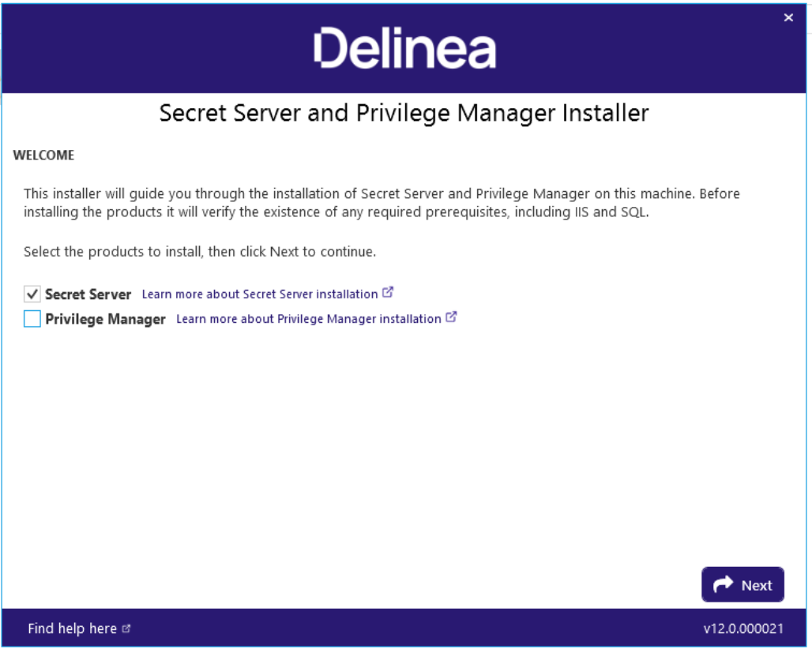
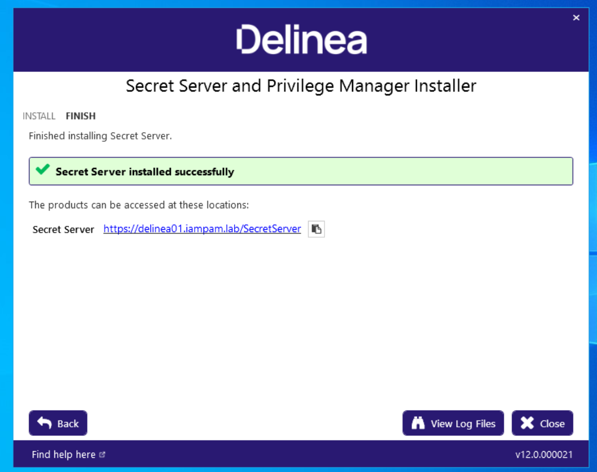
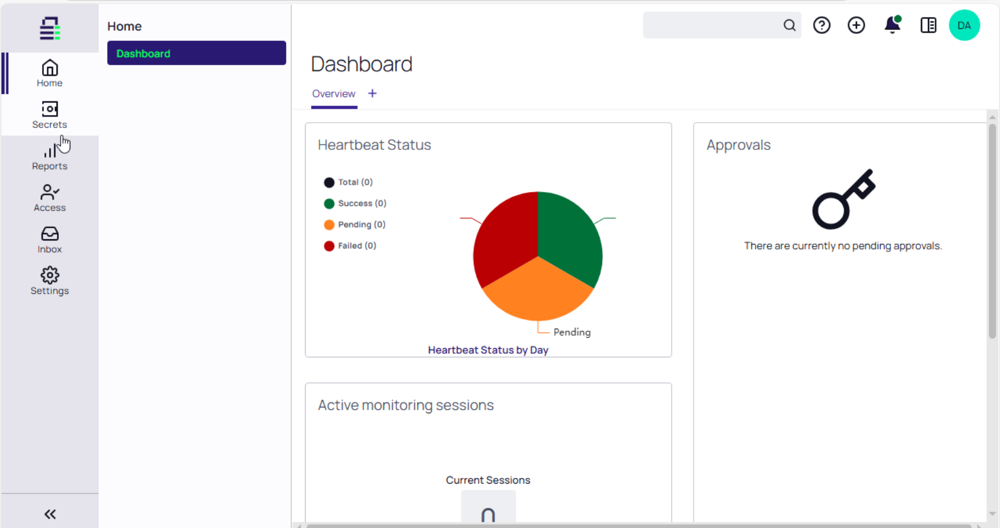
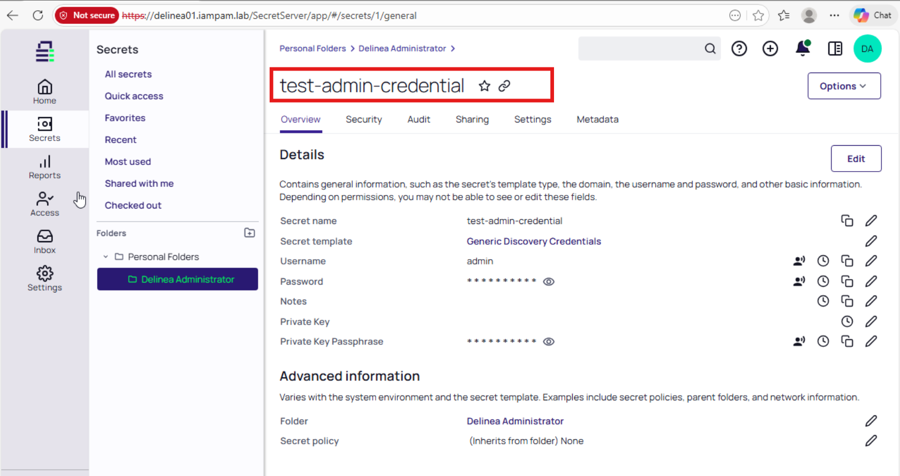

← [Back to Main README](../README.md)


# Module 06: Delinea Secret Server Deployment and Integration

**Module**: 06 - Delinea Secret Server Deployment and Integration
**Status**: ✅ COMPLETE (Credential Management Platform Deployed & Validated)
**Built by**: Edward E. Spence
**Completed**: March 2026
**Purpose**: Deploy and integrate Delinea Secret Server within the IAMPAM.LAB environment to provide centralized privileged credential management, secure storage, and controlled access to secrets using IIS and SQL Server Express.

---

## 1. Objective

Deploy Delinea Secret Server within the IAMPAM.LAB environment using SQL Server Express and IIS, and validate full application functionality through credential storage and retrieval.

---

## 2. Scope

This module covers:

* IIS prerequisite configuration
* SQL Server Express validation
* Delinea Secret Server installation
* Application configuration and access
* Functional validation through secret creation

---

## 3. Architecture Context

This deployment integrates into the lab as the centralized privileged credential management system.

* IIS hosts the web application
* SQL Server Express stores secrets and metadata
* Delinea Secret Server provides credential management and access control

---

## 4. Prerequisite Dependencies

This module relies on the following runbooks:

* [sql-express-deployment](../runbook/sql-express-deployment.md)
* [windows-iis-prerequisites](../runbook/windows-iis-prerequisites.md)
* [delinea-secret-server-installation](../runbook/delinea-secret-server-installation.md)

All prerequisite configurations must be completed prior to installation.

---

## 5. Key Configuration Requirements

### SQL Server

* Instance: `DELINEA01\SQLEXPRESS`
* Collation: `SQL_Latin1_General_CP1_CI_AS`
* Authentication: Mixed Mode

### IIS

* Default Web Site configured
* HTTPS binding present (port 443)
* Required WCF and WAS features installed

### Application Requirement

SQL CLR must be enabled prior to installation:

```powershell
sqlcmd -S DELINEA01\SQLEXPRESS -E -Q "EXEC sp_configure 'show advanced options', 1; RECONFIGURE; EXEC sp_configure 'clr enabled', 1; RECONFIGURE;"
```

---

## 6. Installation Summary

Delinea Secret Server was deployed using the following configuration:

* SQL Server: `DELINEA01\SQLEXPRESS`
* Database: `SecretServer`
* Authentication: Windows Authentication
* IIS Site: Default Web Site
* Application Path: `/SecretServer`
* Service Account: `IAMPAM\Administrator`

The installation completed successfully with no configuration errors.

### Installation Evidence





---

## 7. Validation

Validation confirms that the system is not only installed, but operational.

### Application Access

* URL: `https://delinea01.iampam.lab/SecretServer`
* Login successful using configured administrator account

### Functional Validation

* Secret successfully created using Generic Account template
* Stored credentials retrievable within application

This confirms:

* database connectivity
* encryption functionality
* application logic
* UI accessibility

### Validation Evidence





---

## 8. Screenshot Evidence

| Description                       | Filename                                                                |
| --------------------------------- | ----------------------------------------------------------------------- |
| Proxmox VM specifications         | [View](../screenshot/module-06/module06-00-proxmox-specs.png)           |
| IP configuration                  | [View](../screenshot/module-06/module06-01-ip-config.png)               |
| Domain join verification          | [View](../screenshot/module-06/module06-02-domain-joined.png)           |
| DNS resolution                    | [View](../screenshot/module-06/module06-03-dns-resolution.png)          |
| Port validation                   | [View](../screenshot/module-06/module06-04-port-validation.png)         |
| .NET installation                 | [View](../screenshot/module-06/module06-05-dotnet-installed.png)        |
| IIS installation                  | [View](../screenshot/module-06/module06-06-iis-installed.png)           |
| SQL Server installation           | [View](../screenshot/module-06/module06-07-sql-installed.png)           |
| Delinea installer interface       | [View](../screenshot/module-06/module06-08-delinea-portal.png)          |
| Installation success confirmation | [View](../screenshot/module-06/module06-09-delinea-install-success.png) |
| Delinea dashboard (logged-in)     | [View](../screenshot/module-06/module06-10-delinea-dashboard.png)       |
| Secret creation validation        | [View](../screenshot/module-06/module06-11-delinea-secret-created.png)  |

---

## 9. Key Takeaways

* Application-specific dependencies (e.g., SQL CLR) must be validated prior to installation
* IIS and SQL must be configured independently and validated before integration
* Functional validation (secret creation) is required beyond installation success
* Separation of infrastructure and application runbooks improves maintainability

---

## 10. Outcome

Delinea Secret Server is successfully deployed and operational within the IAMPAM.LAB environment.

The system is ready for:

* privileged credential storage
* access control enforcement
* integration with monitoring and automation modules

---

## Architecture Note – Community Edition Lab Constraints

This lab intentionally combines multiple PAM technologies to demonstrate enterprise privileged access management concepts within a home-lab environment.

During development, Delinea Secret Server Community/Lab capabilities did not provide all of the session management features required to demonstrate:

- Session brokering
- Session recording
- Session replay
- Command auditing

To address these limitations while preserving PAM architectural principles, JumpServer Community Edition was later integrated into the environment as a dedicated privileged session management platform.

As a result:

- Delinea Secret Server serves as the privileged credential management platform
- HashiCorp Vault serves as the privileged credential vault
- JumpServer serves as the privileged session management platform
- Splunk Enterprise provides centralized monitoring and audit visibility

This approach allows the lab to demonstrate enterprise PAM concepts that are commonly implemented through commercial platforms such as CyberArk, Delinea, BeyondTrust, and other privileged access management solutions while remaining achievable within a community-supported lab environment.

---

## 11. Troubleshooting

### Issue: IIS Prerequisite Failures

**Symptom**
Installer prerequisite checks failed.

**Root Cause**
Required IIS components (WCF, WAS, compression modules) were not fully installed.

**Resolution**
Installed full IIS feature set using Install-WindowsFeature and re-ran installer.

---

### Issue: HTTPS Binding Not Detected

**Symptom**
Installer continued to fail prerequisite validation after IIS installation.

**Root Cause**
HTTPS binding was not configured on the Default Web Site.

**Resolution**
Rebound SSL certificate to Default Web Site and verified binding with:

```powershell
Get-WebBinding -Name "Default Web Site" -Protocol https
```

---

### Issue: SQL CLR Disabled

**Symptom**
Database upgrade failed during installation.

**Root Cause**
SQL CLR was disabled on the SQL instance.

**Resolution**
Enabled CLR using sp_configure and re-ran installation.

---

### Issue: Partial Database State (Dirty Install)

**Symptom**
Reinstallation failed after initial failed deployment.

**Root Cause**
Existing partially created SecretServer database.

**Resolution**
Dropped database and reinstalled cleanly.

---

## 12. Post-Installation Notes

* The use of `IAMPAM\Administrator` as the service account is acceptable for lab environments
* In production environments, a dedicated service account with least privilege should be used
* HTTPS configuration uses a self-signed certificate; production deployments should use trusted certificates
* SQL Server Express is suitable for lab validation but not recommended for production-scale PAM deployments

---

**E.E. Spence — PAM Engineering | IAMPAM.LAB**

---
