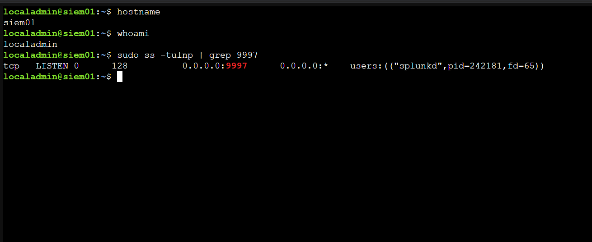
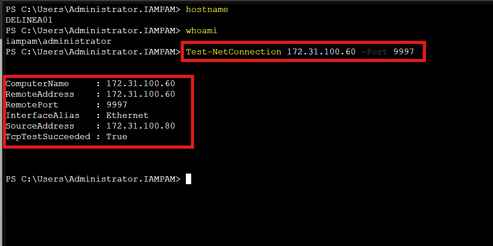
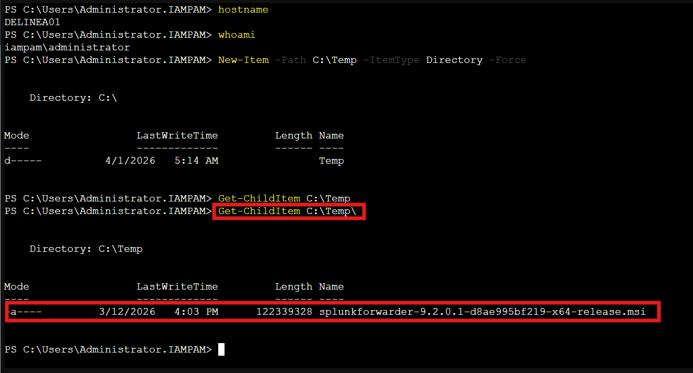
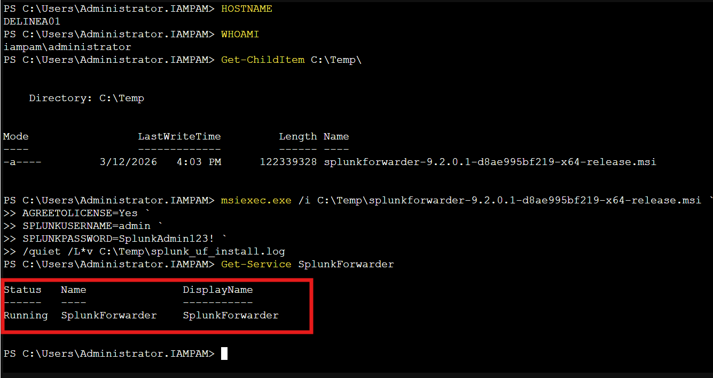
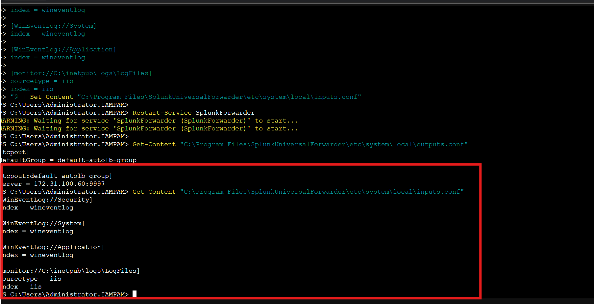
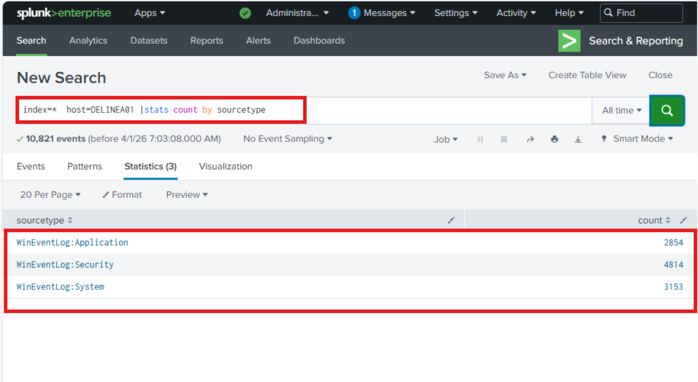
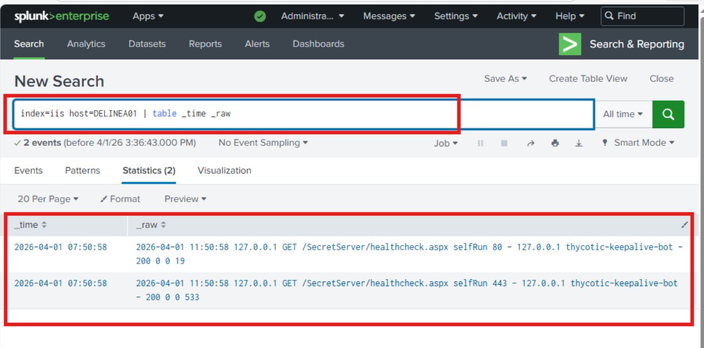
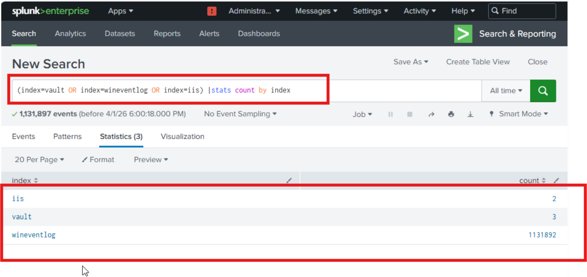
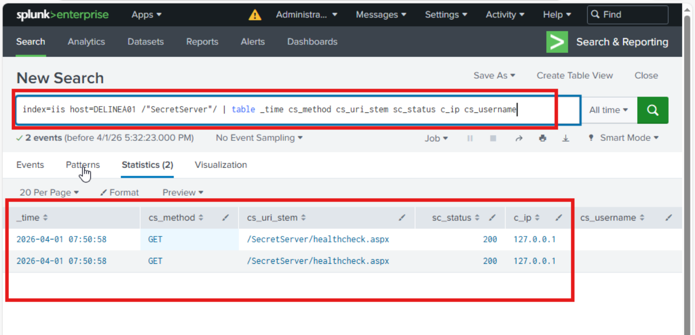

← [Back to Main README](../README.md)


# Module 07: IAM & PAM Monitoring / Incident Detection

**Module**: 07 - IAM & PAM Monitoring / Incident Detection
**Status**: ✅ COMPLETE (Cross-Platform Monitoring & Detection Validated)
**Built by**: Edward E. Spence
**Completed**: March 2026
**Purpose**: Establish centralized monitoring and incident detection for privileged access activity across Delinea Secret Server, HashiCorp Vault, IIS web activity, and Windows security events using Splunk Enterprise for cross-platform visibility and alerting.

---

## 1. Objective

Establish centralized monitoring and detection for privileged access activity across:

* Delinea Secret Server (Windows PAM)
* HashiCorp Vault (Linux PAM)
* IIS Web Activity
* Windows Security Events

---

## 2. Architecture Context

```
PAMVAULT01 → UF → SIEM01 → index=vault  
DELINEA01 → UF → SIEM01 → index=wineventlog + index=iis  
```

---

## 3. Systems

| System     | Role                | IP            |
| ---------- | ------------------- | ------------- |
| DELINEA01  | PAM (Windows + IIS) | 172.31.100.80 |
| PAMVAULT01 | Vault               | 172.31.100.70 |
| SIEM01     | Splunk              | 172.31.100.60 |
| MGMT01     | PAW                 | 172.31.100.20 |

---

## 4. Prerequisites

* Splunk installed (SIEM01)
* Port 9997 enabled
* UF installer available
* Vault logging configured (Module 05)

---

## 5. Phase A — Pre-Flight Validation

```bash
sudo ss -tulnp | grep 9997
```



---

### Verify Connectivity

```powershell
Test-NetConnection 172.31.100.60 -Port 9997
```



---

## 6. Phase B — File Transfer (VALIDATED)

### Verify Admin Share Access FIRST

```powershell
Test-Path "\\DELINEA01\C$\Temp"
```

Expected:

```plaintext
True
```

### Transfer File

```powershell
Copy-Item "C:\Software\Splunk\splunkforwarder.msi" "\\DELINEA01\C$\Temp\"
```



---

## 7. Phase C — Forwarder Installation

```powershell
msiexec /i splunkforwarder.msi `
RECEIVING_INDEXER="172.31.100.60:9997" `
AGREETOLICENSE=Yes `
/quiet
```



---

## 8. Phase D — Forwarding Configuration

### outputs.conf

```ini
[tcpout]
defaultGroup = default-autolb-group

[tcpout:default-autolb-group]
server = 172.31.100.60:9997
```

Restart:

```powershell
Restart-Service SplunkForwarder
```



---

## 9. Phase E — Inputs Configuration

```ini
[WinEventLog://Security]
index = wineventlog

[WinEventLog://System]
index = wineventlog

[WinEventLog://Application]
index = wineventlog

[monitor://C:\inetpub\logs\LogFiles]
index = iis
sourcetype = iis
```

Restart:

```powershell
Restart-Service SplunkForwarder
```




---

## 10. Phase F — Validation

```spl
index=wineventlog host=DELINEA01 | stats count by sourcetype
```

```spl
index=iis host=DELINEA01 | stats count by source
```

```spl
(index=vault OR index=wineventlog OR index=iis) | stats count by index
```



---

## 11. Phase G — Generate Test Activity (FULLY DEFINED)

### Step 1 — Successful Delinea Login

On MGMT01 browser:

```
https://delinea01.iampam.lab/SecretServer
```

Login using:

* Username: `admin.server`
* Password: `<configured password>`

---

### Step 2 — Failed Login Attempt

Attempt login using:

* Username: `admin.server`
* Password: `WrongPassword123`

Expected:

* Failed authentication event (4625)

---

### Step 3 — Secret Access

Navigate:

* Secrets → Select stored credential → Click **View / Reveal**

---

### Step 4 — IIS Activity Generation

While logged in:

* Navigate Dashboard
* Open Secrets list
* Perform search
* Open multiple pages

---

### Step 5 — Vault Credential Retrieval (PAMVAULT01)

```bash
export VAULT_ADDR="http://127.0.0.1:8200"
vault kv get secret/db-creds
```

---

### Cleanup

* No persistent test accounts created
* No credential changes performed
* Activity limited to read-only operations

---

## 12. Phase H — IIS Parsing Validation

```spl
index=iis host=DELINEA01 "/SecretServer/"
| table _time cs_method cs_uri_stem sc_status c_ip cs_username
```



---

## 13. Detection Queries (VALIDATED)

```spl
index=wineventlog EventCode=4624 host=DELINEA01
```

```spl
index=wineventlog EventCode=4625 host=DELINEA01
```

```spl
index=wineventlog EventCode=4672 host=DELINEA01
```

```spl
index=wineventlog EventCode=4688 host=DELINEA01
```

```spl
index=iis host=DELINEA01
```

```spl
index=vault request.path="*db-creds*"
```

### Field Validation Note

The field `request.path` was verified directly from ingested Vault logs in Splunk and confirmed present in JSON event structure.

---

## 14. Alerts (FULLY CLARIFIED)

Alerts created via Splunk UI:

| Alert            | Trigger   | Action             |
| ---------------- | --------- | ------------------ |
| Failed Logon     | >0 events | Email notification |
| Privileged Logon | >0 events | Email notification |
| Vault Access     | >0 events | Email notification |

Configuration:

* Time Range: Last 15 minutes
* Trigger Condition: Number of results > 0
* Action: Email alert configured in Splunk (SMTP)

---

## 15. Troubleshooting

| Issue              | Cause               | Fix              |
| ------------------ | ------------------- | ---------------- |
| No logs            | UF stopped          | Restart service  |
| No IIS logs        | Wrong path          | Verify directory |
| Vault logs missing | VAULT_ADDR mismatch | Set HTTP         |
| No Splunk data     | Port closed         | Check 9997       |

---

## 16. Key Takeaways

* PAM requires system + application visibility
* IIS provides web-layer monitoring
* Vault provides credential-level auditing
* Splunk centralizes detection
* Cross-platform logging is critical

---

## 17. Outcome

* Centralized PAM monitoring established
* Detection validated across all systems
* Alerts configured and functional
* Cross-platform visibility achieved

---

**E.E. Spence — PAM Engineering | IAMPAM.LAB**
