# Module 07: Enterprise PAM Operations with JumpServer (Community Edition)

**Module**: 07 - Enterprise PAM Operations with JumpServer (Community Edition)

**Status**: ✅ COMPLETE

**Built by**: Edward E. Spence

**Purpose**: Deploy and integrate JumpServer Community Edition within the IAMPAM.LAB environment to provide centralized Privileged Access Management (PAM), privileged session brokering, session recording, session replay, command auditing, authorization policy enforcement, controlled file transfer, role-based access control (RBAC), Active Directory authentication, and governance of privileged administrative access to managed Linux assets.

## Core Technologies

* JumpServer Community Edition
* Ubuntu Server 22.04 LTS
* Docker Engine
* Docker Compose
* Active Directory (LDAP)
* SSH
* RHEL 9 Managed Assets

## Enterprise PAM Capabilities Demonstrated

* Active Directory Integration
* LDAP Authentication
* Role-Based Access Control (RBAC)
* Privileged Session Management
* SSH Session Brokering
* Session Identity Validation
* Session Recording
* Session Replay
* Command Auditing
* Asset Access Control
* Authorization Policy Enforcement
* Controlled File Transfer
* Audit Trail Validation
* Privileged Activity Governance
* Administrative Accountability and Traceability

## Lab Systems

| System       | Role                               | IP Address    |
| ------------ | ---------------------------------- | ------------- |
| DC01         | Active Directory Domain Controller | 172.31.100.10 |
| MGMT01       | Privileged Access Workstation      | 172.31.100.20 |
| PAMVAULT01   | HashiCorp Vault                    | 172.31.100.70 |
| DELINEA01    | Delinea Secret Server              | 172.31.100.80 |
| JUMPSERVER01 | JumpServer PAM Gateway             | 172.31.100.85 |
| RHEL01       | Managed Linux Asset                | 172.31.100.90 |
| RHELAPP01    | Managed Application Server         | 172.31.100.91 |

## CyberArk Concept Mapping

Although CyberArk is not deployed within this lab, this module demonstrates CyberArk-aligned Privileged Access Management concepts through JumpServer Community Edition, including:

* Privileged Session Management (PSM)
* Session Recording
* Session Replay
* Command Auditing
* Audit Trails
* Role-Based Access Control
* Authorization Policies
* Asset Access Governance
* Controlled File Transfer
* Privileged Activity Monitoring
* Administrative Accountability

This module focuses on enterprise PAM concepts and operational workflows rather than a specific vendor implementation.

---

# Module 07 — JumpServer Privileged Access Management Platform

**Project:** IAM-PAM Engineering Repository
**Module:** Module 07 – JumpServer Privileged Access Management Platform
**Target Host:** `JUMPSERVER01` (`jumpserver01.iampam.lab`)
**Operating System:** Ubuntu Server 22.04 LTS
**Platform:** JumpServer Community Edition v4.10.16
**Status at Completion:** Fully Deployed and Operational

---

## 1. Purpose

Deploy `JUMPSERVER01` as the centralized **Privileged Access Management (PAM)** platform within the `iampam.lab` IAM/PAM lab environment.

This guide takes the host from bare Proxmox VM creation through to a validated, container-ready state in which JumpServer can be deployed. It is written to be **deterministic, repeatable, and rebuildable from scratch**: destroying and rebuilding the VM and re-running these steps produces an identical end state.

The guide intentionally **stops at "Ready For Deployment."** The JumpServer container deployment itself is performed as a follow-on activity once the prerequisites validated here are in place.

---

## 2. Target End State

| Property | Expected Value |
|---|---|
| Hostname | `jumpserver01` |
| Domain | `iampam.lab` |
| Internal IP | `172.31.100.85` |
| Domain Controller | `172.31.100.10` (`dc01.iampam.lab`) |
| Docker Installed | Yes |
| Docker Running | Yes |
| Container Runtime | Operational |
| Realm Discovery | Operational |
| JumpServer | Ready For Deployment |

---

## 3. Architecture Overview

### 3.1 Infrastructure

| Component | Value |
|---|---|
| Domain | `iampam.lab` |
| Domain Controller (hostname) | `dc01.iampam.lab` |
| Domain Controller (IP) | `172.31.100.10` |

### 3.2 Virtual Machine

| Resource | Value |
|---|---|
| VM Name | `JUMPSERVER01` |
| Hostname | `jumpserver01` |
| OS | Ubuntu Server 22.04 LTS |
| CPU | 4 vCPU |
| Memory | 8 GB |
| Disk | 100 GB |
| Network Adapter Model | VirtIO |

### 3.3 Network Design

Two network interfaces are used. The internal interface is **permanent**; the staging interface is **temporary** and is removed once all Internet-dependent installation activities are complete.

| Interface | NIC | Addressing | Role | Lifecycle |
|---|---|---|---|---|
| Internal IAM/PAM | `ens18` | Static `172.31.100.85/24` | AD, DNS, LDAP, Kerberos, management | Permanent |
| Internet Staging | `ens19` | DHCP | Package / Docker / image downloads | Temporary — removed post-deployment |

**Internal interface (`ens18`) parameters**

| Parameter | Value |
|---|---|
| IP Address | `172.31.100.85/24` |
| Gateway | `172.31.100.1` |
| DNS | `172.31.100.10` |
| Search Domain | `iampam.lab` |

> **Key engineering principle — single authoritative routing.**
> During the build, the **temporary** `ens19` (DHCP) interface provides the **single default route** and external DNS. The internal `ens18` interface carries **no default route during the build phase**, so there is never more than one active default route and DNS resolution does not conflict.
>
> The `ens18` gateway (`172.31.100.1`) is recorded here for reference but is **not** applied within Module 07. Removal of the staging interface and promotion of `ens18` to the sole default route is a **downstream activity** performed only **after** JumpServer has been deployed and validated — it is intentionally out of scope for this module (see §7, "Module Boundary").

This satisfies the engineering requirements:

* A **single authoritative netplan file** is maintained at all times (one file, edited in place — never duplicated).
* There is a **single active default route** in every phase.
* There are **no conflicting DNS or network configurations**.

---

## 4. Prerequisites Checklist

Before starting, confirm:

* [ ] Proxmox host has an Ubuntu Server 22.04 LTS ISO available.
* [ ] Two bridges/VLANs are available: one reaching the internal `172.31.100.0/24` IAM/PAM network, one providing DHCP-based Internet access for staging.
* [ ] `dc01.iampam.lab` (`172.31.100.10`) is online and serving DNS for `iampam.lab`.
* [ ] The `172.31.100.85` address is reserved/unused on the internal network.

---

## 5. Implementation

> **Convention.** All commands are run as a user with `sudo`. Where a screenshot is required, the **📸 Screenshot** callout names the exact file and what it must show. Capture the screenshot *after* the command output is visible.

---

### Step 1 — Create and Configure the Proxmox VM

Create the VM `JUMPSERVER01` on the Proxmox host with the resources and two VirtIO NICs defined in §3.

Recommended VM configuration:

* **General:** Name `JUMPSERVER01`.
* **OS:** Ubuntu Server 22.04 LTS ISO mounted.
* **System:** Machine `q35`, BIOS `OVMF (UEFI)` or `SeaBIOS` (lab-consistent), QEMU Guest Agent enabled.
* **Disk:** 100 GB, bus `VirtIO Block` (or `SCSI` with VirtIO SCSI controller), cache as per lab standard.
* **CPU:** 4 vCPU (1 socket × 4 cores).
* **Memory:** 8192 MB (8 GB).
* **Network Device 1 (`net0` → `ens18`):** Model `VirtIO (paravirtualized)`, bridge = internal IAM/PAM bridge.
* **Network Device 2 (`net1` → `ens19`):** Model `VirtIO (paravirtualized)`, bridge = Internet staging bridge.

> **Note on NIC enumeration.** In Ubuntu 22.04, predictable interface names map in PCI/`net0…netN` order. The first adapter (`net0`) typically enumerates as `ens18` and the second (`net1`) as `ens19`. **Always confirm the actual names after install** (Step 4) rather than assuming.

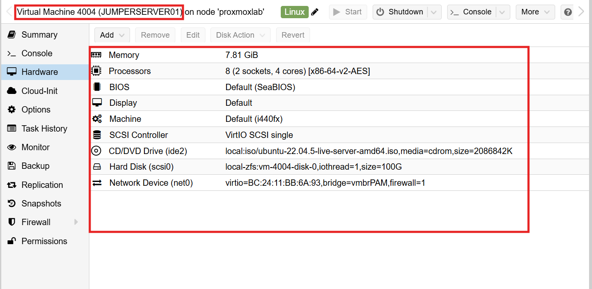


✅ **Checkpoint:** VM `JUMPSERVER01` exists with the correct resources and two VirtIO NICs, ISO mounted, and is ready to boot.

---

### Step 2 — Install Ubuntu Server 22.04 LTS

Boot the VM from the ISO and run the Ubuntu Server installer.

Installer choices:

* **Network:** Accept defaults during installation (DHCP on whichever interface obtains a lease — usually the staging interface). The authoritative network configuration is applied in Step 4; do not hand-craft static addressing in the installer.
* **Storage:** Use the entire 100 GB disk (guided, single partition; LVM optional per lab standard).
* **Profile:** Create your administrative user; set the server name to `jumpserver01`.
* **SSH:** Install OpenSSH Server (recommended for remaining steps).
* **Snaps:** Install none.

Allow the installation to complete and reboot, then remove the ISO from the VM.

### Ubuntu Server Installation Complete

Ubuntu Server 22.04 LTS was successfully installed and the initial operating system deployment was validated through console access. The server was prepared for post-installation configuration, network provisioning, and JumpServer platform deployment.

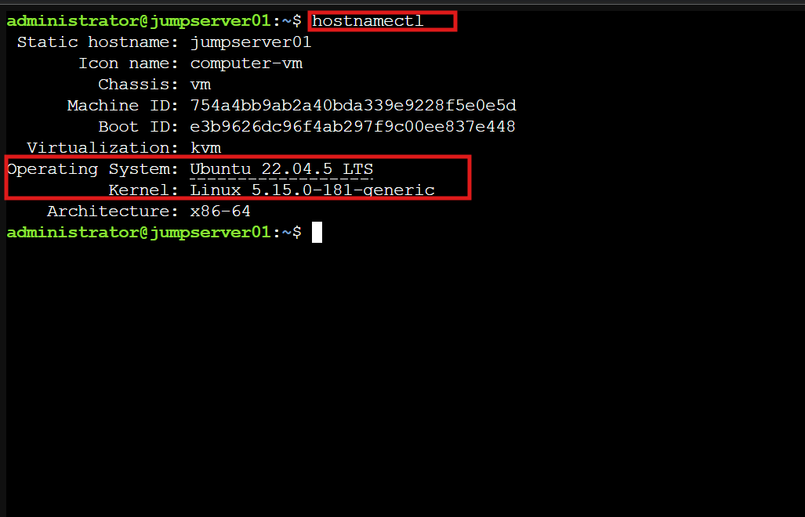

✅ **Checkpoint:** Ubuntu Server 22.04 LTS is installed and the VM boots to a login prompt.

---

### Step 3 — First Boot, System Update, and Hostname

Log in and bring the system current. (Internet at this point is provided by the DHCP staging interface from the installer's default config.)

```bash
sudo apt update
sudo apt -y upgrade
```

Set the hostname deterministically:

```bash
sudo hostnamectl set-hostname jumpserver01
```

Ensure the loopback entry is correct in `/etc/hosts`:

```bash
sudo sed -i 's/^127\.0\.1\.1.*/127.0.1.1\tjumpserver01.iampam.lab\tjumpserver01/' /etc/hosts
grep -E '127\.0\.1\.1' /etc/hosts || echo -e "127.0.1.1\tjumpserver01.iampam.lab\tjumpserver01" | sudo tee -a /etc/hosts
```

Verify:

```bash
hostnamectl
hostname -f
```

Expected:

* **Hostname:** `jumpserver01`
* **FQDN:** `jumpserver01.iampam.lab` *(resolves fully only after Step 4 DNS configuration)*

> On a fresh Ubuntu install — before DNS is configured in Step 4 — `hostname -f` may not yet return the FQDN. That is expected and is **not** a validation failure at this stage. The only hard requirement here is that the **static hostname** is `jumpserver01`. The FQDN is confirmed after Step 4.

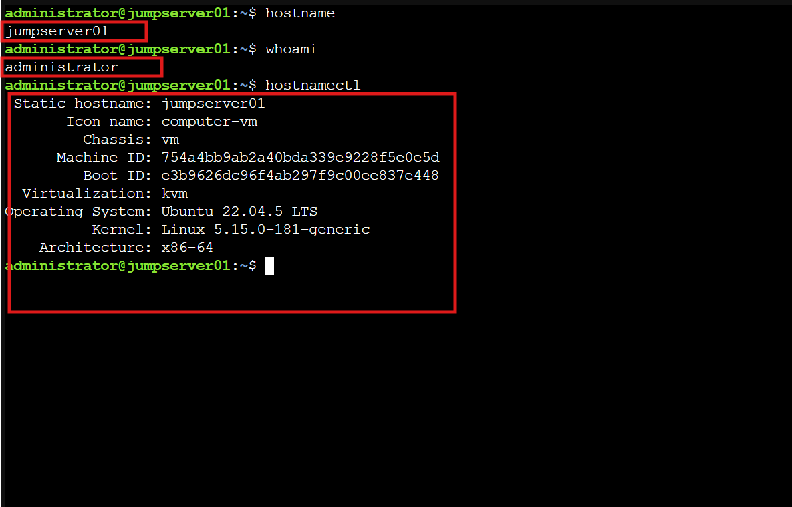

✅ **Checkpoint:** Hostname is `jumpserver01`; system is fully updated.

---

### Step 4 — Network and DNS Configuration (Build Phase)

This step installs the **single authoritative netplan file** for the build phase.

#### 4.1 Identify the interface names

```bash
ip -brief link show
```

Confirm the two interface names (expected `ens18` and `ens19`). If they differ in your environment, substitute the real names throughout.

#### 4.2 Remove any installer-generated netplan files

To guarantee there are **no duplicate netplan files**, inspect and back up anything the installer left behind, remove it, then create one authoritative file:

```bash
ls -l /etc/netplan/

sudo mkdir -p /root/netplan-backups

sudo cp -a /etc/netplan/* /root/netplan-backups/ 2>/dev/null || true

sudo rm -f /etc/netplan/00-installer-config.yaml

sudo rm -f /etc/netplan/50-cloud-init.yaml
```

Existing installer-generated Netplan configurations are backed up before removal. This preserves rollback capability while ensuring only a single authoritative Netplan configuration remains active.

> If cloud-init manages networking, also disable it for the network subsystem:
> ```bash
> echo 'network: {config: disabled}' | sudo tee /etc/cloud/cloud.cfg.d/99-disable-network-config.cfg
> ```

#### 4.3 Create the authoritative build-phase netplan

Create **`/etc/netplan/01-iampam.yaml`** as the single source of truth:

```bash
sudo tee /etc/netplan/01-iampam.yaml >/dev/null <<'EOF'
# Module 07 — JUMPSERVER01 authoritative netplan (BUILD PHASE)
# ens18 = permanent internal IAM/PAM interface (NO default route during build)
# ens19 = temporary Internet staging interface (DHCP) — provides the SINGLE default route
network:
  version: 2
  renderer: networkd
  ethernets:
    ens18:
      dhcp4: false
      dhcp6: false
      addresses:
        - 172.31.100.85/24
      nameservers:
        addresses:
          - 172.31.100.10
        search:
          - iampam.lab
      # No 'routes:' here — ens18 carries no default route during the build phase.
    ens19:
      dhcp4: true
      dhcp6: false
EOF
```

Lock down permissions (netplan warns otherwise) and apply:

```bash
sudo chmod 600 /etc/netplan/01-iampam.yaml
sudo netplan generate
sudo netplan apply
```

#### 4.4 Validate routing, addressing, and DNS

Confirm exactly one default route, and that it is via the **staging** interface:

```bash
ip route show
ip -brief address show
resolvectl status
```

Expected:

* `ens18` holds `172.31.100.85/24`, no default route.
* `ens19` holds a DHCP lease and provides the **single** `default via …` route.
* `resolvectl` shows `172.31.100.10` as DNS for `ens18` with domain `iampam.lab`.

Validate **internal** resolution (the Domain Controller) and **external** resolution:

```bash
# Internal — must resolve dc01 to 172.31.100.10
nslookup dc01.iampam.lab
ping -c 3 dc01.iampam.lab

# External — must resolve via the staging interface's DNS
nslookup github.com
nslookup download.docker.com
```

Expected: `dc01.iampam.lab` → `172.31.100.10`; `github.com` and `download.docker.com` resolve to public addresses.

> **Engineering Requirement — single active default route.**
> During the build phase only **one** active default route is permitted. The temporary Internet staging interface (`ens19`) supplies the default route. The internal interface (`ens18`) **must not** contain a default route until the staging interface is removed (a downstream activity outside Module 07). **Multiple active default routes are a deployment failure condition.**


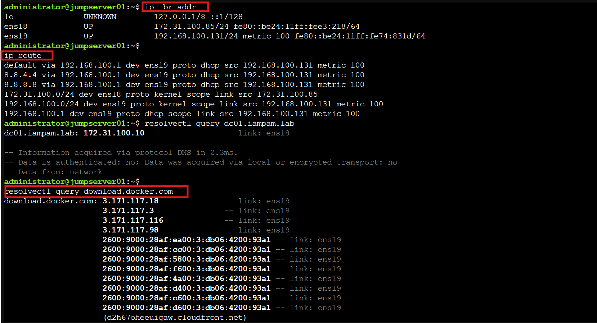

Required evidence visible in the screenshot:

```bash
ip route
resolvectl status
nslookup dc01.iampam.lab
```

Expected evidence:

* Single default route present
* Internal interface (`ens18`) configured at `172.31.100.85/24`
* DNS server `172.31.100.10` configured
* `dc01.iampam.lab` resolves to `172.31.100.10`

✅ **Checkpoint:** Single default route active via `ens19`; `ens18` static at `172.31.100.85`; internal and external DNS both resolve; no duplicate netplan files.

---

### Step 5 — Install Active Directory Integration Packages

Install the components required for AD DNS resolution, Kerberos, LDAP, realm discovery, and domain-join capability.

```bash
sudo apt update
sudo apt -y install \
  realmd \
  sssd \
  sssd-tools \
  adcli \
  krb5-user \
  packagekit \
  samba-common-bin \
  oddjob \
  oddjob-mkhomedir
```

> During `krb5-user` installation you may be prompted for a default Kerberos realm. Enter **`IAMPAM.LAB`** (uppercase). This can also be set non-interactively in `/etc/krb5.conf` later.

Verify the key binaries are present and that the SSSD service is installed. (`sssd` is a daemon, not a `PATH` binary — validate it with `systemctl`, not `which`.)

```bash
which realm
which adcli
which net
which kinit
sudo systemctl status sssd --no-pager
dpkg -l | grep -E 'realmd|sssd|adcli|krb5-user|samba-common-bin|oddjob'
```

Expected:

* `realm` binary present
* `adcli` binary present
* `net` binary present
* `kinit` binary present
* SSSD service installed (`systemctl status sssd` resolves — it may be `inactive`/`loaded` until a domain join occurs, which is normal at this stage)

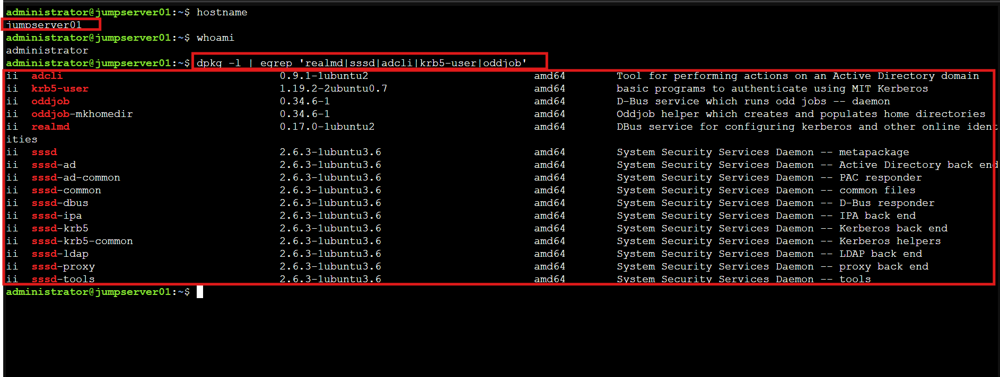

✅ **Checkpoint:** All AD integration packages are installed; the `realm`/`adcli`/`net`/`kinit` binaries are on `PATH` and the SSSD service is present.

---

### Step 6 — Resource Validation

Confirm the VM presents the specified resources to the OS.

```bash
# CPU — expect 4 vCPU
nproc
lscpu | grep -E '^CPU\(s\):'

# Memory — expect ~8 GB
free -h

# Disk — expect ~100 GB root volume
lsblk
df -h /
```

Expected: `nproc` = `4`; total memory ≈ `7.7–8.0Gi`; root disk ≈ `100G`.

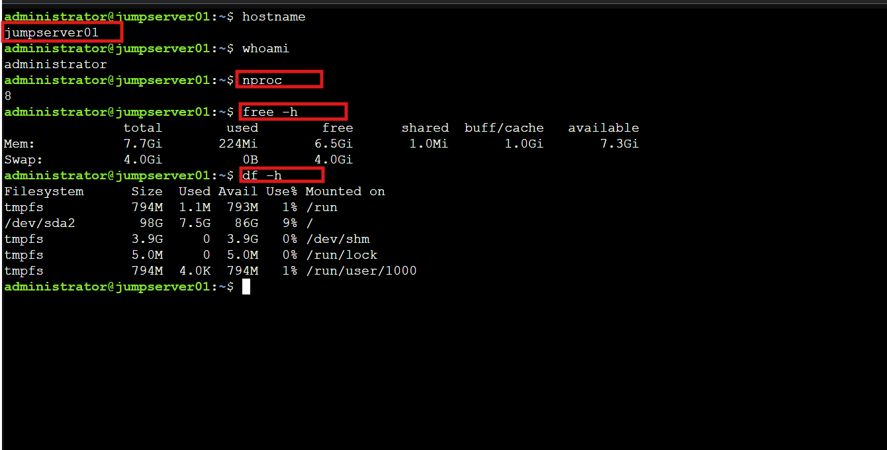

✅ **Checkpoint:** CPU, memory, and disk match the specification (4 vCPU / 8 GB / 100 GB).

---

### Build Status Checkpoint

At the completion of Step 6, the following foundational platform components have been successfully implemented and validated:

* Ubuntu Server 22.04 LTS installed
* System hostname configured
* Network interfaces configured
* DNS resolution operational
* Administrative utilities installed
* Active Directory integration components installed
* System resources validated

`JUMPSERVER01` has successfully completed the **infrastructure preparation phase** and is ready to proceed with the following deployment activities:

* External connectivity validation
* Docker repository configuration
* Docker Engine installation
* Container runtime validation
* JumpServer deployment preparation

---

### Step 7 — External Connectivity Validation

Confirm internal DNS resolution, external DNS resolution, Domain Controller name resolution, Docker repository DNS resolution stability, and Internet connectivity required for subsequent Docker installation activities.

```bash
resolvectl query dc01.iampam.lab

resolvectl query download.docker.com

nslookup dc01.iampam.lab 172.31.100.10

for i in $(seq 5); do getent ahosts download.docker.com >/dev/null && echo OK || echo FAIL; done

ping -c 4 8.8.8.8
```

Expected: ICMP replies (if permitted) and successful HTTPS responses from both endpoints.

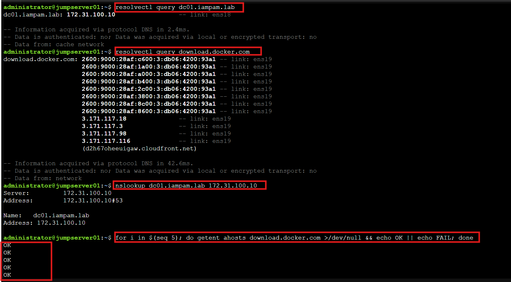

✅ **Checkpoint:** Both external endpoints are reachable over the staging interface.

---

### Step 8 — Configure the Docker Repository

Add Docker's official APT repository and GPG key, then confirm the Docker packages are available.

```bash
# Validate Docker repository HTTPS connectivity
curl -fsS -o /dev/null -w '%{http_code}\n' https://download.docker.com
```

Expected:

```text
200
```

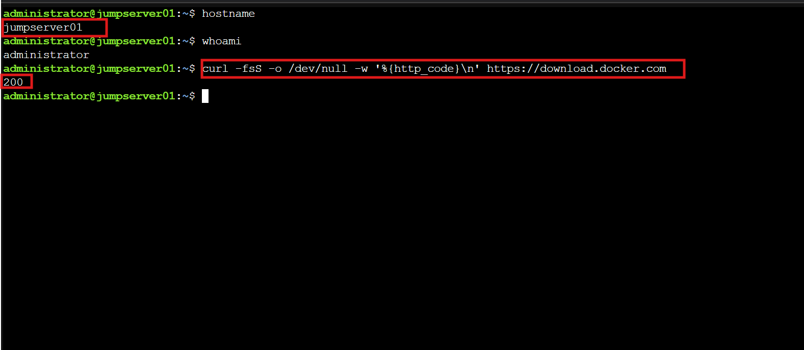

Required evidence:

```bash
curl -fsS -o /dev/null -w '%{http_code}\n' https://download.docker.com
```

Expected evidence:

* HTTP 200 response received
* Docker repository reachable
* HTTPS connectivity validated

```bash
# Prerequisites for adding the repo
sudo apt -y install ca-certificates curl gnupg

# Add Docker's official GPG key
sudo install -m 0755 -d /etc/apt/keyrings
curl -fsSL https://download.docker.com/linux/ubuntu/gpg | \
  sudo gpg --dearmor -o /etc/apt/keyrings/docker.gpg
sudo chmod a+r /etc/apt/keyrings/docker.gpg

# Add the repository (Ubuntu 22.04 = jammy)
echo \
  "deb [arch=$(dpkg --print-architecture) signed-by=/etc/apt/keyrings/docker.gpg] \
  https://download.docker.com/linux/ubuntu $(. /etc/os-release && echo "$VERSION_CODENAME") stable" | \
  sudo tee /etc/apt/sources.list.d/docker.list >/dev/null

# Refresh and confirm the Docker packages are now visible
sudo apt update
apt-cache policy docker-ce | head -n 5
```

Expected: `apt update` completes without errors and `apt-cache policy docker-ce` lists a candidate from `download.docker.com`.

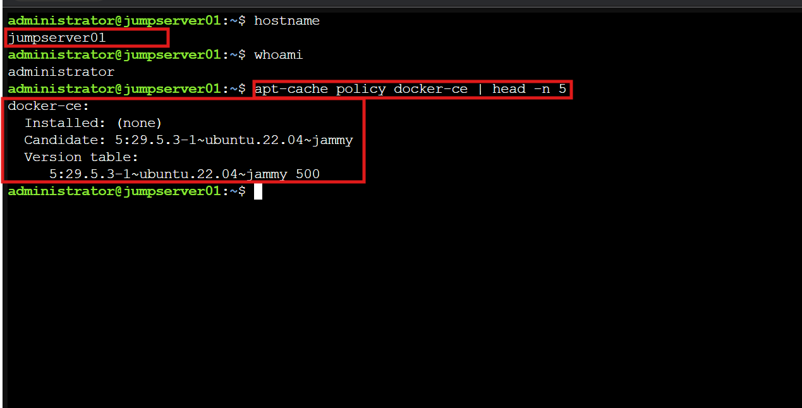

Required evidence:

```bash
sudo apt update
apt-cache policy docker-ce
```

Expected evidence:

* Docker repository reachable
* Candidate package version displayed
* Repository configured successfully

✅ **Checkpoint:** Docker's official repository is configured and its packages are available to APT.


---

### Step 9 — Install Docker and Validate the Runtime

Install the Docker Engine, CLI, containerd, and the Buildx/Compose plugins.

```bash
sudo apt -y install \
  docker-ce \
  docker-ce-cli \
  containerd.io \
  docker-buildx-plugin \
  docker-compose-plugin
```

Enable and start the service, and add your user to the `docker` group:

```bash
sudo systemctl enable --now docker
sudo usermod -aG docker "$USER"
# Apply the new group membership in the current shell (or log out/in):
newgrp docker
```

Validate each runtime component:

```bash
# Service running
systemctl is-active docker          # expect: active

# CLI + server versions
docker version

# Compose plugin functional
docker compose version

# Container runtime functional — Hello World
docker run --rm hello-world
```

Expected: `docker` service `active`; `docker version` shows client and server; `docker compose version` reports a version; `hello-world` prints its success message and exits cleanly.

✅ **Checkpoint:** Docker service is running; CLI, Compose, container runtime, and the hello-world container all function.

---

### Step 10 — JumpServer Deployment Readiness Validation

Confirm the host satisfies every prerequisite JumpServer requires so it is **Ready For Deployment**.

```bash
# Deployment model is containerized on the Docker engine — verify the stack:
echo "== Docker service ==";        systemctl is-active docker
echo "== Docker CLI ==";            docker info --format '{{.ServerVersion}}'
echo "== Compose plugin ==";        docker compose version
echo "== Container runtime ==";     docker run --rm hello-world | grep -i "working"

echo "== Resources =="
echo "vCPU: $(nproc)"               # expect 4
free -h | awk '/Mem:/ {print "RAM:  "$2}'   # expect ~8Gi
df -h / | awk 'NR==2 {print "Disk: "$2" total, "$4" free"}'  # expect ~100G

echo "== Internal name resolution =="
getent hosts dc01.iampam.lab        # expect 172.31.100.10
```

All of the following must be true:

| Prerequisite                     | Expected                      |
| -------------------------------- | ----------------------------- |
| Docker service running           | `active`                      |
| Docker CLI functional            | Server version returned       |
| Docker Compose functional        | Version returned              |
| Container runtime functional     | `hello-world` reports working |
| vCPU                             | 4                             |
| Memory                           | ~8 GB                         |
| Disk                             | ~100 GB                       |
| Internal DNS (`dc01.iampam.lab`) | `172.31.100.10`               |


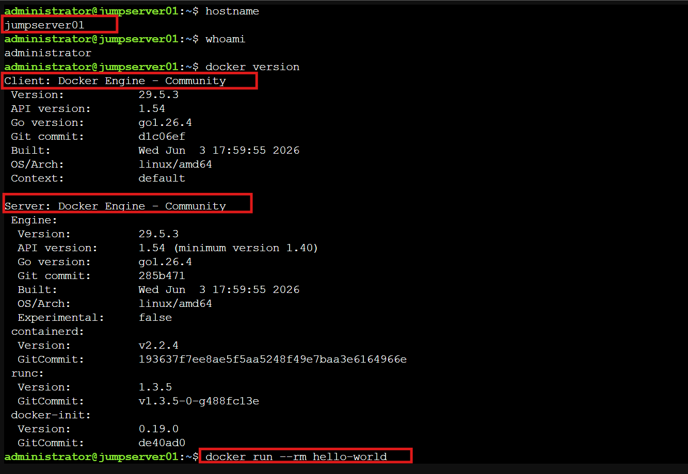

Required evidence:

```bash
systemctl is-active docker
docker compose version
docker run --rm hello-world
getent hosts dc01.iampam.lab
```

Expected evidence:

* Docker active
* Docker Compose operational
* Container runtime operational
* Internal DNS operational
* System ready for JumpServer deployment

✅ **Checkpoint:** Every JumpServer prerequisite is satisfied — the system is ready for JumpServer deployment.

---

### Step 11 — Active Directory Realm Discovery

Confirm the host can discover the `iampam.lab` realm via the Domain Controller. This proves Kerberos/LDAP reachability and realm-join capability without yet performing the join.

```bash
# Discover the realm
realm discover iampam.lab

# Confirm current membership status (expected: not yet joined / "configured: no")
realm list || echo "No realms currently joined (expected at this stage)."
```

Expected `realm discover iampam.lab` output includes:

* `iampam.lab` as the realm name
* `type: kerberos`
* `realm-name: IAMPAM.LAB`
* `domain-name: iampam.lab`
* configured server software `active-directory`
* the required client packages (`sssd`, `adcli`, `samba-common-bin`) listed

> **Domain join (capability — optional in this module).** The packages installed in Step 5 provide full domain-join capability. When the lab calls for an actual join, it is performed with:
>
> ```bash
> sudo realm join --user=<AD_admin> iampam.lab
> ```
>
> This module validates **realm discovery** (the success criterion); the join itself is a documented downstream action.

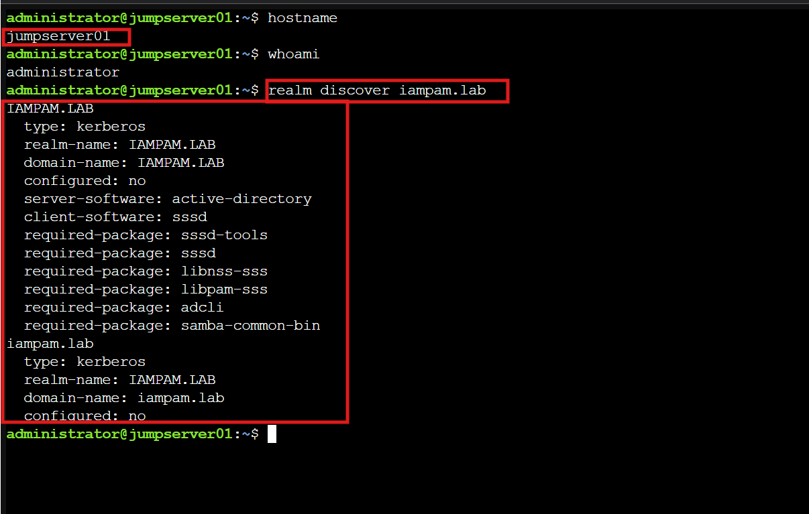

✅ **Checkpoint:** `realm discover iampam.lab` succeeds — realm discovery is operational.


---

### Module 07 Completion Point

**Step 11 is the final step of Module 07.** At this point `JUMPSERVER01` is **Ready For Deployment**.

> **Module Boundary — staging interface lifecycle is out of scope here.**
> The temporary `ens19` staging interface is intentionally **left in place** at the end of Module 07. JumpServer has not yet been deployed, and removing the staging interface before application deployment would introduce unnecessary complexity and create a dependency on future deployment activities. Removal of `ens19` and promotion of `ens18` to the sole `172.31.100.1` default route is performed **after** JumpServer has been deployed and validated, in the subsequent module. The build-phase netplan from Step 4 (single active default route via `ens19`) remains the active configuration at the close of Module 07.

---

## 6. Final State Validation

Run the complete end-state verification:

```bash
echo "Hostname:        $(hostname)"                              # jumpserver01
echo "FQDN:            $(hostname -f)"                            # jumpserver01.iampam.lab
echo "Internal IP:     $(ip -4 -o addr show ens18 | awk '{print $4}')"  # 172.31.100.85/24
echo "Default route:   $(ip route | awk '/default/{print $3" dev "$5}')" # single default via ens19 (DHCP)
echo "Default routes:  $(ip route | grep -c '^default')"          # must be 1
echo "DC resolution:   $(getent hosts dc01.iampam.lab | awk '{print $1}')" # 172.31.100.10
echo "Docker active:   $(systemctl is-active docker)"            # active
echo "Compose:         $(docker compose version --short 2>/dev/null)"
echo "Realm discover:  $(realm discover iampam.lab >/dev/null 2>&1 && echo OK || echo FAIL)" # OK
```

> At the close of Module 07 the build-phase network is still in effect: `ens18` is static with **no** default route, and the temporary `ens19` supplies the **single** active default route. There must be exactly **one** default route (`Default routes: 1`). The staging interface is removed only after JumpServer is deployed (out of scope here).

| Item | Expected State |
|---|---|
| Hostname | `jumpserver01` |
| Domain | `iampam.lab` |
| Internal IP (`ens18`) | `172.31.100.85` |
| Internal PAM Network | `172.31.100.0/24` |
| Domain Controller reachable | `172.31.100.10` |
| Docker installed | Yes |
| Docker running | Yes (`active`) |
| Container runtime | Operational |
| Realm discovery | Operational |
| JumpServer | Ready for Deployment |

When every row passes, **Module 07 is complete** and `JUMPSERVER01` is *Ready For Deployment*.

---

## 7. Screenshot Index

| #  | Filename                                                     | Title                                             | Captured At |
| -- | ------------------------------------------------------------ | ------------------------------------------------- | ----------- |
| 01 | `module07-01-proxmox-vm-configuration.png`                   | Proxmox VM Configuration                          | Step 1      |
| 02 | `module07-02-ubuntu-install-complete.png`                    | Ubuntu Server Installation Complete               | Step 2      |
| 03 | `module07-03-hostname-configuration.png`                     | Hostname Configuration                            | Step 3      |
| 04 | `module07-04-network-dns-configuration.png`                  | Network and DNS Configuration                     | Step 4      |
| 05 | `module07-05-ad-packages-installed.png`                      | Active Directory Packages Installed               | Step 5      |
| 06 | `module07-06-resource-validation.png`                        | Resource Validation                               | Step 6      |
| 07 | `module07-07-external-connectivity-validation.png`           | External Connectivity Validation                  | Step 7      |
| 08 | `module07-08-docker-repository-connectivity.png`             | Docker Repository Connectivity Validation         | Step 8      |
| 09 | `module07-09-docker-repository-validation.png`               | Docker Repository Package Availability Validation | Step 8      |
| 10 | `module07-10-jumpserver-deployment-readiness-validation.png` | JumpServer Deployment Readiness Validation        | Step 10     |
| 11 | `module07-11-realm-discovery-success.png`                    | Active Directory Realm Discovery Success          | Step 11     |

**Final screenshot count: 11.**

---

## Section 1A Complete

The JumpServer host infrastructure was successfully prepared and validated within the IAMPAM.LAB environment. Operating system configuration, network connectivity, DNS resolution, Docker Engine installation, Docker Compose functionality, package repository availability, deployment readiness checks, and Active Directory realm discovery were confirmed operational.

All prerequisite requirements for JumpServer deployment were satisfied and validated through captured evidence. The platform was determined ready for application deployment and integration activities.

**Section 1A Result:** Successful completion of infrastructure preparation and deployment readiness validation.


---

# Section 1B – JumpServer Deployment

## Objective

Deploy the JumpServer Privileged Access Management platform using the official JumpServer installer and validate successful containerized service operation within the IAMPAM.LAB environment.

---

## Deployment Preparation

A clean deployment baseline was established prior to installation.

Validation confirmed:

* Docker Engine operational
* Docker Compose operational
* External network connectivity functional
* Domain connectivity validated
* No existing JumpServer containers
* No existing JumpServer images
* No active JumpServer data directories

A dedicated deployment workspace was created to stage the installer.

```bash
mkdir -p ~/jumpserver-deployment
cd ~/jumpserver-deployment
```

---

## Download and Validate Installer

The latest JumpServer Quick Start installer was downloaded directly from the official JumpServer GitHub release repository.

```bash
curl -fsSL https://github.com/jumpserver/jumpserver/releases/latest/download/quick_start.sh -o quick_start.sh
chmod +x quick_start.sh
```

Installer integrity and workflow behavior were reviewed prior to execution.

Validation activities included:

```bash
ls -l quick_start.sh
head -20 quick_start.sh
grep -n "jmsctl.sh" quick_start.sh
tail -50 quick_start.sh
```

### Evidence

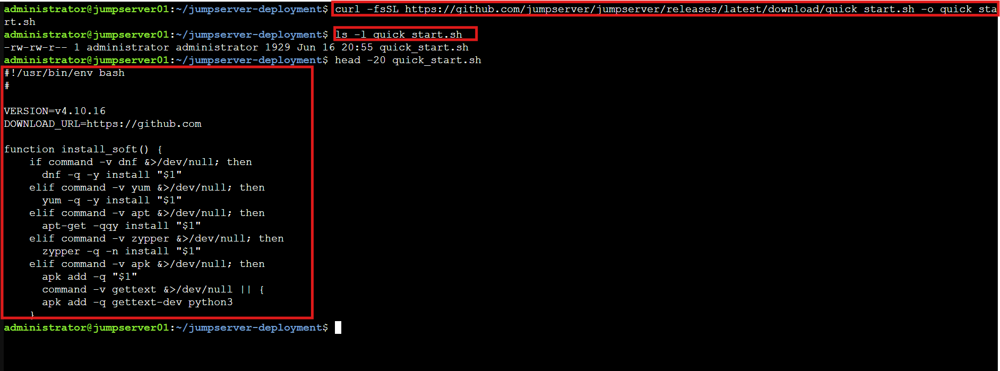

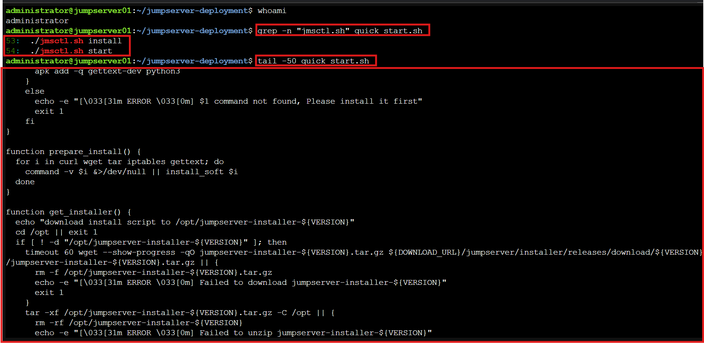

---

## Initialize Deployment

The JumpServer installation process was launched using elevated privileges.

```bash
sudo mkdir -p /opt
sudo ./quick_start.sh
```

The installer automatically downloaded the JumpServer deployment framework and generated the required installation structure.

### Evidence

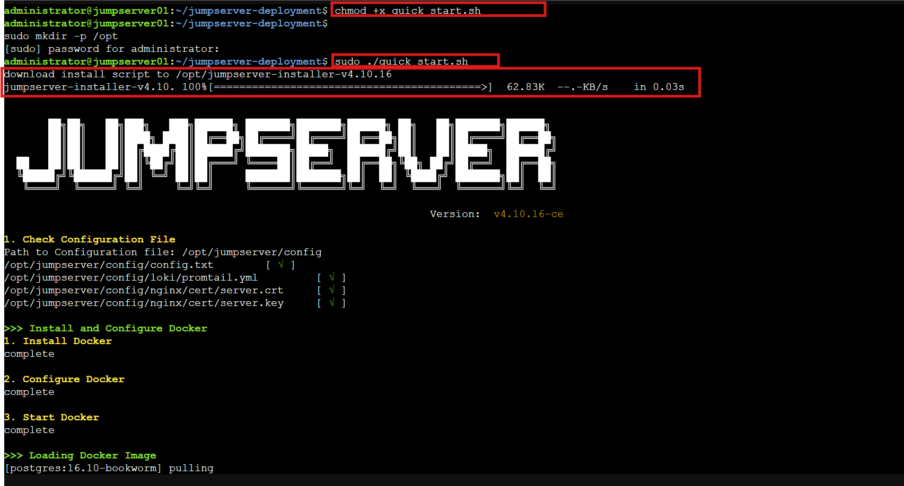

---

## Container Image Acquisition

The installer downloaded all required container images from the official JumpServer container repositories.

Downloaded components included:

* jumpserver/core
* jumpserver/web
* jumpserver/koko
* jumpserver/lion
* jumpserver/chen
* postgres
* redis

These components collectively provide:

* Web Portal
* API Services
* Web Terminal Services
* Session Proxy Services
* Session Recording Components
* Database Services
* Caching Services

### Evidence

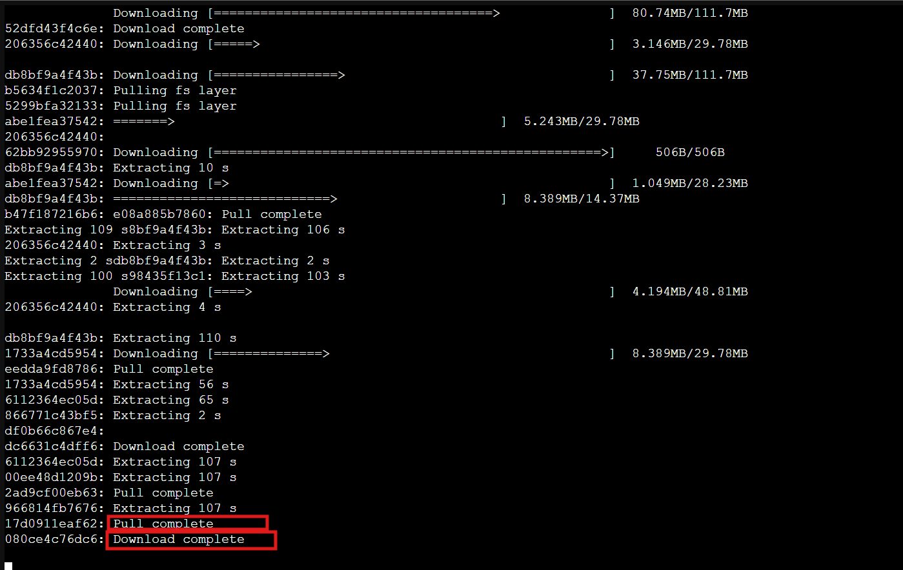

---

## Installation Configuration

The following deployment selections were used during installation.

### IPv6 Support

```text
N
```

IPv6 was not required within the current lab environment.

### Persistent Storage

```text
N
```

Default persistent storage location accepted.

```text
/data/jumpserver
```

### External PostgreSQL

```text
N
```

Internal containerized PostgreSQL selected.

### Redis Engine

```text
redis
```

Standard Redis deployment selected.

### External Redis

```text
N
```

Internal containerized Redis selected.

### External Port Customization

```text
N
```

Default JumpServer web ports retained.

### Language

```text
en
```

### Timezone

```text
America/New_York
```

Configured to match the lab environment timezone.

---

## Deployment Completion

After image acquisition and configuration, JumpServer automatically initialized:

* PostgreSQL
* Redis
* Core Services
* Web Services
* Terminal Services
* Session Components

The installer completed successfully and published the management portal.

```text
http://172.31.100.85
```

Default credentials were generated and immediately replaced during initial administrative access.

### Evidence

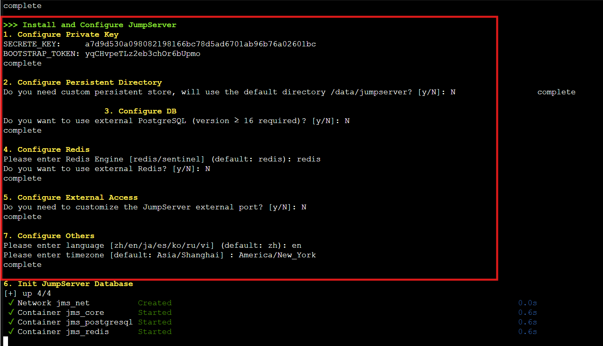

---

## Deployment Issue Encountered

During the initial deployment attempt, the SSH session disconnected while container initialization was still in progress.

This interruption resulted in incomplete JumpServer terminal registration data being written to persistent storage.

Symptoms observed:

* jms_koko repeatedly restarting
* jms_chen repeatedly restarting
* HTTP 401 registration failures
* Terminal registration failures

Validation revealed matching bootstrap tokens across all services, indicating corrupted persistent state rather than configuration mismatch.

Example errors observed:

```text
Authentication credentials were not provided.
```

---

## Remediation

All JumpServer services were stopped.

```bash
sudo ./jmsctl.sh stop
```

Persistent deployment data was removed.

```bash
sudo rm -rf /data/jumpserver
sudo rm -rf /opt/jumpserver
```

The installer framework was removed and redeployed from a clean baseline.

Following redeployment:

* PostgreSQL healthy
* Redis healthy
* Core healthy
* Web healthy
* Lion healthy
* Koko healthy
* Chen healthy
* Celery healthy

The issue was fully resolved.

### Lesson Learned

If JumpServer deployment is interrupted during first-time initialization and Koko or Chen repeatedly fail registration with HTTP 401 errors despite matching bootstrap tokens, remove the persistent storage directory and perform a clean deployment.

```text
/data/jumpserver
```

---

## Container Health Validation

Container status was validated using:

```bash
docker ps
```

All required JumpServer services reported healthy status.

Validated components:

* jms_core
* jms_web
* jms_lion
* jms_celery
* jms_chen
* jms_koko
* jms_postgresql
* jms_redis

### Evidence

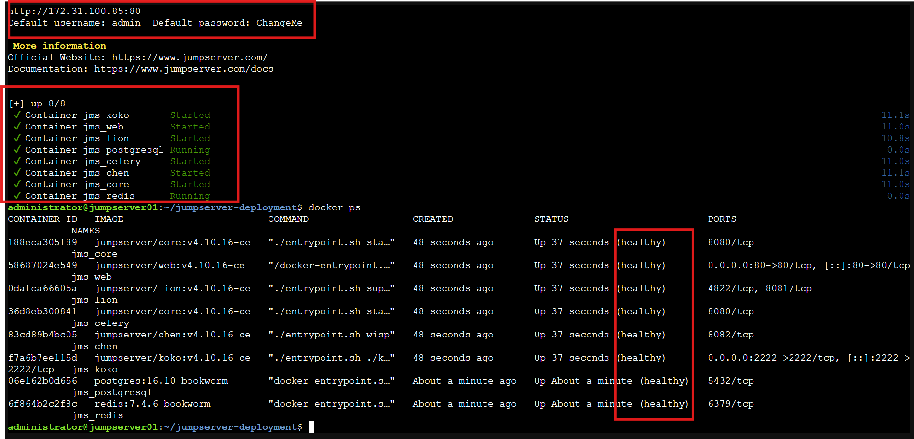

---

## Web Service Validation

Network services were validated locally.

```bash
sudo ss -tulpn | egrep ':80|:443'
```

HTTP service validation:

```bash
curl -I http://127.0.0.1
```

Validation confirmed:

```text
HTTP/1.1 200 OK
Server: nginx
```

### Evidence

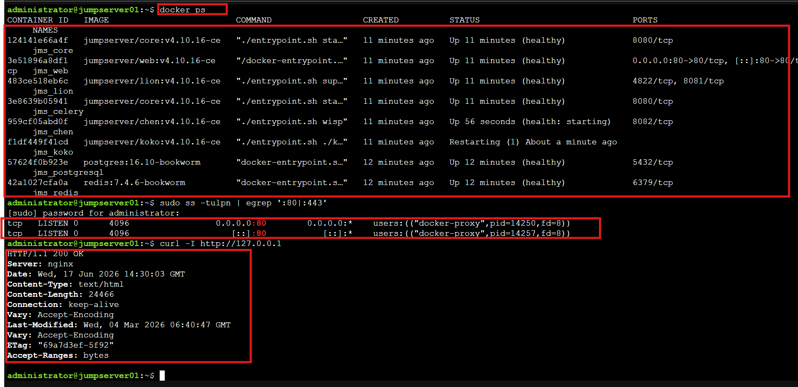

---

## Portal Access Validation

The JumpServer portal was successfully accessed from MGMT01.

```text
http://172.31.100.85
```

Administrative authentication succeeded and platform access was confirmed.

### Evidence

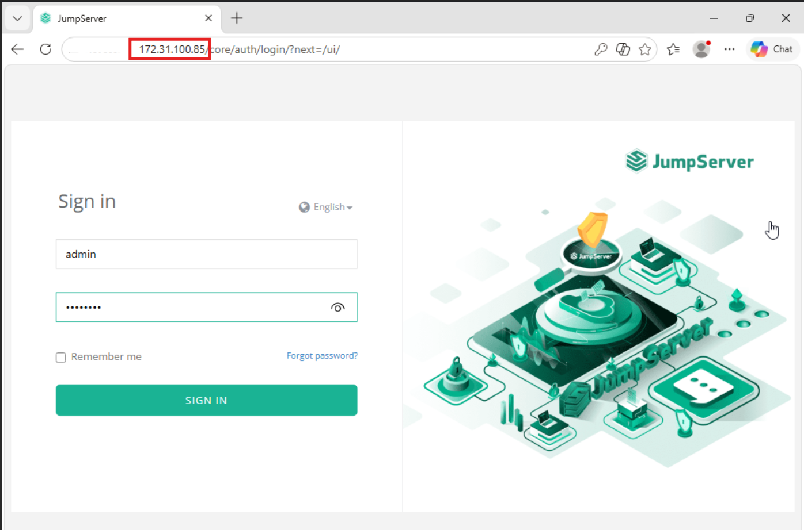

### Dashboard Validation

The JumpServer administrative dashboard loaded successfully following authentication. Platform services, navigation components, and asset management functionality were accessible, confirming successful deployment and operational readiness.

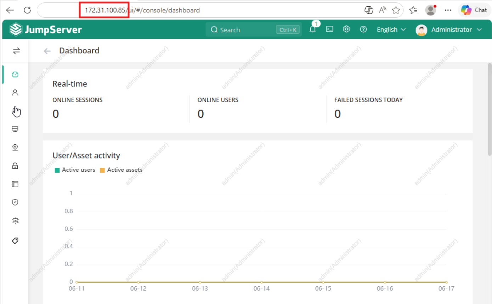

---

## Result

JumpServer Privileged Access Management Platform successfully deployed and validated.

Deployment status:

* Operational
* Containerized
* Web portal accessible
* Administrative dashboard accessible
* Database services healthy
* Redis services healthy
* Terminal services healthy
* Ready for asset onboarding and PAM configuration

---

## Section 2 – Asset Onboarding

| Setting         | Value         |
| --------------- | ------------- |
| Asset Name      | LINUX01       |
| Platform        | Linux         |
| Address         | 172.31.100.40 |
| Protocol        | SSH           |
| Port            | 22            |
| Node Assignment | IAMPAM.LAB    |

The asset registration process establishes the target system that JumpServer will manage and access through controlled privileged sessions.

### Validation

The LINUX01 asset was successfully created and assigned to the IAMPAM.LAB node.

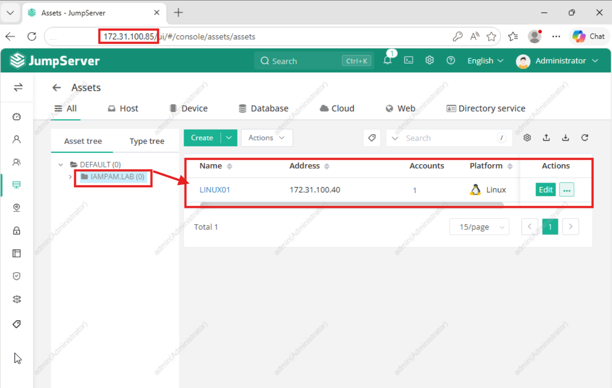

---

## Step 3 – Associate Managed Credentials

A managed account was created and linked to the LINUX01 asset.

### Credential Configuration

| Setting               | Value      |
| --------------------- | ---------- |
| Account Name          | localadmin |
| Username              | localadmin |
| Authentication Method | Password   |
| Asset                 | LINUX01    |

The credential association process enables JumpServer to broker privileged access without requiring administrators to manually enter credentials during each session.

### Validation

The managed credential was successfully associated with the Linux asset and subsequently validated through successful connectivity testing and managed SSH session establishment.

The ability to authenticate to LINUX01 and launch a privileged session confirmed that the stored credential was functioning correctly within the JumpServer PAM platform.

---

## Step 4 – Validate Asset Connectivity

A platform connectivity test was executed to verify that JumpServer could successfully communicate with the onboarded Linux system.

### Validation Activity

JumpServer executed a connectivity validation task against the registered asset using the configured protocol and credential set.

### Results

| Validation Item       | Status     |
| --------------------- | ---------- |
| Asset Reachability    | Successful |
| SSH Connectivity      | Successful |
| Credential Validation | Successful |
| Task Completion       | Successful |

The successful test confirmed that the asset was reachable and properly configured for future privileged access sessions.

### Validation Evidence

Task execution logs displayed successful completion with no failures, unreachable hosts, or authentication errors.


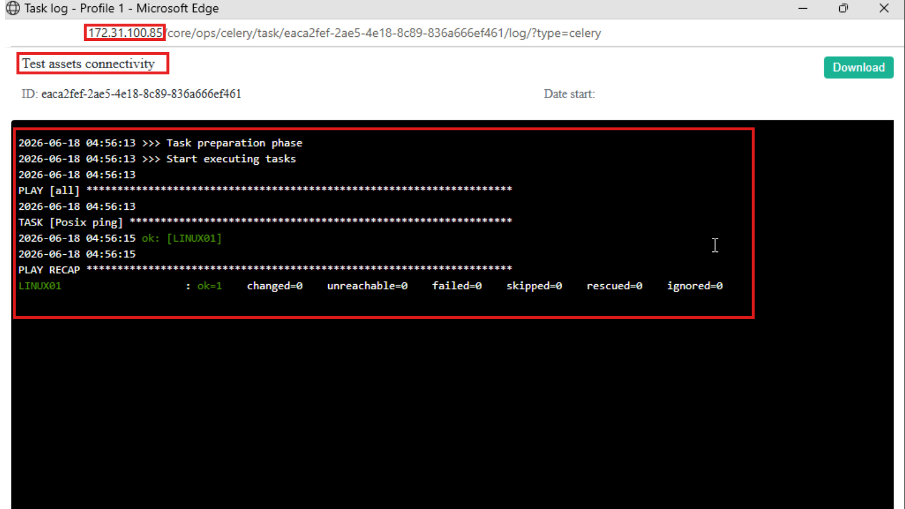


---

## Results

The JumpServer PAM platform successfully onboarded the Linux infrastructure asset and validated operational connectivity.

### Assets Onboarded

| Asset   | Address       | Platform |
| ------- | ------------- | -------- |
| LINUX01 | 172.31.100.40 | Linux    |

### Outcomes

* Created logical asset hierarchy for IAMPAM.LAB.
* Registered Linux infrastructure asset.
* Associated managed administrative credentials.
* Validated SSH communication.
* Confirmed asset readiness for privileged session access.

The environment is now prepared for controlled privileged access sessions and centralized session monitoring through JumpServer.


# Section 3 – Managed Session Access

### Objective

Validate that JumpServer can successfully broker privileged SSH sessions to onboarded Linux assets using centrally managed credentials.

---

## Overview

This section demonstrates the establishment and validation of a managed SSH session to a Linux asset through the JumpServer Privileged Access Management (PAM) platform. Successful session establishment confirms that asset onboarding, credential management, connectivity validation, and session brokering components are functioning correctly.

The ability to launch and manage privileged sessions from a centralized platform is a foundational capability of modern PAM solutions and provides the basis for session monitoring, auditing, and governance activities.

---

## Step 1 – Establish Managed SSH Session

Following successful asset onboarding and connectivity validation, a managed SSH session was initiated from the JumpServer web interface using the associated `localadmin` credential.

The session was brokered through JumpServer without requiring the administrator to manually enter credentials during the connection process. This workflow demonstrates centralized credential management and controlled privileged access to managed infrastructure assets.

### Validation

The managed session launched successfully and provided interactive command-line access to the target Linux system.

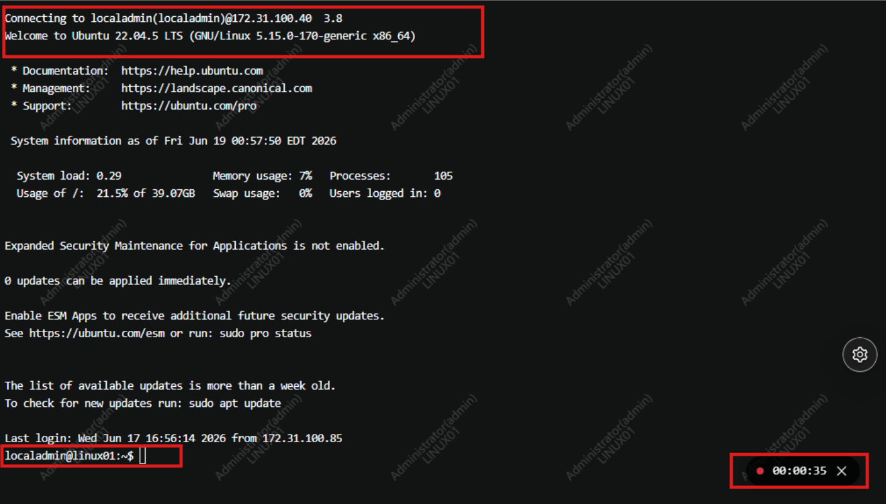

✅ **Checkpoint:** JumpServer successfully established a managed SSH session to LINUX01.

---

## Step 2 – Validate Session Identity

Once the managed session was established, validation commands were executed to confirm both the destination host and the authenticated user context.

### Commands Executed

```bash
hostname
whoami
```

### Validation Results

| Validation Item    | Result              |
| ------------------ | ------------------- |
| Hostname           | linux01             |
| Authenticated User | localadmin          |
| Session Type       | Managed SSH Session |
| Access Method      | JumpServer PAM      |

The command results confirmed that the session was connected to the intended Linux asset and operating under the expected managed administrative account.

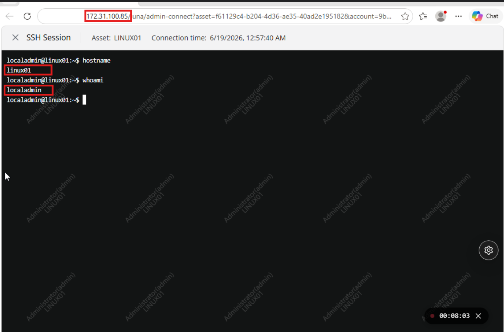

✅ **Checkpoint:** Session validated as localadmin on linux01.

---

## Results

The JumpServer PAM platform successfully brokered privileged access to the managed Linux asset and validated end-to-end session functionality.

### Outcomes

* Established a managed SSH session through JumpServer.
* Authenticated using the associated managed credential.
* Verified target asset identity.
* Verified authenticated user context.
* Confirmed operational PAM session brokering.
* Demonstrated centralized privileged access management.

The environment is now prepared for session auditing, monitoring, recording, and privileged access governance activities.

# Section 4 – Session Monitoring and File Transfer Auditing

## Objective

Validate that JumpServer Community Edition can centrally broker privileged administrative access while providing session monitoring, session replay, command auditing, authorization enforcement, and controlled file transfer capabilities.

---

## Overview

This section demonstrates the operational auditing and governance capabilities of JumpServer Community Edition after successful onboarding of the managed Linux asset.

Administrative access to `LINUX01` was brokered through JumpServer, allowing privileged activity to be monitored, recorded, audited, authorized, and validated through a centralized management platform.

Successful completion of this section confirms that JumpServer can provide accountability, visibility, and governance controls for privileged administrative operations.

### CyberArk Concept Mapping

| CyberArk Capability      | JumpServer Community Edition |
| ------------------------ | ---------------------------- |
| PVWA                     | JumpServer Web Portal        |
| PSMP                     | KoKo SSH Gateway             |
| PSM Session Monitoring   | Asset Sessions               |
| PSM Session Recording    | Session Recording            |
| PSM Session Playback     | Session Replay               |
| PSM Command Auditing     | Session Commands             |
| Safes / Access Policies  | Authorization Policies       |
| Controlled File Transfer | Workbench File Transfer      |

---

# Step 1 – Audit Dashboard Overview

## Objective

Validate centralized audit visibility for privileged administrative activity.

### Validation

The JumpServer audit dashboard provided centralized visibility into session activity, login activity, operation logs, command activity, and historical administrative records.

The dashboard serves as the primary monitoring interface for administrators reviewing privileged activity across managed infrastructure assets.

### Evidence

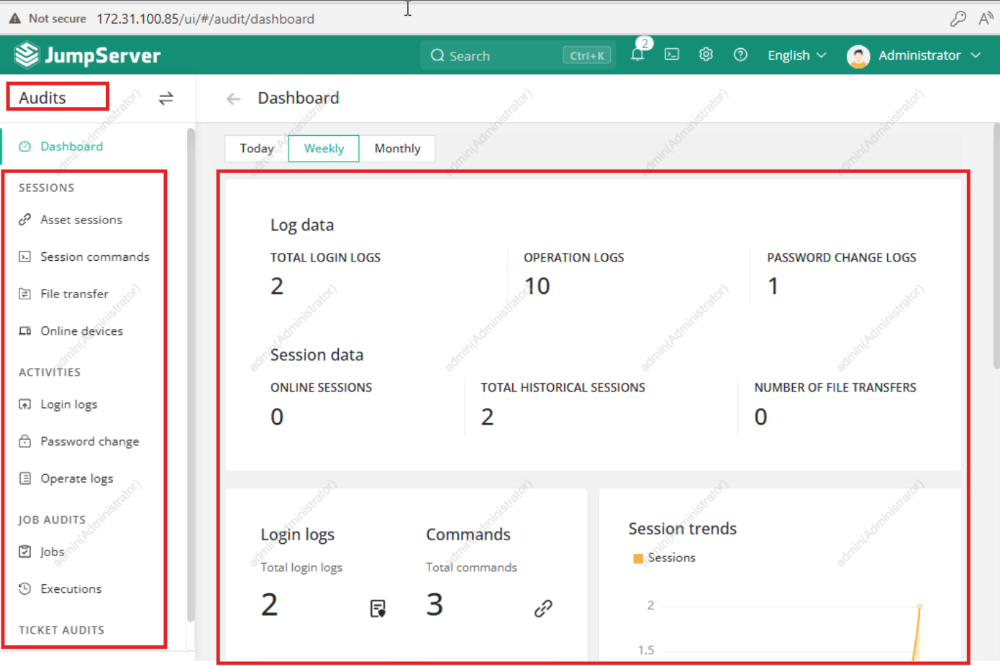

### Validation Results

| Validation Item              | Result    |
| ---------------------------- | --------- |
| Audit Dashboard Accessible   | Yes       |
| Administrative Visibility    | Confirmed |
| Session Monitoring Available | Confirmed |
| Audit Services Operational   | Confirmed |

✅ **Checkpoint:** Centralized auditing dashboard validated.

---

# Step 2 – Historical Session Records

## Objective

Validate that JumpServer retains historical records of privileged administrative sessions.

### Validation

Historical session records were reviewed through the JumpServer audit interface. Session records associated privileged activity with the initiating administrator, managed asset, protocol, account, and session timestamp.

These records provide accountability and traceability for administrative activity.

### Evidence

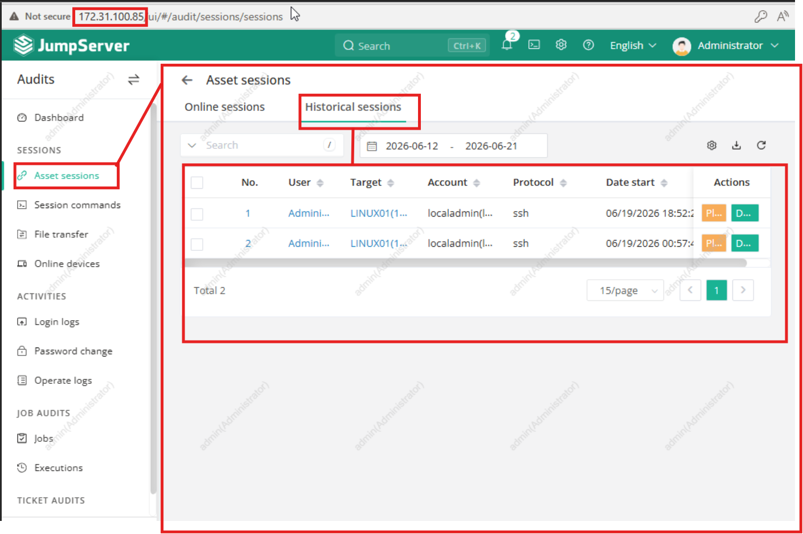

### Validation Results

| Validation Item             | Result |
| --------------------------- | ------ |
| Session Records Available   | Yes    |
| User Attribution Present    | Yes    |
| Asset Attribution Present   | Yes    |
| Historical Tracking Enabled | Yes    |

✅ **Checkpoint:** Historical session retention validated.

---

# Step 3 – Session Replay Validation

## Objective

Validate session replay functionality for privileged administrative activities.

### Validation

JumpServer provided replay functionality for recorded SSH sessions. Replay controls enabled administrators to review historical privileged activity performed against managed assets.

This capability supports forensic review, audit investigations, and compliance validation.

### Evidence

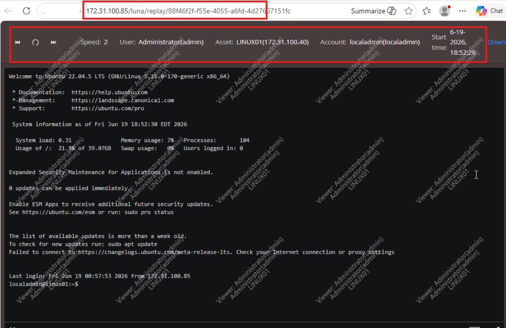

### Validation Results

| Validation Item                   | Result |
| --------------------------------- | ------ |
| Session Replay Available          | Yes    |
| Recorded Activity Accessible      | Yes    |
| Playback Controls Functional      | Yes    |
| Audit Review Capability Confirmed | Yes    |

✅ **Checkpoint:** Session replay functionality validated.

---

# Step 4 – Command Auditing Validation

## Objective

Validate that administrative commands executed during privileged sessions are captured and recorded.

### Validation

Commands executed during brokered SSH sessions were recorded within the JumpServer command auditing interface.

Administrative activity was associated with the authenticated user, target asset, managed account, and originating session, providing complete command-level accountability.

### Evidence

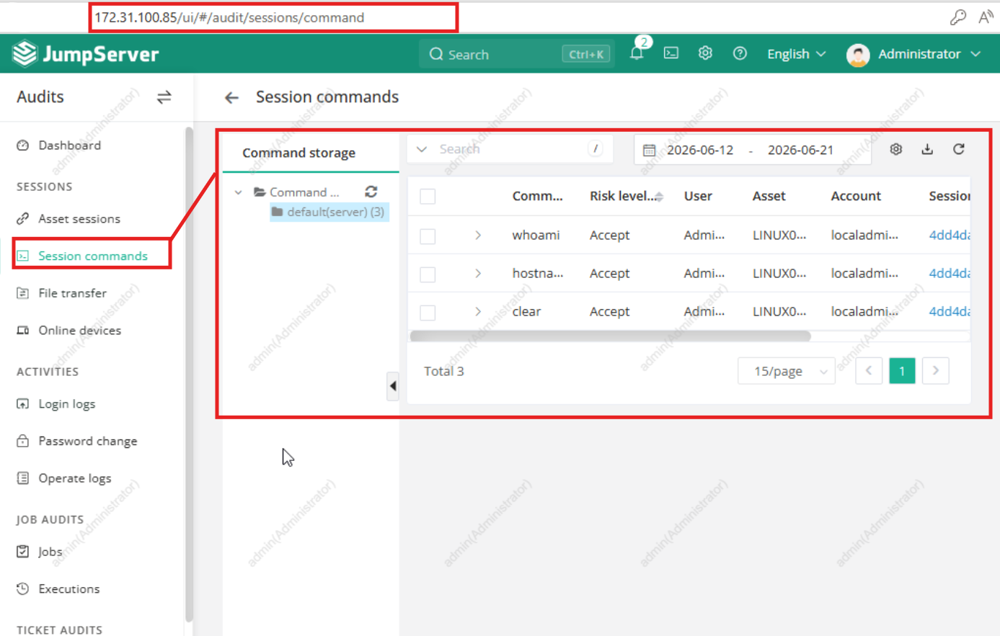

### Validation Results

| Validation Item           | Result |
| ------------------------- | ------ |
| Commands Captured         | Yes    |
| User Attribution Present  | Yes    |
| Asset Attribution Present | Yes    |
| Audit Trail Available     | Yes    |

✅ **Checkpoint:** Command auditing successfully validated.

---

# Step 5 – Workbench File Transfer Interface

## Objective

Validate that JumpServer provides a controlled file transfer interface for managed administrative operations.

### Validation

The JumpServer Workbench File Transfer interface was reviewed to validate secure file movement capabilities between administrative operators and managed assets.

The interface provides centralized control over file upload and download operations while maintaining accountability through authenticated user sessions and managed asset associations.

This capability extends privileged access governance beyond interactive administrative sessions and supports secure operational workflows requiring controlled file exchange.

### Evidence

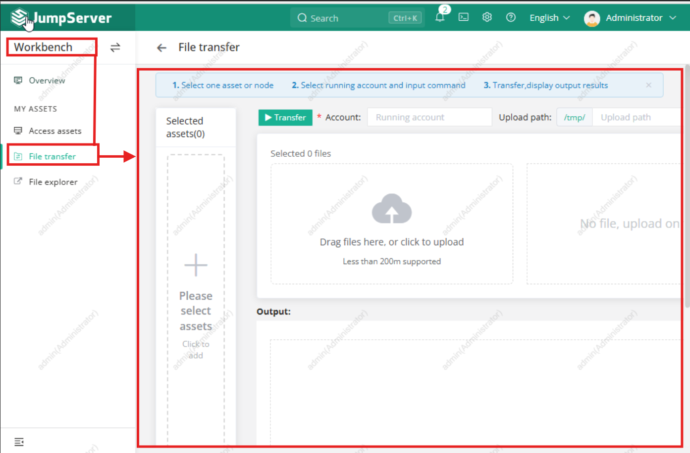

### Validation Results

| Validation Item                    | Result |
| ---------------------------------- | ------ |
| File Transfer Interface Accessible | Yes    |
| Managed Asset Available            | Yes    |
| Administrative Controls Available  | Yes    |
| File Transfer Capability Confirmed | Yes    |

✅ **Checkpoint:** Workbench file transfer interface validated.

---

# Step 6 – Authorization Policy Validation

## Objective

Validate that the authorization policy was successfully created and activated.

### Validation

The completed authorization policy appeared within the JumpServer authorization inventory and displayed a valid status.

The policy associated the Administrator account with the managed Linux asset and managed localadmin credential.

Authorization policies provide centralized governance over privileged access operations by defining which users may access specific assets and accounts.

### Evidence

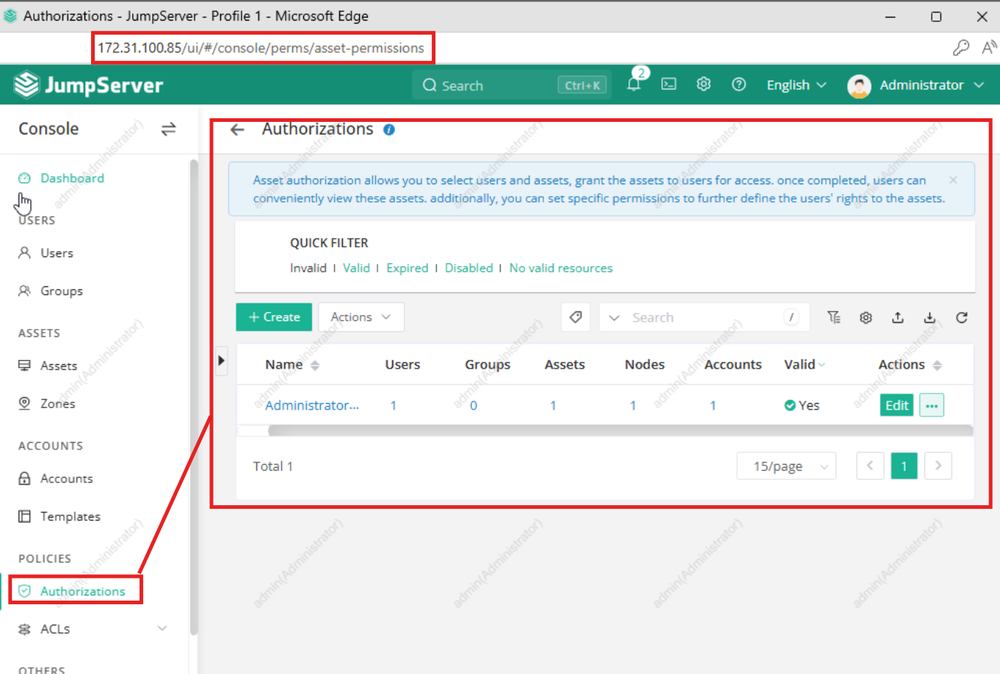

### Validation Results

| Validation Item      | Result    |
| -------------------- | --------- |
| Authorization Status | Valid     |
| Assigned Users       | Confirmed |
| Assigned Asset       | Confirmed |
| Assigned Account     | Confirmed |

✅ **Checkpoint:** Authorization policy successfully validated.

---

# Step 7 – Controlled File Transfer Validation

## Objective

Validate secure file transfer operations through JumpServer Workbench.

### Validation

A Linux security baseline report was transferred from the administrative workstation to the managed Linux asset through the JumpServer Workbench File Transfer interface.

The transfer operation utilized:

* Asset: LINUX01
* Account: localadmin
* Destination: /tmp/
* File: linux01-security-baseline.txt

JumpServer reported a successful transfer operation and displayed the destination path.

### Evidence

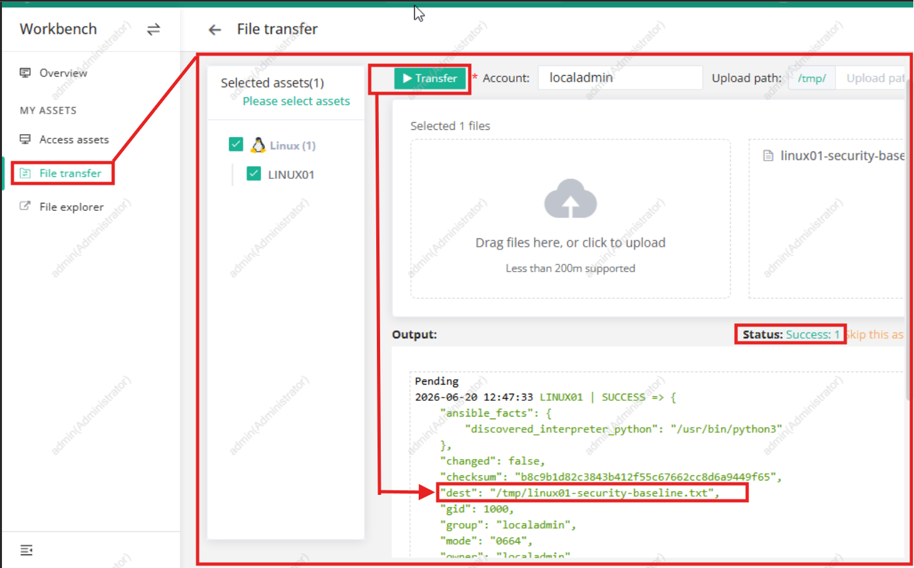

### Validation Results

| Validation Item            | Result |
| -------------------------- | ------ |
| Transfer Initiated         | Yes    |
| Transfer Completed         | Yes    |
| Destination Path Validated | Yes    |
| Status Returned Success    | Yes    |

✅ **Checkpoint:** Controlled file transfer successfully completed.

---

# Step 8 – File Delivery Verification

## Objective

Validate successful delivery and accessibility of the transferred file.

### Validation

A brokered SSH session was used to verify file delivery on the managed Linux asset.

The following commands confirmed file presence and contents:

```bash
ls -l linux01-security-baseline.txt
cat linux01-security-baseline.txt
```

The output verified that the file was successfully written to the target host and remained accessible to the managed administrative account.

### Evidence

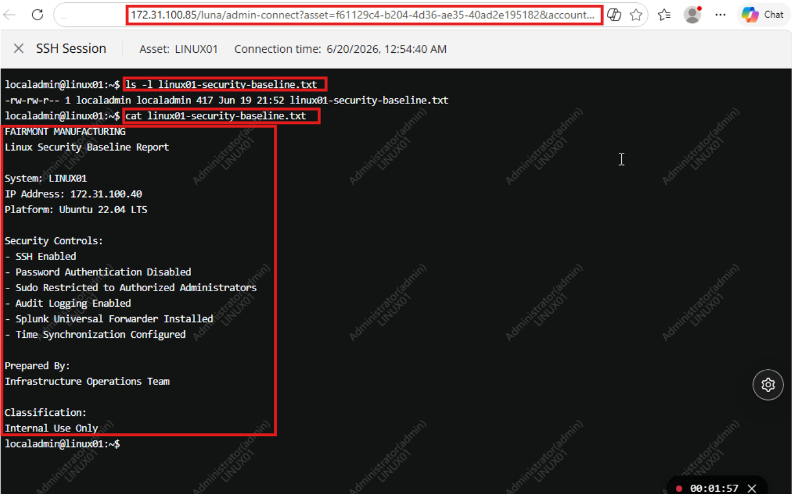

### Validation Results

| Validation Item              | Result |
| ---------------------------- | ------ |
| File Exists                  | Yes    |
| File Readable                | Yes    |
| Content Verified             | Yes    |
| Transfer Integrity Confirmed | Yes    |

✅ **Checkpoint:** File delivery successfully validated.

---

# Results

JumpServer Community Edition successfully demonstrated operational Privileged Access Management auditing and governance capabilities.

### Outcomes

* Centralized audit dashboard validated.
* Historical session records reviewed.
* Session replay functionality validated.
* Command auditing confirmed.
* Workbench file transfer interface validated.
* Authorization policies validated.
* Controlled file transfer operations completed.
* File delivery verified on the target Linux asset.
* End-to-end PAM auditing workflow successfully demonstrated.

The environment now provides centralized visibility, accountability, and governance for privileged administrative access across managed Linux infrastructure.

---

# Section Summary

Section 4 successfully validated the following JumpServer PAM capabilities:

* Audit Dashboard Visibility
* Historical Session Tracking
* Session Replay
* Command Auditing
* Workbench File Transfer Interface
* Authorization Policy Enforcement
* Controlled File Transfer
* File Delivery Verification

These capabilities provide the foundational monitoring, auditing, and governance controls expected within a Privileged Access Management platform.

---

**E.E. Spence — PAM Engineering | IAMPAM.LAB**
