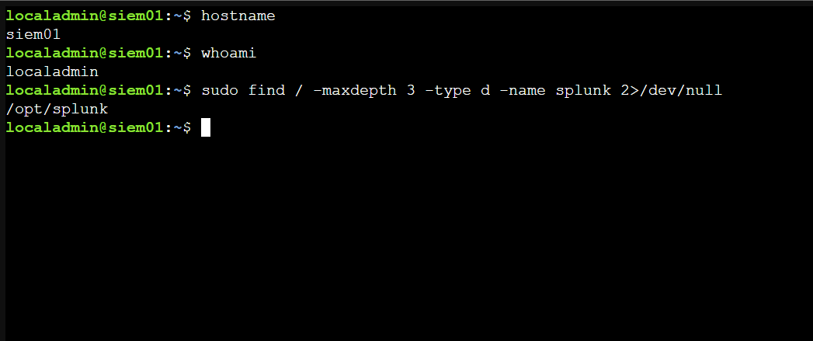
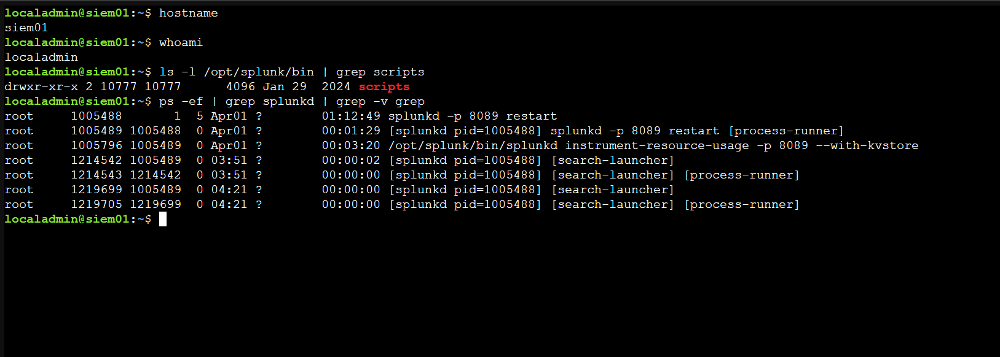
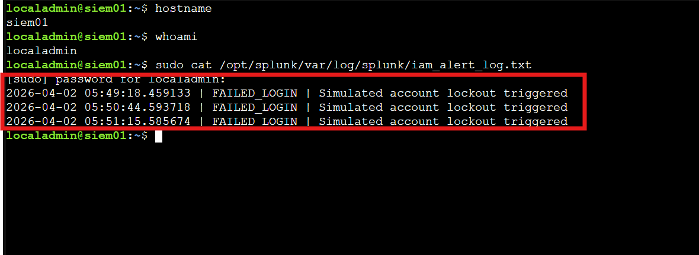
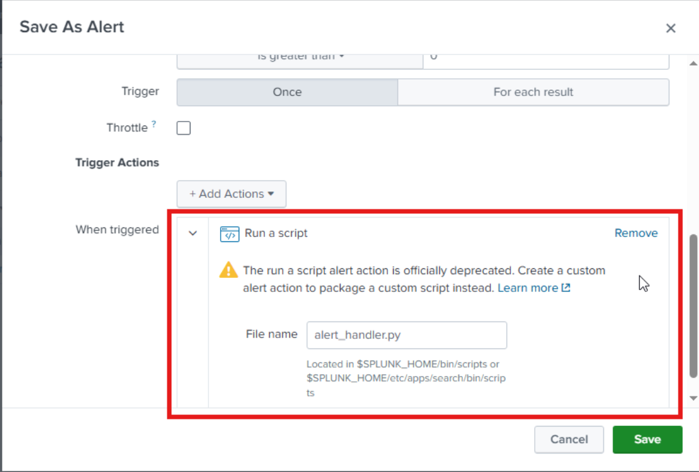
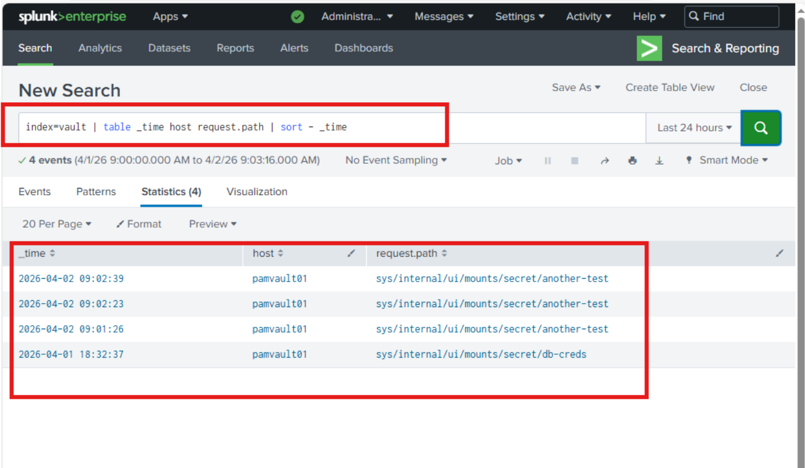
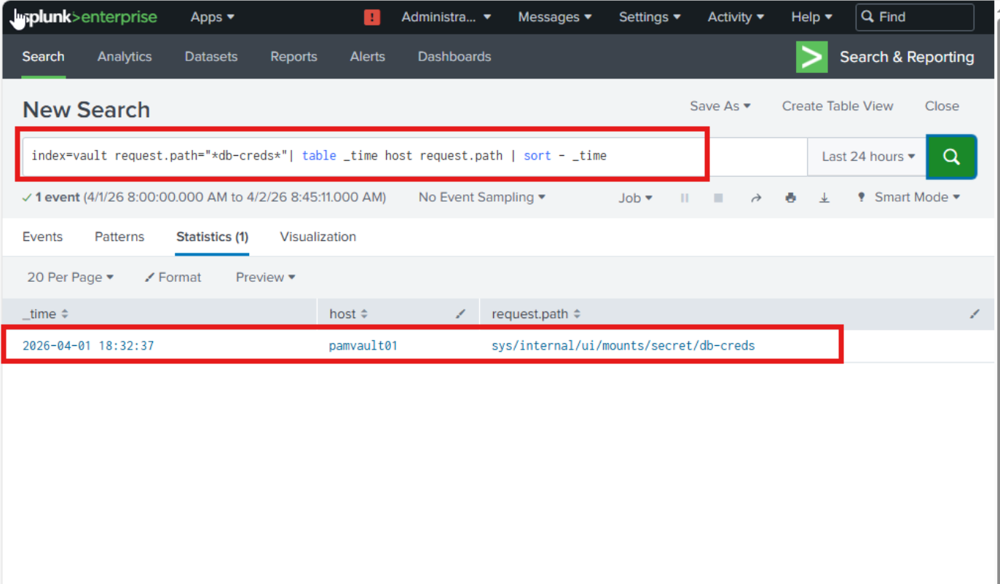
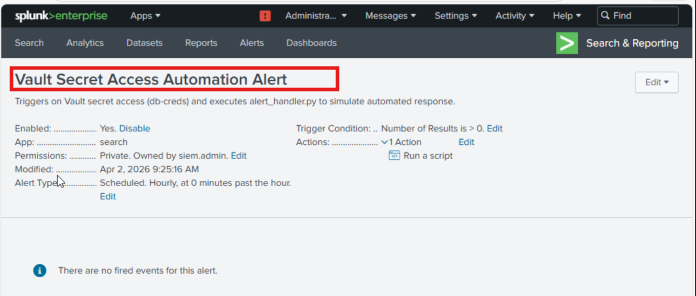
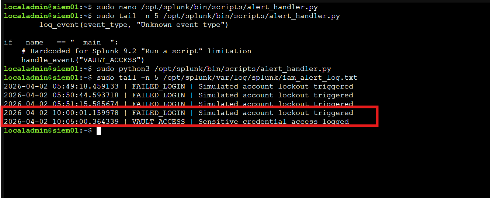

← [Back to Main README](../README.md)


# Module 08: IAM Automation & Policy Enforcement

**Module**: 08 - IAM Automation & Policy Enforcement
**Status**: ✅ COMPLETE (Alert-Driven Automation & Policy Enforcement Validated)
**Built by**: Edward E. Spence
**Completed**: March 2026
**Purpose**: Implement alert-driven automation within the IAMPAM.LAB environment by integrating Splunk detection alerts with scripted response execution, enabling automated handling of IAM events using Vault audit logs as a deterministic trigger source.

---

## 1. Objective

Implement alert-driven automation within the IAM/PAM lab by integrating Splunk alert actions with a Python-based response mechanism.

This validates:

* Detection events can trigger automated responses
* Splunk can execute scripts in response to IAM activity
* Vault audit logs can act as a deterministic trigger source

---

## 2. Architecture Context

```id="g2x1qh"
Vault → Splunk Detection → Alert → Script Execution → Log Output
```

---

## 3. Systems

| System     | Role              | IP            |
| ---------- | ----------------- | ------------- |
| SIEM01     | Splunk Enterprise | 172.31.100.60 |
| PAMVAULT01 | Vault Server      | 172.31.100.70 |
| MGMT01     | PAW               | 172.31.100.20 |

---

## 4. Prerequisites

* Splunk Enterprise installed and running
* Vault audit logging enabled (Module 05)
* Script execution directory available (`/opt/splunk/bin/scripts`)
* Python3 installed on SIEM01

---

## 5. Phase A — Splunk Path Validation

```bash id="6j2paf"
sudo find / -maxdepth 3 -type d -name splunk 2>/dev/null
```



---

## 6. Phase B — Script Directory Validation

```bash id="r94t0p"
ls -l /opt/splunk/bin | grep scripts
```



---

## 7. Phase C — Script Creation & Validation

### Automation Context — Splunk Alert Action Integration

The Python script (`alert_handler.py`) was implemented as a custom Splunk alert action to simulate automated response behavior within the IAM/PAM pipeline. Rather than operating as a standalone utility, the script is executed directly by Splunk in response to detection events, bridging the gap between passive monitoring and active response.

This implementation demonstrates how IAM-related events such as failed logons, vault access, and privileged sessions can trigger deterministic automation workflows. While the script performs structured logging for validation purposes, it models the foundational behavior of a SOAR-integrated environment, where detection events initiate controlled response actions. This establishes a repeatable and testable automation pattern within the IAMPAM.LAB architecture. :contentReference[oaicite:0]{index=0}

Script created:

```bash id="s9jk21"
sudo nano /opt/splunk/bin/scripts/alert_handler.py
```

### alert_handler.py

```python id="i0as2k"
import datetime
import os

SPLUNK_HOME = os.environ.get("SPLUNK_HOME", "/opt/splunk")
LOG_FILE = f"{SPLUNK_HOME}/var/log/splunk/iam_alert_log.txt"

def log_event(event_type, action):
    try:
        with open(LOG_FILE, "a") as f:
            f.write(f"{datetime.datetime.now()} | {event_type} | {action}\n")
    except Exception as e:
        print(f"ERROR: {e}")

def handle_event(event_type):
    if event_type == "FAILED_LOGIN":
        log_event(event_type, "Simulated account lockout triggered")
    elif event_type == "VAULT_ACCESS":
        log_event(event_type, "Sensitive credential access logged")
    elif event_type == "PRIVILEGED_LOGIN":
        log_event(event_type, "Privileged session flagged for review")
    else:
        log_event(event_type, "Unknown event type")

if __name__ == "__main__":
    # Hardcoded due to Splunk 9.2 alert action limitations
    handle_event("VAULT_ACCESS")
```

### Manual Execution

```bash id="6s1kzq"
sudo python3 /opt/splunk/bin/scripts/alert_handler.py
```

### Validation

```bash id="u3a9dn"
sudo cat /opt/splunk/var/log/splunk/iam_alert_log.txt
```



---

## 8. Phase D — Failed Login Alert (Baseline Validation)

Baseline alert used to confirm Splunk alert → script execution behavior.

### Detection Query

```spl id="9cb2pk"
index=wineventlog EventCode=4625 host=DELINEA01
```

### Purpose

* Validate alert scheduling
* Validate script execution from alert context
* Establish baseline detection capability



---

## 9. Phase E — Vault Event Visibility

```spl id="h3o4k1"
index=vault | table _time host request.path | sort - _time
```



---

## 10. Phase F — Vault Detection Query

```spl id="8k1s9a"
index=vault request.path="*db-creds*"
| table _time host request.path
| sort - _time
```



---

## 11. Phase G — Automation Alert Creation

Alert created:

* Name: Vault Secret Access Automation Alert
* Type: Scheduled (Hourly)
* Trigger: Number of results > 0
* Action: Run a script
* Script: `alert_handler.py`



---

## 12. Phase H — Script Execution Proof

```bash id="qz7e2r"
sudo cat /opt/splunk/var/log/splunk/iam_alert_log.txt
```

Observed:

* FAILED_LOGIN entries (baseline scheduled alert execution)
* VAULT_ACCESS entry (automation validation)



---

## 13. Engineering Notes

* Splunk 9.2 “Run a script” alert action does not reliably support argument passing
* Earlier module iterations used arguments (e.g., FAILED_LOGIN), but this approach was replaced with hardcoded event types to ensure consistent execution
* File permissions on `/opt/splunk/var/log/splunk` required adjustment
* Scheduled alerts execute on defined intervals, not immediately
* Vault logs provide structured, reliable telemetry for automation validation

---

## 14. Delinea Consideration

Delinea authentication events were evaluated as a potential automation trigger source.

However:

* Authentication failures occur at the IIS/application layer
* Event ID 4625 is not consistently generated
* Log propagation depends on authentication method (NTLM, Kerberos, LDAP)

Due to this variability, Delinea was not used for automation triggering.

Vault audit logs were selected because they provide consistent, deterministic event generation.

---

## 15. Outcome

* Alert-driven automation successfully implemented
* Splunk script execution validated
* Vault-based detection used for reliable triggering
* End-to-end workflow confirmed:

```id="0t9l4q"
Detection → Alert → Script → Logged Response
```

---

## 16. Key Takeaways

* Reliable automation requires consistent event sources
* Not all authentication failures propagate uniformly across systems
* Splunk alert actions can simulate SOAR workflows
* Vault audit logs provide deterministic IAM testing signals
* Engineering decisions must adapt to telemetry realities

---

**E.E. Spence — PAM Engineering | IAMPAM.LAB**
