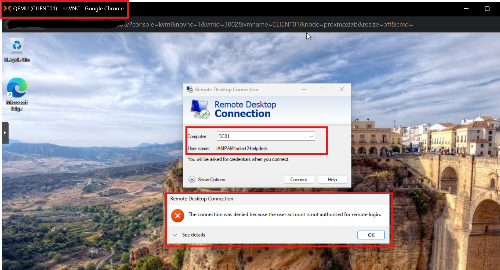
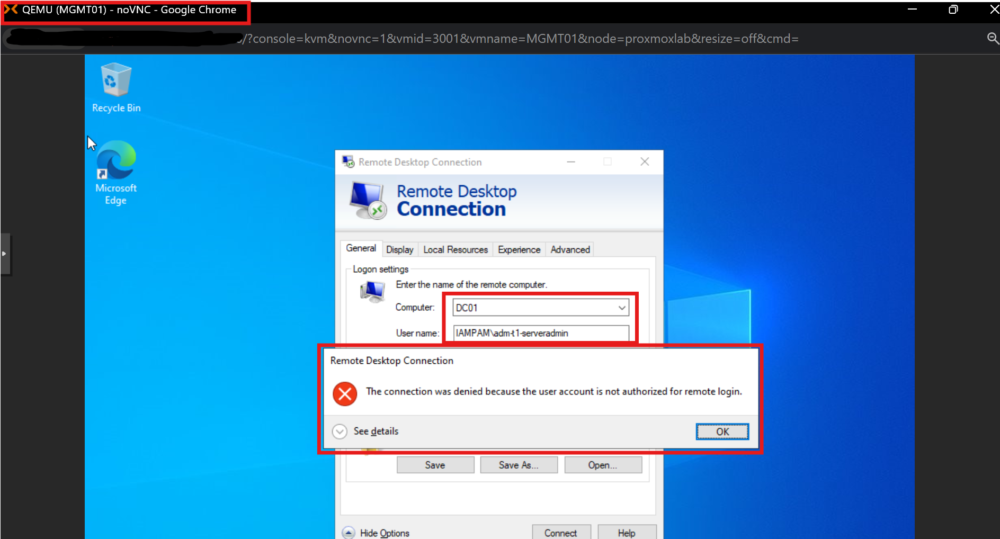
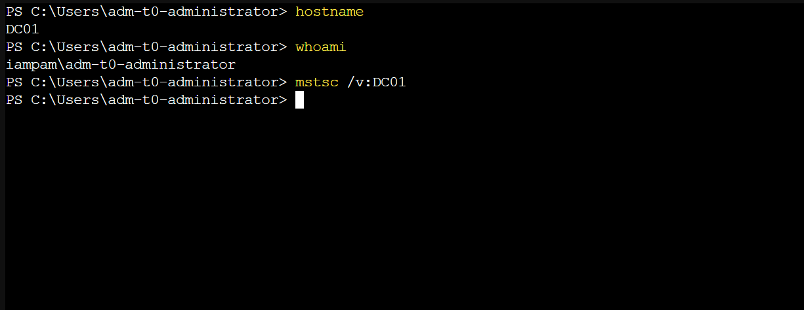

← [Back to Main README](../README.md)


# Module 09 — Identity Security Architecture & Validation

**Module**: 09 - Identity Security Architecture & Validation  
**Status**: ✅ COMPLETE (Tier-Based Access Control and IAM/PAM Architecture Validation Confirmed)  
**Built by**: Edward E. Spence  
**Completed**: March 2026  
**Purpose**: Validate that the IAM/PAM architecture within the IAMPAM.LAB environment is functioning as designed by confirming identity flows, privileged access paths, logging pipelines, automation mechanisms, and tier-based access controls operate cohesively, with strict enforcement of administrative boundaries and prevention of unauthorized cross-tier access.

---

## 1. Objective

Document and validate the IAM/PAM architecture within this repository, ensuring identity flows, privileged access paths, logging pipelines, and automation mechanisms operate cohesively.

---

## 2. Architecture Overview

This module represents the final validated architecture for the IAM/PAM lab environment.

The environment consists of:

* Active Directory (identity provider)
* Delinea Secret Server (Windows PAM)
* HashiCorp Vault (credential management)
* Splunk Enterprise (SIEM + detection + automation)
* Proxmox VE (virtualization platform)

---

## 3. Architecture Diagram


This diagram represents identity authentication paths, PAM access flows, centralized logging ingestion, and automation integration within the IAM/PAM lab.

---

## 4. Systems (Scoped to This Repository)

| System     | Role                          | IP            |
| ---------- | ----------------------------- | ------------- |
| DC01       | Domain Controller             | 172.31.100.10 |
| MGMT01     | Privileged Access Workstation | 172.31.100.20 |
| CLIENT01   | Domain Workstation            | 172.31.100.30 |
| ID-SYNC01  | Identity Sync (Entra Connect) | 172.31.100.50 |
| PAMVAULT01 | HashiCorp Vault               | 172.31.100.70 |
| DELINEA01  | Delinea Secret Server + IIS   | 172.31.100.80 |
| SIEM01     | Splunk Enterprise             | 172.31.100.60 |

---

## 5. Identity Flow

### Windows Authentication Path

```text
User → MGMT01 → DC01 (Kerberos/LDAP) → Target System
```

### Validation

* Kerberos authentication validated (Module 02)
* Domain join verified (Module 02)
* Administrative access confirmed via MGMT01

---

## 6. PAM Flow

### Windows PAM (Delinea)

```text
User → Delinea Web → AD Authentication → Secret Retrieval → Target Access
```

### Vault Credential Flow

```text
User → Vault CLI → Secret Access → Credential Retrieval
```

---

## 7. Logging Pipeline

```text
DELINEA01 → UF → SIEM01 → index=wineventlog + index=iis  
PAMVAULT01 → UF → SIEM01 → index=vault  
```

### Validation Queries

```spl
index=wineventlog host=DELINEA01
```

```spl
index=iis host=DELINEA01
```

```spl
index=vault
```

---

## 8. Detection Layer

Detection is based on:

* Windows Security Events (4624, 4625, 4672, 4688)
* IIS Web Logs (application-layer authentication visibility)
* Vault Audit Logs

### Key Insight

Authentication failures do not consistently generate Event ID 4625.
Web-based authentication (Delinea) often remains at the IIS layer.

---

## 9. Automation Layer

Implemented in Module 08:

```text
Vault Access → Splunk Alert → Python Script → Log Output
```

### Validation

* Script execution confirmed via Splunk alert
* Log file updated with VAULT_ACCESS entries
* End-to-end automation validated

---

## 10. Security Boundaries

| Tier   | Systems               | Description                          |
| ------ | --------------------- | ------------------------------------ |
| Tier 0 | DC01, MGMT01          | Identity control + privileged access |
| Tier 1 | DELINEA01, PAMVAULT01 | Privileged systems                   |
| Tier 2 | CLIENT01              | User workstation                     |

### Note

MGMT01 is treated as a Privileged Access Workstation (Tier 0/1).
Placement reflects administrative control role, not user endpoint classification.

---

## 11. Cross-Module Reference

| Component        | Module    |
| ---------------- | --------- |
| Infrastructure   | Module 01 |
| Active Directory | Module 02 |
| Identity Sync    | Module 03 |
| Vault PAM        | Module 05 |
| Delinea PAM      | Module 06 |
| Monitoring       | Module 07 |
| Automation       | Module 08 |

---

## 12. Validation Checklist (Traceable)

| Component        | Status | Evidence  |
| ---------------- | ------ | --------- |
| Active Directory | ✅      | Module 02 |
| Domain Join      | ✅      | Module 02 |
| Identity Sync    | ✅      | Module 03 |
| Vault PAM        | ✅      | Module 05 |
| Delinea PAM      | ✅      | Module 06 |
| Splunk Logging   | ✅      | Module 07 |
| Detection        | ✅      | Module 07 |
| Automation       | ✅      | Module 08 |

---

## 13. Access Control Validation (Tier Enforcement)

This section validates enforcement of tier-based administrative access using Group Policy logon restrictions.

### Test 1 — Tier 2 → Tier 0 Access

**Source:** CLIENT01
**Account:** IAMPAM\adm-t2-helpdesk
**Target:** DC01

**Result:** ❌ Denied



---

### Test 2 — Tier 1 → Tier 0 Access

**Source:** MGMT01
**Account:** IAMPAM\adm-t1-serveradmin
**Target:** DC01

**Result:** ❌ Denied



---

### Test 3 — Tier 0 → Tier 0 Access

**Source:** DC01
**Account:** IAMPAM\adm-t0-administrator

```powershell
hostname
whoami
```

**Result:** ✅ Successful



---

### Enforcement Summary

* Tier 2 accounts are blocked from Domain Controller access
* Tier 1 accounts are blocked from Domain Controller access
* Only Tier 0 administrative accounts can access Tier 0 systems

This confirms strict privilege boundary enforcement and prevention of lateral movement.

---

## 14. Failure Observations

* Delinea failed logins do not consistently produce Event ID 4625
* Authentication behavior varies based on protocol (NTLM, Kerberos, LDAP)
* IIS logs provide required visibility for application-layer authentication

---

## 15. Engineering Decisions

* Vault selected as deterministic automation trigger
* Splunk used as centralized detection and response engine
* Python used for simulated response actions
* Tier-based logon restrictions enforced via Group Policy
* Architecture strictly scoped to repository boundary

---

## 16. Outcome

* IAM/PAM architecture validated end-to-end
* Identity flows confirmed
* Logging pipeline operational
* Detection and automation integrated
* Tier-based access control successfully enforced

---

## 17. Key Takeaways

* Identity security requires layered visibility
* Authentication telemetry varies across systems
* Automation depends on reliable event sources
* Clear architecture boundaries improve maintainability
* Tiered access control significantly reduces attack surface
* Privileged access must be explicitly restricted, not assumed

---

**E.E. Spence — PAM Engineering | IAMPAM.LAB**
